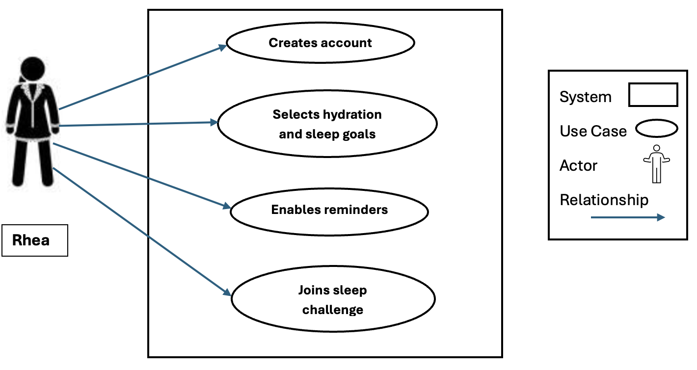
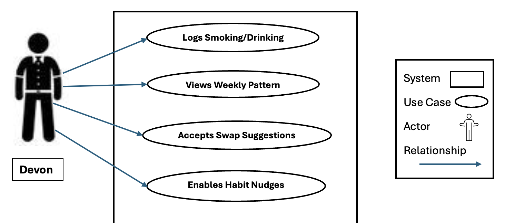
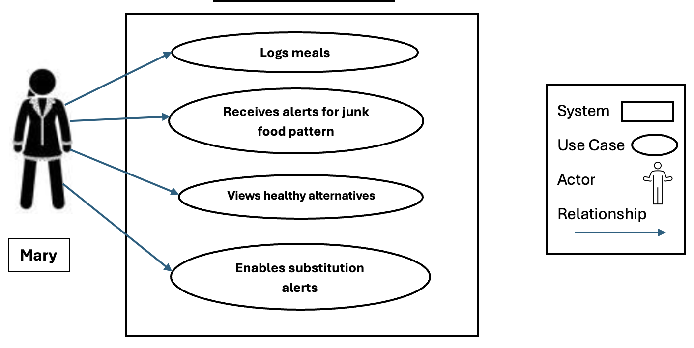
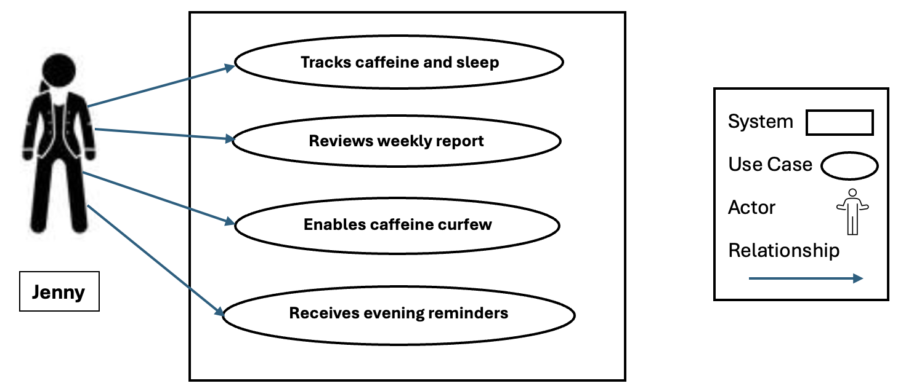
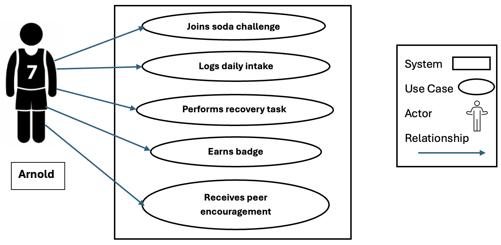
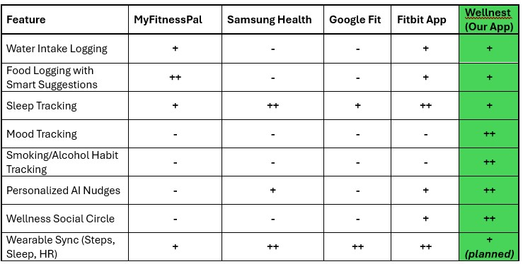

# SW Engineering CSC648-848-03 Summer 2025

## &#x20;<mark style="background-color:purple;">WELLNEST</mark> &#x20;

## <mark style="background-color:blue;">Team 03</mark>                                                                                                                &#x20;

**Team Lead & Technical Writer:** Jacob Cordano - [jcordano1@sfsu.edu](mailto:jcordano1@sfsu.edu)

**Scrum Master:** Hamed Emari

**Frontend Lead:** Jacob Vuong

**Backend lead:** Shivani Bokka

**GitHub Master and Database Lead:** Kevin Hu

**Software Architect:** Diego Antunez

## <mark style="color:blue;">Version History</mark>

| Milestone  | Version | Date |
| --- | --- | --- |
| Milestone 1 | Version 2 | 6/30/25 |
| Milestone 1 | Version 1 | 6/16/25 |

## <mark style="color:blue;">Table of Contents:</mark>

<table><thead><tr><th width="638">Content</th></tr></thead><tbody><tr><td><a href="./#executive-summary">Executive Summary</a></td></tr><tr><td><a href="./#use-cases">Use Cases</a></td></tr><tr><td>1. 1.  <a href="./#actors">Actors</a></td></tr><tr><td>1. 1.  <a href="./#use-cases-1">Cases</a></td></tr><tr><td><a href="./#main-data-items-and-entities">Main Data Items and Entities</a></td></tr><tr><td><a href="./#non-functional-requirements">Functional Requirements</a></td></tr><tr><td><a href="./#non-functional-requirements">Non-functional Requirements</a></td></tr><tr><td><a href="./#competitive-analysis">Competitive Analysis</a></td></tr><tr><td><a href="./#technology-specifications">Technology Specifications</a></td></tr><tr><td><a href="./#checklist">Checklist</a></td></tr><tr><td><a href="./#list-of-team-contributions">List of Team Contributions</a></td></tr></tbody></table>

## <mark style="color:blue;">Executive Summary</mark>

In today's society, where sedentary lifestyles and inconsistent routines increasingly compromise every individual’s physical and mental health, there’s a need for a solution to combat this. This is where our product would come into play: Wellnest, a socially driven mobile application that assists users in monitoring healthy habits and setting and achieving personal wellness goals, resulting in a more balanced life.

Our product, Wellnest, offers a complete hub in which users can track their healthy habits. Unlike other apps in the market that mainly focus on more narrow metrics like steps and calories, Wellnest enables users to log and manage a wide range of their habits. Some examples of the features would be to track food and water intake, weekly sleep patterns, physical activity, and more specific habits like smoking and alcohol intake. The app will essentially take all this data and generate a personalized dashboard catering to the individual user to monitor the trends and track their progress over time.

A key feature that Wellnest offers is its “Wellness Circle”, enabling users to connect with friends and family within a competitive environment to the health challenges. These challenges would consist of hydration goals, daily steps, sleeping habits, etc. This social component will transform health tracking into a more engaging environment shared with other users, creating an incentive to stick to a routine to stay ahead.

On top of the manual tracking feature available, Wellnest will utilize AI-powered insights and behavioral nudges to remind users to stay on track. Essentially, Wellnest will include smart reminders, adaptive suggestions, and milestone celebrations to make the app feel less like a tracker, but a personal digital trainer. This is designed to maintain engagement and to consistently encourage long-term behavioral change.

With the user’s personal experience in mind, we aim to build this with scalability to support future architecture and expansions of Wellnest. From integration with wearable devices, mood tracking, to mindfulness modules, this would allow us as the developers of the app to understand our users’ experience to decide what features are working and which are not. The app itself also prioritizes data privacy, utilizing secure protocols to ensure the protection of user information not being compromised.

When taking a look from a technical standpoint, our goal is to develop a platform that is not just robust and secure, but rather impactful to each user. We believe that Wellnest fills a critical gap in today’s market by encompassing the idea of an all-in-one health companion. This promotes consistency, self-awareness, and community, which are essentially the key pillars of an ideal healthy lifestyle to incorporate in a user’s day-to-day. By combining aspects of a thoughtful design, smart technology, and a deep understanding of user motivation, Wellnest aims to become more than just an app lost in your app library, but a companion for self-growth.

## <mark style="color:blue;">Use Cases</mark>

### Actors:

#### **Rhea (Graduate Student, 25)**

**Characteristics, Skills, and Pain Points:**

* Balances a packed academic schedule with a part-time job
* Health-conscious but struggles to maintain consistency
* Skips meals and forgets to hydrate during long study sessions.
* Finds existing apps overwhelming or too feature-limited

**Goals:**

* Track daily water intake and meal patterns
* Set small, manageable health goals
* Get timely reminders that do not feel intrusive
* Compete with friends for motivation without social media distractions

#### **Devon (Tech Professional, 32)**

**Characteristics, Skills, and Pain Points:**

* Works long hours in front of a computer
* Suffers from irregular sleep and frequent back pain
* Finds it difficult to stay motivated to work out
* Rarely remembers to log habits manually

**Goals:**

* Automatically track daily steps and exercises
* Set sleep goals and monitor progress
* Receive weekly summaries and personalized suggestions
* Reduce screen time before bed and improve sleep quality

#### **Mary (Homemaker, 45)**

**Characteristics, Skills, and Pain Points:**

* Cares for her family full-time, putting her own wellness last
* Suffers from stress and emotional eating
* Has no time for complicated apps
* Wants to feel supported and not judged

**Goals:**

* Track food intake and emotions around eating
* Get kind, motivating nudges for self-care
* Join community wellness challenges with family or friends
* Learn small habits that improve overall mental and physical health

#### **Arnold (College Athlete, 21)**

**Characteristics, Skills, and Pain Points:**

* Extremely competitive and goal-oriented
* Already tracks workouts but not other habits like sleep and hydration
* Wants deeper insights, not basic graphs
* Easily bored with basic UI/UX

**Goals:**

* Sync data with wearables for better performance tracking
* View detailed analytics and trends
* Compete with friends through app leaderboards
* Track macros and meal balance in addition to workouts

#### **Jenny (Corporate Manager, 39)**

**Characteristics, Skills, and Pain Points:**

* Highly organized and result-driven
* Uses productivity tools but not health apps
* Needs consolidated, intelligent health insights
* Has privacy concerns about personal data

**Goals:**

* Track all wellness metrics in one platform
* Receive professional-level reports and recommendations
* Export data for doctor consultations
* Use the app discreetly during work hours

### Use Cases:

#### **#1\. Signing Up and Setting Up Health Goals**

**Actor:** Rhea (Graduate Student)

**Assumptions:** Rhea has a smartphone and internet access

**Use Case:**

Rhea is a full-time student who struggles with staying hydrated and getting consistent sleep. After hearing about Wellnest from a classmate, she installs the app on her phone. She taps on "Sign Up," creates an account, and selects hydration and sleep as her focus areas. She sets a target of 2 liters of water daily and at least 7 hours of sleep each night. The app offers her gentle reminders and invites her to join a 30-Day Sleep Challenge with other students, which she accepts.

**Benefits:**

* Helps Rhea stay properly hydrated by reminding her throughout the day, which is especially helpful when she’s busy with classes

* Encourages her to prioritize sleep by setting realistic, consistent targets and tracking her progress.

* Keeps her accountable through social challenges and gentle nudges without overwhelming her.

* Builds a healthy routine gradually, making it easier to stick with over time

#### **2\. Logging and Reducing Smoking/Alcohol Habits**

**Actor:** Devon (Tech Professional)

**Assumptions:** Devon wants to cut back on cigarettes and on social as well as personal drinking habits.

**Use case:**

Devon is a 32-year-old software developer who has been a chain smoker for years and tends to drink regularly — both during and after work, and during social events. He’s aware that these habits are affecting his health, but hasn’t been able to track or reduce them consistently. On the suggestion of a colleague, he installs Wellnest and starts logging every cigarette and alcoholic drink.

After two weeks of tracking, the app shows him a pattern: his smoking peaks during late-night work and alcohol intake is highest on weekends. It then suggests a personalized Evening Swap Plan, offering alternative substitutes like chamomile tea, music, or short breathing exercises. Devon enables the plan and starts receiving gentle nudges at his usual smoking and drinking times. Over the next month, he begins to log fewer instances, and the app acknowledges his progress with supportive messages and weekly summaries.

**Benefits:**

* Helps Devon clearly see when and why he smokes or drinks

* Offers practical, non-judgmental alternatives based on his lifestyle

* Reinforces progress with positive feedback instead of guilt

* Keeps him engaged with simple daily choices that add up to meaningful change over time

#### **3\. Identifying Junk Food Patterns and Suggesting Alternatives**

**Actor:** Mary (Homemaker)

**Assumption:** Mary wants to eat healthier but tends to stress-eat when overwhelmed

**Use Case:**

Mary, a full-time homemaker, often finds herself reaching for chips, cookies, or processed meals during moments of stress or exhaustion. She decides to try Wellnest to log her meals and gain more control over her eating habits. After a week of consistent logging, the app identifies a pattern of high-calorie, high-sodium foods, especially in the afternoons and evenings. It notifies her and offers healthier, quick-prep snack alternatives like hummus with veggies or Greek yogurt with fruit.

Mary enables Smart Substitution Alerts, which offer better choices in real-time when she logs similar processed items. Although she occasionally returns to her old patterns, she becomes more conscious of what she’s eating. Even when she indulges, she logs it honestly — and the app responds with encouragement, not guilt. Over time, Mary develops a more balanced relationship with food, choosing healthier options more frequently and understanding her triggers better.

**Benefits:**

* Builds real awareness around stress-eating habits and food choices

* Provides helpful and realistic alternatives that fit her daily routine.

* Encourages consistency without guilt, even when setbacks happen

* Supports long-term habit change by helping Mary understand and manage her triggers

#### **4\. Weekly Insight and Adjustment**

**Actor:** Jenny (Corporate Manager)

**Assumptions:** Jenny regularly logs caffeine intake and sleep patterns using a health app

**Use Case:**

Jenny is a high-performing professional who works long hours, often late into the night. To keep up, she relies heavily on caffeine — mostly through coffee but sometimes energy drinks as well. Her average sleep time is under 4 hours, even on weekends. She begins using Wellnest to track her daily caffeine consumption and sleep duration.

After a week of data collection, Wellnest identifies that her late-night caffeine intake is severely impacting her sleep. It suggests a “Caffeine Curfew” and prompts her to shift to non-caffeinated drinks in the evening. Jenny enables this feature and receives gentle reminders to wind down. Over time, the app helps her replace evening coffee with herbal teas, and her sleep duration gradually increases. The weekly report shows clear improvement, and the consistent nudges keep her motivated to continue making better choices.

**Benefits:**

* Makes the connection between caffeine intake and sleep disruption clear and easy to understand.

* Provides personalized, manageable steps without overwhelming the user

* Reinforces small improvements through weekly reports and visible progress

* Helps Jenny begin a gradual but meaningful shift toward healthier routines despite her demanding lifestyle

#### **5\. Social Motivation Through Challenges**

**Actor:** Arnold (College Athlete)

**Assumption:** Arnold enjoys competition and is highly conscious of his health and fitness routine

**Use Case:**

Arnold is a state-level athlete who maintains a strict diet and workout routine. While he tries to avoid unhealthy food and drinks, he often finds himself tempted by sodas and the occasional fast food. His trainer has encouraged him to completely cut out sodas and replace them with protein drinks to stay competition-ready.

Arnold uses Wellnest to track his daily food and beverage intake. He signs up for the “No Soda for 7 Days” challenge through the Wellness Circle. On the third day, he logs a soda out of habit. Instead of disqualifying him, the app suggests a recovery activity — a 20-minute high-intensity workout. He completes the task and continues the challenge. Over the course of the week, Arnold becomes more mindful of his beverage choices, and the support from his wellness circle helps him stay on track.

**Benefits:**

* Helps athletes like Arnold build discipline by reinforcing long-term goals through short, manageable challenges

* Turns slip-ups into learning opportunities rather than setbacks.

* Keeps motivation high with encouragement and achievement badges

* Promotes consistency and mindfulness, which are crucial for athletes working to improve performance and health habits

## <mark style="color:blue;">Main Data Items and Entities:</mark>

Users: Users are the people who will use Wellnest in order to track their habits and build new and healthier habits. They will be allowed full access to the app, meaning, they can create new habits, view the calendar, add friends, compete, add family members, delete habits, and delete their account if they wish to.

Profile: Each user has their own profile, they can change their visible and hidden information, they can access the setting and dashboard through their profile.

Habits: These are desirable tasks which the user wants to integrate in their daily life and routine, Habits have a date, time, and duration, they can be set to be repeated and can be shared with friends and family. Habits will be shown as missed if the user does not indicate they have accomplished the task.

Task: Task and habit will be used interchangeably

Family: A group of users who create a Family, will be able to share common habits and goals, these habits will require all the family members participation and if one misses a habit it will be shown as missed for all members.

Family-head: Is the administrator and creator of the family, they have the power to change add and remove habits and family members.

Friends: Two users who are friends, can share common goals and habits, and compete in completing their desired habits.

Streak: When a habit is completed continuously without being missed for 3 days a streak will be created where it shows the days the user has spent without missing a certain task.

Calendar: The calendar shows an overview of all the tasks ahead, and reminds of the upcoming habits.

Dashboard: The dashboard shows the users accomplishments, and a graph of the users past activities.

## <mark style="color:blue;">Functional Requirements</mark>

Registered Users

1. Users shall be able to create and register an account
1. Users shall be able to edit their profile information
1. Users shall be able to delete their accounts
1. Users shall be able to track their progress
1. Users shall be able to navigate the app without complication
1. Users shall be able to create a profile picture
1. Users shall be guided through helpful onboarding
1. Users shall be able to log in with their social profiles
1. Users shall be able to connect their AI assistance to the app
1. Users shall be able to connect to the app from multiple devices
1. Users shall be able to share the app with their App Store family

User Personal Survey

12. Users shall be asked onboard questions for curated habit suggestions
1. Users shall be able to skip individual questions
1. Users shall be able to rate the survey
1. Users shall be able to report the survey
1. Users shall be able to skip survey

Personal Health Tracker

17. Users shall track number of consecutive habit sessions
1. Users shall be able to monitor indications of completed habits
1. User shall have an indication of missed habits
1. Users shall be able to view calorie goals met
1. Users shall be able to see calorie loss goals
1. Users shall be able to remove suggested habits by the app
1. Users shall be able to ask the AI assistant to suggest better habits
1. Users shall be able to journal their thoughts on each habit session
1. Users shall be able to copy family goals to their own personal archive

Habit Tracking

26. Users shall be able to add habits
1. Users shall be able to delete habits
1. Users shall be able to modify habits
1. Users shall be able to name habits
1. Users shall be able to track pre-defined habits
1. Users shall be able to track custom habits
1. Users shall be able to view suggested habits to track
1. Users shall be able to add AI-suggested habits

Calendar

34. Users shall be able to view their weekly progress
1. Users shall be able to change the time of their habit
1. Users shall be able to change the duration of the habit
1. Users shall be able to filter calendar view by type (habits, moods, journal, challenges).
1. Users shall be able to view monthly progress
1. Users shall be able to filter calendar view by month week year
1. Users shall be able to connect their calendar to their google calendar
1. Users shall be able to share their Wellnest Calendar with Google Calendar users
1. Users shall change their Calendar System (Gregorian, Indian, Islamic, Chinese)

Notifications: 

43. Users shall receive reminders to continue habits not logged
1. Users shall receive notification of friend activity
1. User shall receive notification of suggested habits
1. Users shall receive a notification of habit to log each day
1. Users shall receive notifications through the app
1. Users shall receive notifications through email

Settings

49. Users shall be able to turn off notifications
1. Users shall be able to change their information
1. Users shall be able to delete their account
1. Users shall be able to modify privacy settings for profile viewership
1. Users shall be able to customize habits viewable by others
1. Users shall be able to block other users
1. Users shall have Wellnest contact email and socials
1. Users shall be able to change the language 
1. Users shall be able to change accessibility functionalities
1. Users shall be able to change the Font and Color
1. Users shall be able to change between Light and Dark mode
1. Users shall be able to change the time and calendar
1. Users shall be able to change their account
1. Users shall be able to connect their account to playstore
1. Users shall be able to connect their account to appstore

For Family Leaders

64. Users shall be able to create a group and invite family members.
1. Users shall be able to set a challenge (steps, water intake, sleep).
1. Users shall be able to view group leaderboard and stats.
1. Users shall be able to Send encouragement to family chat.
1. Users shall be able to create more than one challenge
1. Users shall be able to add family members
1. Users shall be able to Kick family members
1. Users shall be able to share their family link on other apps
1. Users shall be able to name their family/habit circle
1. Users shall be able to change the name of their habit circle
1. Users shall be able to change their family habit
1. Users shall be able to delete the family circle

Friends

76. Users shall be able to create challenges.
1. Users shall be able to view leaderboard
1. Users shall be able to nudge friend.
1. Users shall be able to view individual friends habits
1. Users shall be able to have joint habit tracking
1. Users shall be able to add friends
1. Users shall be able to delete friends
1. Users shall be able to see suggested friends on the app
1. Users shall be able to see suggested friends from their contacts
1. Users shall be able to see suggested friends from their Google or social accounts
1. Users shall be able to change their shared habits if they are the owner of the habit

Leaderboards and Progress

87. Users shall be able to track their progression
1. Users shall be able to compete with other users through a leaderboard
1. Users shall gain points based off of their progress
1. User shall be able to have tiered awards
1. Users shall be able to share completed goals to social media
1. Users shall be able to see AI analysis of their progress
1. Users shall be able to remove themselves from leaderboards and competing
1. Users shall be able to change the view of the leader board (Histogram, pie chart, etc)

## <mark style="color:blue;">Non-functional Requirements</mark>

 ### System Requirements
1. The System shall be hosted on Amazon Web Services EC2
1. A MySQL database shall be created and hosted on AWS EC2
1. Djangox4 shall be used as the backend framework
1. Vanilla JS and CSS shall be used for the frontend
1. The frontend service shall run on port 3000
1. The backend service shall run on port 8000
1. Ubuntu shall be used as the Operating System on AWS
1. A secure HTTPS website certificate is to be installed

### Security Requirements
9. User information and Password shall be encrypted
1. Each user can only have one account created with their email
1. Each user shall be able to log in from any device and access their information
1. Personal information shall not be shared with third party APIs
1. Personal information shall only be stored for user log in process

### Storage Requirements
14. User information shall be stored on a MySQL database
1. User Habits shall be stored on the MySQL database
1. User information shall be displayed from the database upon logging in
1. If applied users shall be informed of their storage limitations

### Content Requirements
18. The list of user family and friends shall be saved and updated with every login
1. The list of the user’s habits shall be updated with every login
1. The Calendar shall be updated with every login
1. The user Streak shall be saved and kept track of automatically
1. The user’s information shall be deleted automatically upon account deletion

### Usability
22. The UI shall have a user-friendly design
1. The UI shall have a wellness-focused design
1. The Fonts and Texts shall have a 2-4 variety and size difference 
1. The app colors shall follow CodingGator’s color theme
1. The app shall be completely functional on mobile and desktop
1. The navigation shall be intuitive and accessible 

### Supportability
27. The front-end shall display clear, noticeable, and user-friendly errors
1. Back-end shall capture errors and bugs allowing developers to correct them
1. The app shall support IOS, Windows, and Linux
1. The shall support the following engines:
    - Firefox 135
    - Chrome 134
    - Safari 18.3
    - Microsoft Edge 133

### Efficiency
33. The user info shall be displayed from the database to the frontend in less than 5 seconds
1. The app shall support at least 50 concurrent users without degradation in response time
1. The API response time shall be reduced to a minimum 

### Coding
36. Data and Variable naming should follow CodingGator’s convention 
1. Comments shall be used frequently and should give clear explanations 
1. Code shall be encapsulated and secure
1. Code shall be original work

### Marketing and Legal
40. All copyrights shall belong to CodingGators 
1. User agreement terms shall be shown to the user before registering 
1. The names Wellnest and CodingGators shall be included in all marketing attempts

## <mark style="color:blue;">Competitive Analysis</mark>

| 
Features
 | 
MyFitnessPal
 | 
Samsung Health
 | 
Google Fit
 |  
Fitbit App
 | 
Wellnest (our app)
 |
|---|---|---|---|---|---|
| Strengths | 🔹 Largest food & nutrition database   🔹 Barcode scanning   🔹 Detailed macro tracking | 🔹 Tracks sleep, stress, heart rate   🔹 Built-in with Samsung devices   🔹 Guided fitness programs | 🔹 Minimalist UI   🔹 Deep integration with Android & wearables   🔹 Focused on daily activity | 🔹 Advanced sleep & heart tracking   🔹 Social challenges   🔹 Fitbit device sync | 🔹 Unified habit tracking (food, sleep, exercise, water, mood, smoking, alcohol)   🔹 Social wellness circles   🔹 AI suggestions and habit-based feedback   🔹 Planned integration with Fitbit/Apple Health |
| Weaknesses | 🔹 Cluttered interface   🔹 Premium-only advanced insights | 🔹 Samsung device dependency   🔹 Lacks strong habit-building features | 🔹 No social features   🔹 No nutrition tracking   🔹 Lacks reminders and nudges | 🔹 Premium locked features   🔹 Limited value without Fitbit hardware | 🔹 Wearable sync not yet live (planned post-launch)   🔹 Early-stage app still building user base |
| Pricing| 🔹 Free basic version; Premium: $9.99/mo | 🔹 Free | 🔹 Free | 🔹 Free basic version; Premium: $9.99/mo | 🔹 Free during launch phase; all features unlocked |
| Social Media & Community | 🔹 Facebook, Twitter, Instagram; In-app blog | 🔹 Twitter, Facebook; Some social challenges | 🔹 No official community | 🔹 Facebook, Instagram; In-app friend leaderboard | 🔹 Built-in Wellness Circles; In-app forum; Instagram, Twitter; Challenge friends and track together |
| Onboarding Experience | 🔹 Requires long setup   🔹 Feature-rich but overwhelming for first-time | 🔹 Quick start with Samsung login   🔹 Good for casual tracking | 🔹 Fast setup   🔹 Basic goal setting | 🔹 Quick for device users   🔹 May feel data-heavy for new users | 🔹 Seamless onboarding   🔹 Pick goals and focus areas   🔹 Gentle tone and inclusive |
| Site URL | [MyFitnessPal](https://www.myfitnesspal.com/) | [Samsung Health](https://www.samsung.com/us/apps/samsung-health/) |  [Google Fit](https://www.google.com/fit/)| [Fitbit](https://store.google.com/gb/category/watches_trackers?hl=en-GB)  | [Wellnest](http://ec2-3-147-96-129.us-east-2.compute.amazonaws.com) |

With the above table, it becomes evident that while most competing health apps offer selective features like food logging, sleep tracking, or wearable syncing, they often operate in silos and lack a unified, user-centric approach. Additionally, several apps place essential features like habit insights or social engagement behind premium subscriptions, limiting accessibility for many users. Wellnest fills this gap by offering a holistic platform that combines core habit tracking (food, sleep, hydration, exercise) with often-overlooked aspects like mood logging and smoking/alcohol control. What sets Wellnest apart is its use of AI to provide personalized nudges, adaptive suggestions, and wellness insights — all without overwhelming the user. The inclusion of a "Wellness Circle" introduces a community-driven model where users can challenge, support, and grow with one another. Moreover, while full wearable integration is on the roadmap, Wellnest ensures that users can gain value even without external devices, making it both inclusive and scalable. In essence, Wellnest isn't just another health tracker — it is a smart, supportive companion that promotes sustainable lifestyle change through personalization, empathy, and social accountability. These differentiators position Wellnest uniquely in a crowded market and make it a promising alternative to traditional wellness apps.

## <mark style="color:blue;">Checklist</mark>

* The team has found a time slot to meet outside of class. **DONE**
* GitHub Master has been chosen. **DONE**
* The team has collectively decided on and agreed to use the listed software tools and deployment server. **DONE**
* The team is ready to use the chosen front-end and back-end frameworks, and those who need to learn are actively working on it. **DONE**
* The Team Lead has ensured that all members have read and understand the final M1 before submission. **DONE**
* GitHub is organized as discussed in class (e.g., master branch, development branch, folder for milestone documents, etc.). **DONE**

## <mark style="color:blue;">Technology Specifications</mark>

* **Server:** AWS EC2 (t2.micro free tier)
* **Operating System:** Ubuntu 24.04
* **Database:** MySQL 8.0.42
* **App/WSGI server:** Gunicorn 23
* **HTTP server:** Nginx 1.24
* **Backend Language:** Python 3.12.3
* **Frontend Language:** HTML/CSS/JavaScript
* Additional Tech:
* **Frontend Framework:** Vanilla html, javascript, css
* **Backend Framework:** Django 5.2.3
* **IDE:** Visual Studio Code, MySQL Workbench
* **SSL Cert**: Lets Encrypt (Cert Bot)
* **Docker:** Docker 28.2.2

## <mark style="color:blue;">List of Team Contributions</mark>

<mark style="color:blue;">Hame Emari (Team Lead, Scrum Master)</mark>

* Worked on Functional Requirements
* Worked on the List of Main Data
* Worked on List Non-functional Requirements
* Worked on the website HTML&#x20;
* GitHub, and Gitbook editor

<mark style="color:blue;">Jacob Cordano (Technical Writer) 10/10</mark>

* Worked on AWS Cloud Server
* Configured ssh key
* Installed the MySQL Database
* Worked on website HTML and GitHub
* Worked on Functional Requirements
* Worked on High-level System Architecture and tech

<mark style="color:blue;">Jacob Vuong (Front-end Lead) 10/10</mark>

* Worked on AWS Cloud Server
* Worked as the Front-end webmaster
* Worked on website HTML and GitHub
* Worked on Functional Requirements
* Worked on High-level System Architecture and tech

<mark style="color:blue;">Shivani Bokka (Back-end Lead) 10/10</mark>

* Worked on the Executive Summary
* Worked on Use Cases
* Worked on Actors
* Worked on Competitive Analysis
* Worked on website HTML

<mark style="color:blue;">Diego Antunez</mark> <mark style="color:blue;">(Software Architect) 9/10</mark>

* Worked on Competitive Analysis
* Worked on Use Cases and Actors
* Worked on website HTML

<mark style="color:blue;">Kevin Hu (Database Lead) 9/10</mark>

* Worked on Functional Requirements
* Worked on website HTML