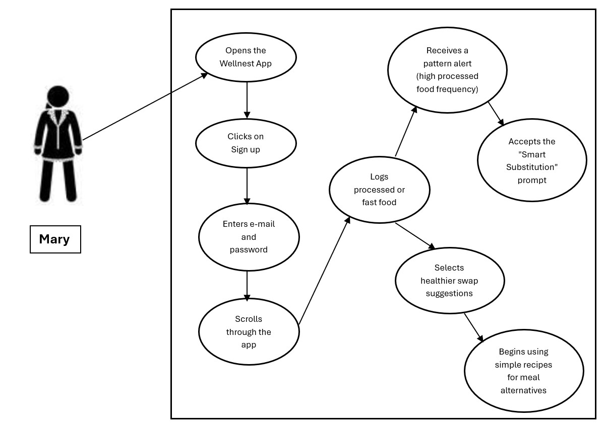
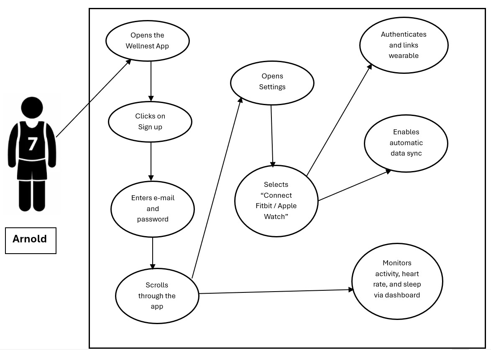
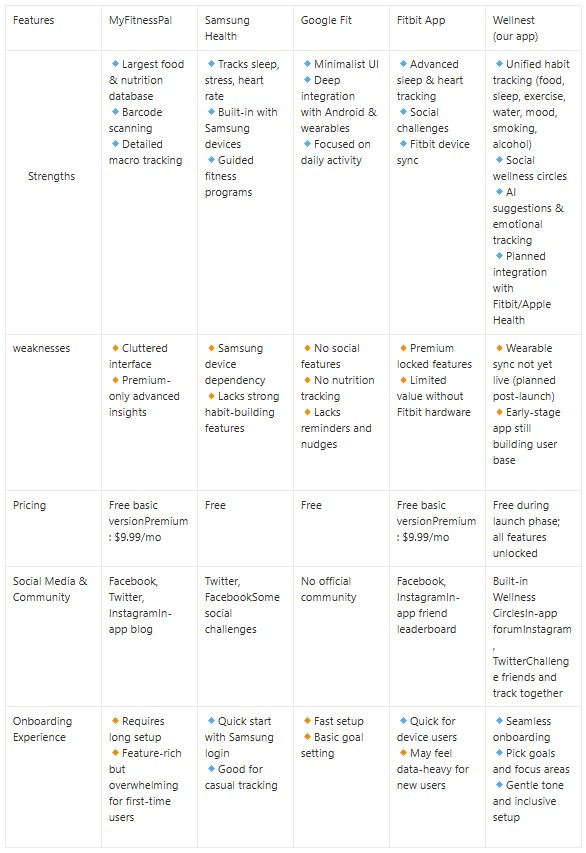

# SW Engineering CSC648-848-03 Summer 2025

## &#x20;                                                       <mark style="background-color:purple;">WELLNEST</mark>                                                  &#x20;

## <mark style="background-color:blue;">Team 03</mark>                                                                                                                &#x20;

**Team Lead and Scrum Master:** Hamed Emari - [hemari@sfsu.edu](mailto:hemari@sfsu.edu)

**Frontend Lead:** Jacob Vuong&#x20;

**Backend lead:** Shivani Bokka

**GitHub Master and Database Lead:** Kevin Hu

**Technical Writer:** Jacob Cordano

**Software Architect:** Diego Antunez

## <mark style="color:blue;">Version History</mark>

| Milestone  | Version | Date    |
| ---------- | ------- | ------- |
| Milestone 1 | 1.0   | 6/16/25 |
| Milestone 1 | 1.2| 6/30/25|

## <mark style="color:blue;">Table of Contents:</mark>

<table><thead><tr><th width="638">Content</th></tr></thead><tbody><tr><td><a href="./#executive-summary">Executive Summary</a></td></tr><tr><td><a href="./#use-cases">Use Cases</a></td></tr><tr><td>         <a href="./#actors">Actors</a></td></tr><tr><td>         <a href="./#use-cases-1">Cases</a></td></tr><tr><td><a href="./#main-data-items-and-entities">Main Data Items and Entities</a></td></tr><tr><td><a href="./#non-functional-requirements">Functional Requirements</a></td></tr><tr><td><a href="./#non-functional-requirements">Non-functional Requirements</a></td></tr><tr><td><a href="./#competitive-analysis">Competitive Analysis</a></td></tr><tr><td><a href="./#technology-specifications">Technology Specifications</a></td></tr><tr><td><a href="./#checklist">Checklist</a></td></tr><tr><td><a href="./#list-of-team-contributions">List of Team Contributions</a></td></tr></tbody></table>

## <mark style="color:blue;">Executive Summary</mark>

In today's society, where sedentary lifestyles and inconsistent routines increasingly compromise every individual’s physical and mental health, there’s a need for a solution to combat this. This is where our product would come into play: Wellnest, a socially driven mobile application that assists users in monitoring healthy habits and setting and achieving personal wellness goals, resulting in a more balanced life.

Our product, Wellnest, offers a complete hub in which users can track their healthy habits. Unlike other apps in the market that mainly focus on more narrow metrics like steps and calories, Wellnest enables users to log and manage a wide range of their habits. Some examples of the features would be to track food and water intake, weekly sleep patterns, physical activity, and more specific habits like smoking and alcohol intake. The app will essentially take all this data and generate a personalized dashboard catering to the individual user to monitor the trends and track their progress over time.

A key feature that Wellnest offers is its “Wellness Circle”, enabling users to connect with friends and family within a competitive environment to the health challenges. These challenges would consist of hydration goals, daily steps, sleeping habits, etc. This social component will transform health tracking into a more engaging environment shared with other users, creating an incentive to stick to a routine to stay ahead.

On top of the manual tracking feature available, Wellnest will utilize AI-powered insights and behavioral nudges to remind users to stay on track. Essentially, Wellnest will include smart reminders, adaptive suggestions, and milestone celebrations to make the app feel less like a tracker, but a personal digital trainer. This is designed to maintain engagement and to consistently encourage long-term behavioral change.

With the user’s personal experience in mind, we aim to build this with scalability to support future architecture and expansions of Wellnest. From integration with wearable devices, mood tracking, to mindfulness modules, this would allow us as the developers of the app to understand our users’ experience to decide what features are working and which are not. The app itself also prioritizes data privacy, utilizing secure protocols to ensure the protection of user information not being compromised.

When taking a look from a technical standpoint, our goal is to develop a platform that is not just robust and secure, but rather impactful to each user. We believe that Wellnest fills a critical gap in today’s market by encompassing the idea of an all-in-one health companion. This promotes consistency, self-awareness, and community, which are essentially the key pillars of an ideal healthy lifestyle to incorporate in a user’s day-to-day. By combining aspects of a thoughtful design, smart technology, and a deep understanding of user motivation, Wellnest aims to become more than just an app lost in your app library, but a companion for self-growth.

## <mark style="color:blue;">Use Cases</mark>

### Actors:

#### **Rhea (Graduate Student, 25)**

**Characteristics, Skills, and Pain Points:**

* Balances a packed academic schedule with a part-time job
* Health-conscious but struggles to maintain consistency
* Skips meals and forgets to hydrate during long study sessions.
* Finds existing apps overwhelming or too feature-limited

**Goals:**

* Track daily water intake and meal patterns
* Set small, manageable health goals
* Get timely reminders that do not feel intrusive
* Compete with friends for motivation without social media distractions

#### **Devon (Tech Professional, 32)**

**Characteristics, Skills, and Pain Points:**

* Works long hours in front of a computer
* Suffers from irregular sleep and frequent back pain
* Finds it difficult to stay motivated to work out
* Rarely remembers to log habits manually

**Goals:**

* Automatically track daily steps and exercises
* Set sleep goals and monitor progress
* Receive weekly summaries and personalized suggestions
* Reduce screen time before bed and improve sleep quality

#### **Mary (Homemaker, 45)**

**Characteristics, Skills, and Pain Points:**

* Cares for her family full-time, putting her own wellness last
* Suffers from stress and emotional eating
* Has no time for complicated apps
* Wants to feel supported and not judged

**Goals:**

* Track food intake and emotions around eating
* Get kind, motivating nudges for self-care
* Join community wellness challenges with family or friends
* Learn small habits that improve overall mental and physical health

#### **Arnold (College Athlete, 21)**

**Characteristics, Skills, and Pain Points:**

* Extremely competitive and goal-oriented
* Already tracks workouts but not other habits like sleep and hydration
* Wants deeper insights, not basic graphs
* Easily bored with basic UI/UX

**Goals:**

* Sync data with wearables for better performance tracking
* View detailed analytics and trends
* Compete with friends through app leaderboards
* Track macros and meal balance in addition to workouts

#### **Jenny (Corporate Manager, 39)**

**Characteristics, Skills, and Pain Points:**

* Highly organized and result-driven
* Uses productivity tools but not health apps
* Needs consolidated, intelligent health insights
* Has privacy concerns about personal data

**Goals:**

* Track all wellness metrics in one platform
* Receive professional-level reports and recommendations
* Export data for doctor consultations
* Use the app discreetly during work hours

### Use Cases:

#### **Signing Up and Setting Up Health Goals**

**Actor:** **Rhea (Graduate Student)**

Rhea hears about Wellnest from a friend and decides to give it a try. She downloads the app and selects the “Sign Up” option. She enters her name, email, and password, and agrees to the privacy terms. After account creation, the app prompts her to select focus areas such as hydration, food logging, and sleep improvement. Rhea sets a goal of drinking 2 liters of water daily and sleeping 7 hours per night. She enables smart reminders and selects “gentle” tone for notifications. She’s also invited to join the “30-Day Sleep Reset Challenge” with her classmates.

#### **Logging and Controlling Smoking/Alcohol Habits**

**Actor:** **Devon (Tech Professional)**

Devon is a social drinker and occasional smoker. He wants to cut down both habits and track how often they occur. On Wellnest, he enables the “Habit Control” module and sets reduction goals: no more than 2 alcoholic drinks per week and zero cigarettes.

Each time he smokes or drinks (e.g., beer at happy hour or a cigarette during breaks), he logs it in the app. After two weeks, Wellnest detects that his smoking frequency hasn’t decreased and sends a reflective insight:

**“You’ve exceeded your cigarette goal 3 times. Try shifting your evening habit to chamomile tea or a short walk — want to try the Healthy Evening Swap plan?”**

Devon accepts. The app enables “replacement reminders” and sends encouraging nudges at his usual craving times. After a month, Devon reduces both habits by over 40%.

#### **Identifying Junk Food Patterns and Suggesting Alternatives**

**Actor:** **Mary (Homemaker)**

Mary often snacks on highly processed foods, especially when under stress. She logs her meals honestly — including frozen pizza, potato chips, and fast food like burgers and fries. After 10 days of consistent tracking, Wellnest detects a pattern:

**“50% of your logged meals are categorized as high in sodium or saturated fat. Want healthier 15-minute alternatives for your cravings?”**

Mary clicks _Yes_, and Wellnest recommends recipes like baked sweet potato fries, turkey lettuce wraps, and homemade veggie quesadillas. It also enables a _Smart Substitution Alert_ — when Mary logs a high-calorie snack, it gently suggests a swap with a healthier option.

Over time, Mary starts incorporating small changes that significantly reduce her reliance on junk food, without feeling deprived.

#### **Smart Weekly Insights and Course Correction**

**Actor:** **Jenny (Corporate Manager)**

Jenny uses Wellnest consistently to track sleep, meals, and caffeine intake. On Sunday, the app sends her a Weekly Wellness Snapshot. One week, she notices a flag:

**“Your average sleep dropped to 5.5 hours this week. Caffeine intake after 6 PM was logged 4 times.”**

Wellnest recommends activating a “Caffeine Curfew” plan. Jenny agrees, enabling gentle evening nudges and replacing late-night coffee with herbal tea options. Within two weeks, her average sleep improves to over 7 hours.

#### **Competing in a Wellness Challenge for Motivation**

**Actor:** **Arnold (College Athlete)**

Arnold joins a “No Soda for 7 Days” challenge through the Wellness Circle. The app sends daily motivation tips and lets him track sugary beverage intake. On Day 3, he logs a can of soda. The app responds:

**“No worries! You’re still in the game. Want to offset it with a brisk 20-minute walk?”**

He completes the walk and earns a recovery point. At the end of the challenge, Arnold earns a bronze badge and shares his win with his teammates — helping everyone stay motivated and accountable.

#### **Customizing Notifications and Privacy Settings**

**Actor:** **Rhea (Graduate Student)**

After a few days of using Wellnest, Rhea finds the notifications a bit distracting during class. She opens Settings and customizes her experience:

* Quiet Hours: 9 AM – 2 PM (no notifications during lectures)
* Health summaries: Only at 8 PM
* Privacy mode: On (hides health stats on lock screen)

Wellnest respects her preferences, and her daily experience becomes smoother and more focused.

#### **Syncing with a Wearable Device for Passive Tracking**

**Actor: Arnold (College Athlete)**

Arnold connects his Apple Watch to Wellnest via the app's “Sync Devices” section. With a few taps, his step count, resting heart rate, and sleep hours sync automatically. The app now uses this data to recommend active recovery days and hydration tips post-workout. He no longer needs to log anything manually — just focuses on staying consistent.

#### **Previewing Mood Tracking and Emotional Wellness Insights**

**Actor:** **Mary (Homemaker)**

Mary enables the beta “Mood & Energy Tracker” feature. Every evening, she receives a question: _“How was your day?”_ with mood emojis and a short text box. One night she logs: _“Felt low — kids were sick, grabbed drive-thru on the way home.”_

After a week, the app notes: **“Lower moods are consistently logged on days with less than 6 hours of sleep and fast food meals. Try prepping easy grab-and-go options like a turkey sandwich or fruit parfait.”**

Mary appreciates the insight and begins following a “Simple Meals for Busy Days” plan recommended by Wellnest, making small but meaningful shifts toward emotional and physical balance.

## <mark style="color:blue;">Main Data Items and Entities:</mark>

Users: Users are the people who will use Wellnest in order to track their habits and build new and healthier habits. They will be allowed full access to the app, meaning, they can create new habits, view the calendar, add friends, compete, add family members, delete habits, and delete their account if they wish to.

Profile: Each user has their own profile, they can change their visible and hidden information, they can access the setting and dashboard through their profile.

Habits: These are desirable tasks which the user wants to integrate in their daily life and routine, Habits have a date, time, and duration, they can be set to be repeated and can be shared with friends and family. Habits will be shown as missed if the user does not indicate they have accomplished the task.

Task: Task and habit will be used interchangeably

Family: A group of users who create a Family, will be able to share common habits and goals, these habits will require all the family members participation and if one misses a habit it will be shown as missed for all members.

Family-head: Is the administrator and creator of the family, they have the power to change add and remove habits and family members.

Friends: Two users who are friends, can share common goals and habits, and compete in completing their desired habits.

Streak: When a habit is completed continuously without being missed for 3 days a streak will be created where it shows the days the user has spent without missing a certain task.

Calendar: The calendar shows an overview of all the tasks ahead, and reminds of the upcoming habits.

Dashboard: The dashboard shows the users accomplishments, and a graph of the users past activities.

## <mark style="color:blue;">Functional Requirements</mark>

Registered Users

1. Users shall be able to create and register an account
2. Users shall be able to edit their profile information
3. Users shall be able to delete their accounts
4. Users shall be able to track their progress
5. Users shall be able to navigate app without complication
6. Users shall be able to create a profile picture
7. Users shall be guided through helpful onboarding

User Personal Survey

8. Users shall be asked onboard questions for curated habit suggestions
9. Users shall be able to skip survey

Personal Health Tracker

10. Users shall track number of consecutive workout sessions
11. Users shall be able to monitor indications of completed workout
12. User shall monitor of indication of missed workout
13. Users shall be able to view calorie goals met
14. Users shall be able to see calorie loss goals

Habit Tracking

15. Users shall be able to add habits
16. Users shall be able to delete habits
17. Users shall be able to modify habits
18. Users shall be able to name habits
19. Users shall be able to track pre-defined habits
20. Users shall be able to track custom habits
21. Users shall be able to view suggested habits to track

Calendar

22. Users shall be able to view their weekly progress
23. Users shall be able to change the time of their habit
24. Users shall be able to change the duration of the habit
25. User shall be able to filter calendar view by type (habits, moods, journal, challenges).
26. Users shall be able to view monthly progress

Notifications

27. Users shall receive reminders to continue habits not logged
28. Users shall receive notification of friend activity
29. User shall receive notification of suggested habits
30. Users shall receive notification of habit to log each day

Settings

31. Users shall be able to turn off notifications
32. Users shall be able to change their information
33. Users shall be able to delete their account
34. Users shall be able to modify privacy settings for profile viewership
35. Users shall be able to customize habits viewable by others
36. Users shall be able to block other users
37. Users shall have Wellnest contact email and socials

For Family Leaders:

38. Users shall be able to create a group and invite family members.
39. Users shall be able to set a challenge (steps, water intake, sleep).
40. Users shall be able to view group leaderboard and stats.
41. Users shall be able to Send encouragement to family chat.

For Friends:

42. Users shall be able to create challenges.
43. Users shall be able to view leaderboard
44. Users shall be able to nudge friend.
45. Users shall be able to view individual friends habits
46. Users shall be able to have joint habit tracking

Leaderboards and Progress

47. Users shall be able to track their progression
48. Users shall be able to compete with other users through a leaderboard
49. Users shall gain points based off of their progress
50. User shall be able to have tiered awards
51. Users shall be able to share completed goals to social media

## <mark style="color:blue;">Non-functional Requirements</mark>

#### System Requirements

1. The System shall be hosted on Amazon Web Services EC2
2. A MySQL database shall be created and hosted on AWS EC2
3. Djangox4 shall be used as the backend framework
4. Vanilla JS and CSS shall be used for the frontend
5. The frontend service shall run on port 3000
6. The backend service shall run on port 8000
7. Ubuntu Shall be used as Operating System on AWS
8. A secure HTTPS website certificate is to be installed

#### Storage and Security Requirements

1. User information and Password shall be encrypted
2. Each user can only have one account created with their email
3. Each user shall be able to login from any device and access their information
4. If applied users shall be informed of their storage limitations

#### Content Requirements

1. The list of user family and friends shall be saved and updated with every login
2. The list of the user’s habits shall be updated with every login
3. The Calendar shall be updated with every login
4. The user Streak shall be saved kept track of automatically
5. The user’s information shall be deleted automatically upon account deletion

## <mark style="color:blue;">Competitive Analysis</mark>

<figure><figcaption></figcaption></figure>

With the above table, it becomes evident that while most competing health apps offer selective features like food logging, sleep tracking, or wearable syncing, they often operate in silos and lack a unified, user-centric approach. Additionally, several apps place essential features like habit insights or social engagement behind premium subscriptions, limiting accessibility for many users. Wellnest fills this gap by offering a holistic platform that combines core habit tracking (food, sleep, hydration, exercise) with often-overlooked aspects like mood logging and smoking/alcohol control. What sets Wellnest apart is its use of AI to provide personalized nudges, adaptive suggestions, and wellness insights — all without overwhelming the user. The inclusion of a "Wellness Circle" introduces a community-driven model where users can challenge, support, and grow with one another. Moreover, while full wearable integration is on the roadmap, Wellnest ensures that users can gain value even without external devices, making it both inclusive and scalable. In essence, Wellnest isn't just another health tracker — it is a smart, supportive companion that promotes sustainable lifestyle change through personalization, empathy, and social accountability. These differentiators position Wellnest uniquely in a crowded market and make it a promising alternative to traditional wellness apps.

## <mark style="color:blue;">Checklist</mark>

* The team has found a time slot to meet outside of class. **DONE**
* GitHub Master has been chosen. **DONE**
* The team has collectively decided on and agreed to use the listed software tools and deployment server. **DONE**
* The team is ready to use the chosen front-end and back-end frameworks, and those who need to learn are actively working on it. **DONE**
* The Team Lead has ensured that all members have read and understand the final M1 before submission. **DONE**
* GitHub is organized as discussed in class (e.g., master branch, development branch, folder for milestone documents, etc.). **DONE**

## <mark style="color:blue;">Technology Specifications</mark>

* **Server:** AWS EC2 (t2.micro free tier)
* **Operating System:** Ubuntu 24.04
* **Database:** MySQL 8.0.42
* **App/WSGI server:** Gunicorn 23
* **HTTP server:** Nginx 1.24
* **Backend Language:** Python 3.12.3
* **Frontend Language:** HTML/CSS/JavaScript
* Additional Tech:
* **Frontend Framework:** Vanilla html, javascript, css
* **Backend Framework:** Django 5.2.3
* **IDE:** Visual Studio Code, MySQL Workbench
* **SSL Cert**: Lets Encrypt (Cert Bot)
* **Docker:** Docker 28.2.2

## <mark style="color:blue;">List of Team Contributions</mark>

<mark style="color:blue;">Hame Emari (Team Lead, Scrum Master)</mark>

* Worked on Functional Requirements
* Worked on the List of Main Data
* Worked on List Non-functional Requirements
* Worked on the website HTML&#x20;
* GitHub, and Gitbook editor

<mark style="color:blue;">Jacob Cordano (Technical Writer)</mark>

* Worked on AWS Cloud Server
* Configured ssh key
* Installed the MySQL Database
* Worked on website HTML and GitHub
* Worked on Functional Requirements
* Worked on High-level System Architecture and tech

<mark style="color:blue;">Jacob Vuong (Front-end Lead)</mark>

* Worked on AWS Cloud Server
* Worked as the Front-end webmaster
* Worked on website HTML and GitHub
* Worked on Functional Requirements
* Worked on High-level System Architecture and tech

<mark style="color:blue;">Shivani Bokka (Back-end Lead)</mark>

* Worked on the Executive Summary
* Worked on Use Cases
* Worked on Actors
* Worked on Competitive Analysis
* Worked on website HTML

<mark style="color:blue;">Diego Antunez</mark> <mark style="color:blue;">(Software Architect)</mark>

* Worked on Competitive Analysis
* Worked on Use Cases and Actors
* Worked on website HTML

<mark style="color:blue;">Kevin Hu (Database Lead)</mark>

* Worked on Functional Requirements
* Worked on website HTML