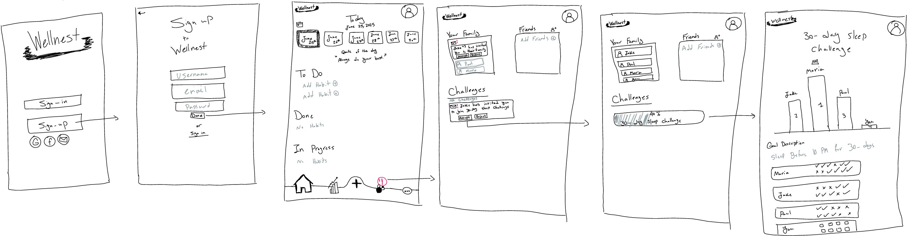
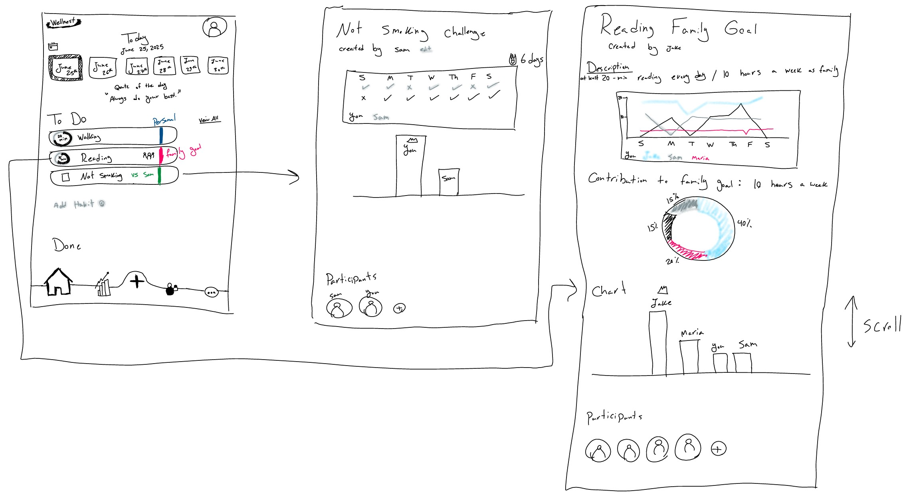

# SW Engineering CSC648-848-03 Summer 2025

## &#x20; <mark style="background-color:purple;">WELLNEST</mark> &#x20;

## <mark style="background-color:blue;">Team 03</mark> &#x20;

**Technical Writer:** Jacob Cordano - [jcordano1@sfsu.edu](mailto:jcordano1@sfsu.edu)

**Scrum Master:** Hamed Emari

**Frontend Lead:** Jacob Vuong

**Backend lead:** Shivani Bokka

**GitHub Master and Database Lead:** Kevin Hu

**Software Architect:** Diego Antunez

## <mark style="color:blue;">Version History</mark>

| Milestone   | Version   | Date    |
| ----------- | --------- | ------- |
| Milestone 2 | Version 1 | 6/30/25 |
| Milestone 1 | Version 2 | 6/30/25 |
| Milestone 1 | Version 1 | 6/16/25 |

## <mark style="color:blue;">Table of Contents:</mark>

<table><thead><tr><th width="638">Content</th></tr></thead>
<tbody><tr><td><a href="./#executive-summary">Executive Summary</a></td></tr>
<tr><td><a href="./#use-cases">Use Cases</a></td></tr>
<tr><td><a href="./#actors">Actors</a></td></tr>
<tr><td><a href="./#use-cases-1">Cases</a></td></tr>
<tr><td><a href="./#main-data-items-and-entities">Main Data Items and Entities</a></td></tr>
<tr><td><a href="./#non-functional-requirements">Functional Requirements</a></td></tr>
<tr><td><a href="./#non-functional-requirements">Non-functional Requirements</a></td></tr>
<tr><td><a href="./#mockups">Mockups</a></td></tr>
<tr><td><a href="./#high-level-system-design">High-Level System Design</a></td></tr>
<tr><td><a href="./#competitive-analysis">Competitive Analysis</a></td></tr>
<tr><td><a href="./#technology-specifications">Technology Specifications</a></td></tr>
<tr><td><a href="./#checklist">Checklist</a></td></tr>
<tr><td><a href="./#list-of-team-contributions">List of Team Contributions</a></td></tr></tbody></table>

## <mark style="color:blue;">Executive Summary</mark>

In today's society, where sedentary lifestyles and inconsistent routines increasingly compromise every individual’s physical and mental health, there’s a need for a solution to combat this. This is where our product would come into play: Wellnest, a socially driven mobile application that assists users in monitoring healthy habits and setting and achieving personal wellness goals, resulting in a more balanced life.

Our product, Wellnest, offers a complete hub in which users can track their healthy habits. Unlike other apps in the market that mainly focus on more narrow metrics like steps and calories, Wellnest enables users to log and manage a wide range of their habits. Some examples of the features would be to track food and water intake, weekly sleep patterns, physical activity, and more specific habits like smoking and alcohol intake. The app will essentially take all this data and generate a personalized dashboard catering to the individual user to monitor the trends and track their progress over time.

A key feature that Wellnest offers is its “Wellness Circle”, enabling users to connect with friends and family within a competitive environment to the health challenges. These challenges would consist of hydration goals, daily steps, sleeping habits, etc. This social component will transform health tracking into a more engaging environment shared with other users, creating an incentive to stick to a routine to stay ahead.

On top of the manual tracking feature available, Wellnest will utilize AI-powered insights and behavioral nudges to remind users to stay on track. Essentially, Wellnest will include smart reminders, adaptive suggestions, and milestone celebrations to make the app feel less like a tracker, but a personal digital trainer. This is designed to maintain engagement and to consistently encourage long-term behavioral change.

With the user’s personal experience in mind, we aim to build this with scalability to support future architecture and expansions of Wellnest. From integration with wearable devices, mood tracking, to mindfulness modules, this would allow us as the developers of the app to understand our users’ experience to decide what features are working and which are not. The app itself also prioritizes data privacy, utilizing secure protocols to ensure the protection of user information not being compromised.

When taking a look from a technical standpoint, our goal is to develop a platform that is not just robust and secure, but rather impactful to each user. We believe that Wellnest fills a critical gap in today’s market by encompassing the idea of an all-in-one health companion. This promotes consistency, self-awareness, and community, which are essentially the key pillars of an ideal healthy lifestyle to incorporate in a user’s day-to-day. By combining aspects of a thoughtful design, smart technology, and a deep understanding of user motivation, Wellnest aims to become more than just an app lost in your app library, but a companion for self-growth.

## <mark style="color:blue;">Use Cases</mark>

### Actors:

#### **Rhea (Graduate Student, 25)**

**Characteristics, Skills, and Pain Points:**

- Balances a packed academic schedule with a part-time job
- Health-conscious but struggles to maintain consistency
- Skips meals and forgets to hydrate during long study sessions.
- Finds existing apps overwhelming or too feature-limited

**Goals:**

- Track daily water intake and meal patterns
- Set small, manageable health goals
- Get timely reminders that do not feel intrusive
- Compete with friends for motivation without social media distractions

#### **Devon (Tech Professional, 32)**

**Characteristics, Skills, and Pain Points:**

- Works long hours in front of a computer
- Suffers from irregular sleep and frequent back pain
- Finds it difficult to stay motivated to work out
- Rarely remembers to log habits manually

**Goals:**

- Automatically track daily steps and exercises
- Set sleep goals and monitor progress
- Receive weekly summaries and personalized suggestions
- Reduce screen time before bed and improve sleep quality

#### **Mary (Homemaker, 45)**

**Characteristics, Skills, and Pain Points:**

- Cares for her family full-time, putting her own wellness last
- Suffers from stress and emotional eating
- Has no time for complicated apps
- Wants to feel supported and not judged

**Goals:**

- Track food intake and emotions around eating
- Get kind, motivating nudges for self-care
- Join community wellness challenges with family or friends
- Learn small habits that improve overall mental and physical health

#### **Arnold (College Athlete, 21)**

**Characteristics, Skills, and Pain Points:**

- Extremely competitive and goal-oriented
- Already tracks workouts but not other habits like sleep and hydration
- Wants deeper insights, not basic graphs
- Easily bored with basic UI/UX

**Goals:**

- Sync data with wearables for better performance tracking
- View detailed analytics and trends
- Compete with friends through app leaderboards
- Track macros and meal balance in addition to workouts

#### **Jenny (Corporate Manager, 39)**

**Characteristics, Skills, and Pain Points:**

- Highly organized and result-driven
- Uses productivity tools but not health apps
- Needs consolidated, intelligent health insights
- Has privacy concerns about personal data

**Goals:**

- Track all wellness metrics in one platform
- Receive professional-level reports and recommendations
- Export data for doctor consultations
- Use the app discreetly during work hours

### Use Cases:

#### **Signing Up and Setting Up Health Goals**

**Actor:** **Rhea (Graduate Student)**

Rhea hears about Wellnest from a friend and decides to give it a try. She downloads the app and selects the “Sign Up” option. She enters her name, email, and password, and agrees to the privacy terms. After account creation, the app prompts her to select focus areas such as hydration, food logging, and sleep improvement. Rhea sets a goal of drinking 2 liters of water daily and sleeping 7 hours per night. She enables smart reminders and selects “gentle” tone for notifications. She’s also invited to join the “30-Day Sleep Reset Challenge” with her classmates.

#### **Logging and Controlling Smoking/Alcohol Habits**

**Actor:** **Devon (Tech Professional)**

Devon is a social drinker and occasional smoker. He wants to cut down both habits and track how often they occur. On Wellnest, he enables the “Habit Control” module and sets reduction goals: no more than 2 alcoholic drinks per week and zero cigarettes.

Each time he smokes or drinks (e.g., beer at happy hour or a cigarette during breaks), he logs it in the app. After two weeks, Wellnest detects that his smoking frequency hasn’t decreased and sends a reflective insight:

**“You’ve exceeded your cigarette goal 3 times. Try shifting your evening habit to chamomile tea or a short walk — want to try the Healthy Evening Swap plan?”**

Devon accepts. The app enables “replacement reminders” and sends encouraging nudges at his usual craving times. After a month, Devon reduces both habits by over 40%.

#### **Identifying Junk Food Patterns and Suggesting Alternatives**

**Actor:** **Mary (Homemaker)**

Mary often snacks on highly processed foods, especially when under stress. She logs her meals honestly — including frozen pizza, potato chips, and fast food like burgers and fries. After 10 days of consistent tracking, Wellnest detects a pattern:

**“50% of your logged meals are categorized as high in sodium or saturated fat. Want healthier 15-minute alternatives for your cravings?”**

Mary clicks _Yes_, and Wellnest recommends recipes like baked sweet potato fries, turkey lettuce wraps, and homemade veggie quesadillas. It also enables a _Smart Substitution Alert_ — when Mary logs a high-calorie snack, it gently suggests a swap with a healthier option.

Over time, Mary starts incorporating small changes that significantly reduce her reliance on junk food, without feeling deprived.

#### **Smart Weekly Insights and Course Correction**

**Actor:** **Jenny (Corporate Manager)**

Jenny uses Wellnest consistently to track sleep, meals, and caffeine intake. On Sunday, the app sends her a Weekly Wellness Snapshot. One week, she notices a flag:

**“Your average sleep dropped to 5.5 hours this week. Caffeine intake after 6 PM was logged 4 times.”**

Wellnest recommends activating a “Caffeine Curfew” plan. Jenny agrees, enabling gentle evening nudges and replacing late-night coffee with herbal tea options. Within two weeks, her average sleep improves to over 7 hours.

#### **Competing in a Wellness Challenge for Motivation**

**Actor:** **Arnold (College Athlete)**

Arnold joins a “No Soda for 7 Days” challenge through the Wellness Circle. The app sends daily motivation tips and lets him track sugary beverage intake. On Day 3, he logs a can of soda. The app responds:

**“No worries! You’re still in the game. Want to offset it with a brisk 20-minute walk?”**

He completes the walk and earns a recovery point. At the end of the challenge, Arnold earns a bronze badge and shares his win with his teammates — helping everyone stay motivated and accountable.

#### **Customizing Notifications and Privacy Settings**

**Actor:** **Rhea (Graduate Student)**

After a few days of using Wellnest, Rhea finds the notifications a bit distracting during class. She opens Settings and customizes her experience:

- Quiet Hours: 9 AM – 2 PM (no notifications during lectures)
- Health summaries: Only at 8 PM
- Privacy mode: On (hides health stats on lock screen)

Wellnest respects her preferences, and her daily experience becomes smoother and more focused.

#### **Syncing with a Wearable Device for Passive Tracking**

**Actor: Arnold (College Athlete)**

Arnold connects his Apple Watch to Wellnest via the app's “Sync Devices” section. With a few taps, his step count, resting heart rate, and sleep hours sync automatically. The app now uses this data to recommend active recovery days and hydration tips post-workout. He no longer needs to log anything manually — just focuses on staying consistent.

#### **Previewing Mood Tracking and Emotional Wellness Insights**

**Actor:** **Mary (Homemaker)**

Mary enables the beta “Mood & Energy Tracker” feature. Every evening, she receives a question: _“How was your day?”_ with mood emojis and a short text box. One night she logs: _“Felt low — kids were sick, grabbed drive-thru on the way home.”_

After a week, the app notes: **“Lower moods are consistently logged on days with less than 6 hours of sleep and fast food meals. Try prepping easy grab-and-go options like a turkey sandwich or fruit parfait.”**

Mary appreciates the insight and begins following a “Simple Meals for Busy Days” plan recommended by Wellnest, making small but meaningful shifts toward emotional and physical balance.

## <mark style="color:blue;">Main Data Items and Entities:</mark>

Users: Users are the people who will use Wellnest in order to track their habits and build new and healthier habits. They will be allowed full access to the app, meaning, they can create new habits, view the calendar, add friends, compete, add family members, delete habits, and delete their account if they wish to.

Profile: Each user has their own profile, they can change their visible and hidden information, they can access the setting and dashboard through their profile.

Habits: These are desirable tasks which the user wants to integrate in their daily life and routine, Habits have a date, time, and duration, they can be set to be repeated and can be shared with friends and family. Habits will be shown as missed if the user does not indicate they have accomplished the task.

Task: Task and habit will be used interchangeably

Family: A group of users who create a Family, will be able to share common habits and goals, these habits will require all the family members participation and if one misses a habit it will be shown as missed for all members.

Family-head: Is the administrator and creator of the family, they have the power to change add and remove habits and family members.

Friends: Two users who are friends, can share common goals and habits, and compete in completing their desired habits.

Streak: When a habit is completed continuously without being missed for 3 days a streak will be created where it shows the days the user has spent without missing a certain task.

Calendar: The calendar shows an overview of all the tasks ahead, and reminds of the upcoming habits.

Dashboard: The dashboard shows the users accomplishments, and a graph of the users past activities.

## <mark style="color:blue;">Functional Requirements</mark>

Registered Users

1. Users shall be able to create and register an account
2. Users shall be able to edit their profile information
3. Users shall be able to delete their accounts
4. Users shall be able to track their progress
5. Users shall be able to navigate app without complication
6. Users shall be able to create a profile picture
7. Users shall be guided through helpful onboarding

User Personal Survey

8. Users shall be asked onboard questions for curated habit suggestions
9. Users shall be able to skip survey

Personal Health Tracker

10. Users shall track number of consecutive workout sessions
11. Users shall be able to monitor indications of completed workout
12. User shall monitor of indication of missed workout
13. Users shall be able to view calorie goals met
14. Users shall be able to see calorie loss goals

Habit Tracking

15. Users shall be able to add habits
16. Users shall be able to delete habits
17. Users shall be able to modify habits
18. Users shall be able to name habits
19. Users shall be able to track pre-defined habits
20. Users shall be able to track custom habits
21. Users shall be able to view suggested habits to track

Calendar

22. Users shall be able to view their weekly progress
23. Users shall be able to change the time of their habit
24. Users shall be able to change the duration of the habit
25. User shall be able to filter calendar view by type (habits, moods, journal, challenges).
26. Users shall be able to view monthly progress

Notifications

27. Users shall receive reminders to continue habits not logged
28. Users shall receive notification of friend activity
29. User shall receive notification of suggested habits
30. Users shall receive notification of habit to log each day

Settings

31. Users shall be able to turn off notifications
32. Users shall be able to change their information
33. Users shall be able to delete their account
34. Users shall be able to modify privacy settings for profile viewership
35. Users shall be able to customize habits viewable by others
36. Users shall be able to block other users
37. Users shall have Wellnest contact email and socials

For Family Leaders:

38. Users shall be able to create a group and invite family members.
39. Users shall be able to set a challenge (steps, water intake, sleep).
40. Users shall be able to view group leaderboard and stats.
41. Users shall be able to Send encouragement to family chat.

For Friends:

42. Users shall be able to create challenges.
43. Users shall be able to view leaderboard
44. Users shall be able to nudge friend.
45. Users shall be able to view individual friends habits
46. Users shall be able to have joint habit tracking

Leaderboards and Progress

47. Users shall be able to track their progression
48. Users shall be able to compete with other users through a leaderboard
49. Users shall gain points based off of their progress
50. User shall be able to have tiered awards
51. Users shall be able to share completed goals to social media

## <mark style="color:blue;">Non-functional Requirements</mark>

#### System Requirements

1. The System shall be hosted on Amazon Web Services EC2
2. A MySQL database shall be created and hosted on AWS EC2
3. Djangox4 shall be used as the backend framework
4. Vanilla JS and CSS shall be used for the frontend
5. The frontend service shall run on port 3000
6. The backend service shall run on port 8000
7. Ubuntu Shall be used as Operating System on AWS
8. A secure HTTPS website certificate is to be installed

#### Storage and Security Requirements

1. User information and Password shall be encrypted
2. Each user can only have one account created with their email
3. Each user shall be able to login from any device and access their information
4. If applied users shall be informed of their storage limitations

#### Content Requirements

1. The list of user family and friends shall be saved and updated with every login
2. The list of the user’s habits shall be updated with every login
3. The Calendar shall be updated with every login
4. The user Streak shall be saved kept track of automatically
5. The user’s information shall be deleted automatically upon account deletion

## <mark style="color:blue;">Mockups</mark>

## <mark style="color:blue;">High-Level System Design</mark>

### <mark style="color:blue;">Database Architecture</mark>

### <mark style="color:blue;">Backend Architecture</mark>

## <mark style="color:blue;">Competitive Analysis</mark>

<figure><figcaption></figcaption></figure>

With the above table, it becomes evident that while most competing health apps offer selective features like food logging, sleep tracking, or wearable syncing, they often operate in silos and lack a unified, user-centric approach. Additionally, several apps place essential features like habit insights or social engagement behind premium subscriptions, limiting accessibility for many users. Wellnest fills this gap by offering a holistic platform that combines core habit tracking (food, sleep, hydration, exercise) with often-overlooked aspects like mood logging and smoking/alcohol control. What sets Wellnest apart is its use of AI to provide personalized nudges, adaptive suggestions, and wellness insights — all without overwhelming the user. The inclusion of a "Wellness Circle" introduces a community-driven model where users can challenge, support, and grow with one another. Moreover, while full wearable integration is on the roadmap, Wellnest ensures that users can gain value even without external devices, making it both inclusive and scalable. In essence, Wellnest isn't just another health tracker — it is a smart, supportive companion that promotes sustainable lifestyle change through personalization, empathy, and social accountability. These differentiators position Wellnest uniquely in a crowded market and make it a promising alternative to traditional wellness apps.

## <mark style="color:blue;">Checklist</mark>

- The team has found a time slot to meet outside of class. **DONE**
- GitHub Master has been chosen. **DONE**
- The team has collectively decided on and agreed to use the listed software tools and deployment server. **DONE**
- The team is ready to use the chosen front-end and back-end frameworks, and those who need to learn are actively working on it. **DONE**
- The Team Lead has ensured that all members have read and understand the final M1 before submission. **DONE**
- GitHub is organized as discussed in class (e.g., master branch, development branch, folder for milestone documents, etc.). **DONE**

## <mark style="color:blue;">Technology Specifications</mark>

- **Server:** AWS EC2 (t2.micro free tier)
- **Operating System:** Ubuntu 24.04
- **Database:** MySQL 8.0.42
- **App/WSGI server:** Gunicorn 23
- **HTTP server:** Nginx 1.24
- **Backend Language:** Python 3.12.3
- **Frontend Language:** HTML/CSS/JavaScript
- Additional Tech:
- **Frontend Framework:** Vanilla html, javascript, css
- **Backend Framework:** Django 5.2.3
- **IDE:** Visual Studio Code, MySQL Workbench
- **SSL Cert**: Lets Encrypt (Cert Bot)
- **Docker:** Docker 28.2.2

## <mark style="color:blue;">List of Team Contributions</mark>

<mark style="color:blue;">Hame Emari (Team Lead, Scrum Master)</mark>

- Worked on Functional Requirements
- Worked on the List of Main Data
- Worked on List Non-functional Requirements
- Worked on the website HTML&#x20;
- GitHub, and Gitbook editor

<mark style="color:blue;">Jacob Cordano (Technical Writer)</mark>

- Worked on AWS Cloud Server
- Configured ssh key
- Installed the MySQL Database
- Worked on website HTML and GitHub
- Worked on Functional Requirements
- Worked on High-level System Architecture and tech

<mark style="color:blue;">Jacob Vuong (Front-end Lead)</mark>

- Worked on AWS Cloud Server
- Worked as the Front-end webmaster
- Worked on website HTML and GitHub
- Worked on Functional Requirements
- Worked on High-level System Architecture and tech

<mark style="color:blue;">Shivani Bokka (Back-end Lead)</mark>

- Worked on the Executive Summary
- Worked on Use Cases
- Worked on Actors
- Worked on Competitive Analysis
- Worked on website HTML

<mark style="color:blue;">Diego Antunez</mark> <mark style="color:blue;">(Software Architect)</mark>

- Worked on Competitive Analysis
- Worked on Use Cases and Actors
- Worked on website HTML

<mark style="color:blue;">Kevin Hu (Database Lead)</mark>

- Worked on Functional Requirements
- Worked on website HTML

# SW Engineering CSC648-848-03 Summer 2025

## &#x20;<mark style="background-color:purple;">WELLNEST</mark> &#x20;

## <mark style="background-color:blue;">Team 03</mark>&#x20;

**Team Lead & Technical Writer:** Jacob Cordano - [jcordano1@sfsu.edu](mailto:jcordano1@sfsu.edu)

**Scrum Master:** Hamed Emari

**Frontend Lead:** Jacob Vuong

**Backend lead:** Shivani Bokka

**GitHub Master and Database Lead:** Kevin Hu

**Software Architect:** Diego Antunez

## <mark style="color:blue;">Version History</mark>

| Milestone   | Version   | Date    |
| ----------- | --------- | ------- |
| Milestone 2 | Version 1 | 7/3/25  |
| Milestone 1 | Version 2 | 6/30/25 |
| Milestone 1 | Version 1 | 6/16/25 |

## <mark style="color:blue;">Table of Contents:</mark>

<table><thead><tr><th width="638">Content</th></tr></thead>

<tr><td><a href="./#Data-Definition">Data Definition</a></td></tr>
<tr><td><a href="./#Prioritized-High-Level-Functional-Requirements">Prioritized High-Level Functional Requirements</a></td></tr>
<tr><td><a href="./#UI-Mockup-and-Storyboards">UI Mockup and Storyboards</a></td></tr>
<tr><td><a href="./#high-level-system-design">High-Level System Design</a></td></tr>
<tr><td><a href="./#current-key-risks">Current Key Risks</a></td></tr>
<tr><td><a href="./#project-management">Project management</a></td></tr>
<tr><td><a href="./#list-of-team-controbutions">List of Team Contributions</a></td></tr>
</tbody></table>

## <mark style="color:blue;">Data Definition</mark>

**User**

- ID will be an integer which will auto increase. Is used to maintain relationships with other entities
- Name will be a varchar which will contain a maximum of 100 characters and cannot be null. It will contain the user’s full name.
- Email will be a varchar which will contain a maximum of 100 characters and cannot be null. It will be used for things like logging in.
- Encrypted password will be a varchar which will contain a maximum of 255 characters and cannot be null. It will be used for things such as logging in.
- Created at will be a timestamp which cannot be null. It will be used to see when the user’s account was created

**Health Metrics**

- ID will be an integer which will auto increase. Is used to maintain relationships with other entities
- weight_kg will be a decimal which will contain a maximum of 5 digits and will have 2 decimal spaces. It will be used to calculate things such as the user’s bmi.
- bmi will be a decimal which will contain a maximum of 4 digits and will have 2 decimal spaces.
- user_id will be a bigint which cannot be null. It will make sure the health metrics connect to a specific user.
- height_cm will be a decimal which will contain a maximum of 6 digits and will have 2 decimal spaces. It will be used to calculate things such as the user’s bmi.
- age_years will be an int ranging through 13\*100. It will be used to verify a user’s minimum age before registration
- body_fat_percentage will be a decimal which will contain a maximum of 5 digits and will have 2 decimal spaces.
- muscle_mass_percentage will be a decimal which will contain a maximum of 5 digits and will have 2 decimal spaces.
- timestamp will be a timestamp and will be used for things such as progress reports

**Notification**

- ID will be an integer which will auto increase. Is used to maintain relationships with other entities
- user_id will be a bigint which cannot be null. It will make sure the notifications connect to a specific user.
- area_type which will be an enum.
- sent_at which will be a timestamp. Will be used to track when a notification is sent
- status which will be a boolean. Will be used to track if a notification was successfully sent or not

**Calendar Entry**

- ID will be an integer which will auto increase. Is used to maintain relationships with other entities
- user_id will be a bigint which cannot be null. It will make sure the calendar entries connect to a specific user.
- date which will be a date.
- entry_type which will be an enum. It will be used to specify the type of calendar entry
- ref_id

**Group Participation**

- ID will be an integer which will auto increase. Is used to maintain relationships with other entities
- user_id will be a bigint which cannot be null. It will make sure the group participation entries connect to a specific user.
- joined_at which will be a timestamp. It will be used to track when a user participates
- group_id which will be an int. It will connect with a certain group
- challenge_completed which will be a boolean. It will track if a group completes an activity

**Group**

- ID will be an integer which will auto increase. Is used to maintain relationships with other entities
- name which will be a varchar with a maximum of 100 characters. It will be used so users can see the group name
- start_date will be a date. It will be used so users can see when they created the date
- description will be a text. It will be used so users can see what the group does
- end_date which will be a date

**Group Challenge**

- ID will be an integer which will auto increase. Is used to maintain relationships with other entities
- goal_value will be an
- group_id which will be an int. It will connect with a certain group
- goal_type which will be an enum. It will be used so users can select which type of challenge they want to create
- goal_description will be a text. It will be used so other users can see what the challenge is

**Leaderboard**

- ID will be an integer which will auto increase. Is used to maintain relationships with other entities
- group_id which will be an int. It will connect with a certain group
- last_updated which will be a timestamp. It will be used so users can check when it was last updated
- score which will be an int. It will be used so we can organize the leaderboard
- user_id which will be id to connect to a user

**Habit**

- ID will be an integer which will auto increase. Is used to maintain relationships with other entities
- user_id which will be id to connect to a user
- name which will be a varchar containing a maximum of 100 characters. It will be used to identify a habit
- is_predefined which will be a boolean

**Habit Log**

- ID will be an integer which will auto increase. Is used to maintain relationships with other entities
- user_id which will be id to connect to a user
- habit_id which will be id to connect to a habit
- timestamp will be a timestamp
- recorded_value which will be a varchar containing a maximum of 100 characters

**Workout Log**

- ID will be an integer which will auto increase. Is used to maintain relationships with other entities
- user_id which will be id to connect to a user
- workout_type which will be an enum. It will be used to select a type of workout
- timestamp will be a timestamp
- duration_minutes which will be an int. It will be used to see how long a user worked out for
- calories_burned which will be an int. It will be used to track a users calories burned

**Sleep Log**

- ID will be an integer which will auto increase. Is used to maintain relationships with other entities
- user_id which will be id to connect to a user
- sleep_start which will be a timestamp. It will be used to calculate how much time the user has slept for
- sleep_end which will be a timestamp. It will be used to calculate how much time the user has slept for
- duration_hours which will be a decimal containing a maximum of 4 digits and will have 2 decimal values

**Food Intake**

- ID will be an integer which will auto increase. Is used to maintain relationships with other entities
- user_id which will be id to connect to a user
- calories which will be an int. It will track how many calories was consumed by the user
- number_of_servings which will be an int. It will be used to calculate how many calories were consumed
- timestamp will be a timestamp
- meal_type which will be an enum. It will track when the user ate their meal
- food_name will be a varchar containing a maximum of 100 characters. It will be used so the user can see what type of food it was

**Water Intake**

- ID will be an integer which will auto increase. Is used to maintain relationships with other entities
- user_id which will be id to connect to a user
- amount_ml which will be an int. It will be used to track how much water a user has drank
- timestamp will be a timestamp

## <mark style="color:blue;">Prioritized High-Level Functional Requirements</mark>

**Priority 1**

**Registered Users**

1. Users shall be able to create and register an account
1. Users shall be able to edit their profile information
1. Users shall be able to delete their accounts
1. Users shall be able to track their progress
1. Users shall be able to navigate the app without complication

**User Personal Survey**

1. Users shall be asked onboard questions for curated habit suggestions
1. Users shall be able to skip survey

**Personal Health Tracker**

1. Users shall track number of consecutive habit sessions
1. Users shall be able to monitor indications of completed habits
1. User shall have an indication of missed habits
1. Users shall be able to remove suggested habits by the app

**Habit Tracking**

1. Users shall be able to add habits
1. Users shall be able to delete habits
1. Users shall be able to modify habits
1. Users shall be able to name habits
1. Users shall be able to track pre-defined habits
1. Users shall be able to view suggested habits to track

**Calendar**

1. Users shall be able to view their weekly progress
1. Users shall be able to change the time of their habit
1. Users shall be able to change the duration of the habit

**Notifications**

1. Users shall receive notifications through the app

**Settings**

1. Users shall be able to turn off notifications
1. Users shall be able to change their information
1. Users shall be able to delete their account

**For Family Leaders**

1. Users shall be able to create a group and invite family members.
1. Users shall be able to set a challenge (steps, water intake, sleep).
1. Users shall be able to view group leaderboard and stats.
1. Users shall be able to add family members
1. Users shall be able to Kick family members
1. Users shall be able to name their family/habit circle
1. Users shall be able to change the name of their habit circle
1. Users shall be able to delete the family circle

**For Friends**

1. Users shall be able to create challenges.
1. Users shall be able to view leaderboard
1. Users shall be able to view individual friends habits
1. Users shall be able to add friends
1. Users shall be able to delete friends
1. Users shall be able to change their shared habits if they are the owner of the habit

**Leaderboards and Progress**

1. Users shall be able to track their progression
1. Users shall be able to compete with other users through a leaderboard
1. Users shall gain points based off of their progress
1. User shall be able to have tiered awards

**Priority 2**

**Registered Users**

1. Users shall be able to create a profile picture
1. Users shall be guided through helpful onboarding

**User Personal Survey**

1. Users shall be able to skip individual questions

**Personal Health Tracker**

1. Users shall be able to journal their thoughts on each habit session

**Habit Tracking**

1. Users shall be able to track custom habits

**Calendar**

1. User shall be able to filter calendar view by type (habits, moods, journal, challenges).
1. Users shall be able to view monthly progress

**Settings**

1. Users shall be able to customize habits viewable by others
1. Users shall be able to block other users

**For Family Leaders**

1. Users shall be able to Send encouragement to family chat.
1. Users shall be able to change their family habit

**For Friends**

1. Users shall be able to have joint habit tracking
1. Users shall be able to see suggested friends on the app

**Priority 3**

**Registered Users**

1. Users shall be able to log in with their social profiles
1. Users shall be able to connect their AI assistance to the app
1. Users shall be able to connect to the app from multiple devices
1. Users shall be able to share the app with their App Store family

**User Personal Survey**

1. Users shall be able to rate the survey
1. Users shall be able to report the survey

**Personal Health Tracker**

1. Users shall be able to view calorie goals met
1. Users shall be able to see calorie loss goals
1. Users shall be able to ask the AI assistant to suggest better habits
1. Users shall be able to copy family goals to their own personal archive

**Habit Tracking**

1. Users shall be able to add AI-suggested habits

**Calendar**

1. Users shall be able to filter calendar view by month week year
1. Users shall be able to connect their calendar to their google calendar
1. Users shall be able to share their Wellnest Calendar with Google Calendar users
1. Users shall change their Calendar System (Gregorian, Indian, Islamic, Chinese)

**Notification**

1. Users shall receive reminders to continue habits not logged
1. Users shall receive notification of friend activity
1. User shall receive notification of suggested habits
1. Users shall receive a notification of habit to log each day
1. Users shall receive notifications through email

**Settings**

1. Users shall be able to modify privacy settings for profile viewership
1. Users shall have Wellnest contact email and socials
1. Users shall be able to change the language
1. Users shall be able to change accessibility functionalities
1. Users shall be able to change the Font and Color
1. Users shall be able to change between Light and Dark mode
1. Users shall be able to change the time and calendar
1. Users shall be able to change their account
1. Users shall be able to connect their account to playstore
1. Users shall be able to connect their account to appstore

**For Family Leaders**

1. Users shall be able to create more than one challenge
1. Users shall be able to share their family link on other apps

**For Friends**

1. Users shall be able to nudge friend.
1. Users shall be able to see suggested friends from their contacts
1. Users shall be able to see suggested friends from their Google or social accounts

**Leaderboard and Progress**

1. Users shall be able to share completed goals to social media
1. Users shall be able to see AI analysis of their progress
1. Users shall be able to remove themselves from leaderboards and competing
1. Users shall be able to change the view of the leader board (Histogram, pie chart, etc)

## <mark style="color:blue;">UI Mockup and Storyboards</mark>

### Rhea Sign-up Scenario

Reah Sign-ins to the Wellnest app after inputting her Username, Email, and Password. In the Main page she sees a calendar, an inspirational quote, and a text from the app welcoming her. She has not created any pre-existing nor custom habits, but she has a notification from a friend who suggested the app to her. She clicks on the notification and navigates to the socials page. She has not added any friends but she can join a wellness circle managed by Jake. After accepting the challenge, she navigates to the challenge page and sees the progress everyone has made towards the challenge, her standing on the leaderboard, and the participants of the challenge in her Wellness circle.

### Creating Habits Scenario

Devon uses the Wellnest app every day. Today, he opened the app and sees that he has 3 habits left to do today: Walking, Reading, and Not Smoking. He wishes to add another custom habit / task. He clicks on the add habit button in the nav bar or under the To Do list and an overlay opens for him to customize a new task. He can choose the task name, description, time, duration, etc. After he is done he will click the Done button, and the overlay will close.

### Habits / Challenges types and pages

Mary opens the Wellnest app and sees three different kinds of tasks/ habits that Wellnest offers:

1. Personal habits that are pre-existing or she has customly created for herself.
1. Group habits that have been created by other people and she has joined.
1. Friendly challenges that only she and her friend are a part of.

She clicks on one of the challenges and navigates to the page of that challenge, viewing the information, statistics, and leaderboard of the challenge.

## <mark style="color:blue;">High-Level System Design</mark>

### <mark style="color:blue;">Database Architecture</mark>

Our app’s backend database is designed to support both individual health tracking and group-based wellness challenges. Users can log daily health activities like water intake, food intake, sleep, workouts, and habits. In addition, users can monitor health metrics such as weight, BMI, body fat percentage, muscle mass, height, and age.
While group challenges are available, users are not required to join a group to use the app. The system also tracks progress streaks. The structure emphasizes clean data organization, time-based tracking, and performance.

**DBMS Selection**
We selected MySQL, hosted on AWS EC2, as our backend database. MySQL integrates well with our Django framework and supports relational models, foreign keys, and indexing — all of which are critical for managing user-specific logs and group tracking in a scalablity, and reliability.

- A User can log multiple entries across all tracking tables
- A User can join multiple Groups
- Each Group has one GroupChallenge
- GroupParticipation logs each user's membership and completion status
- Leaderboard tracks performance by group and user
- HabitLog is used to record numerical data related to habits (e.g., “drank 2 cups of coffee”)

**Media Storage**
The application does not support any media uploads. All data is purely structured (text and numeric), making the system easier to scale and manage. This choice also improves performance by eliminating the need to handle binary files or external storage systems.

### <mark style="color:blue;">Backend Architecture</mark>

**Architecture Summary**

Our system is built using a microservices architecture, with separate services for handling user data and group management. These services interact with a shared MySQL database. We plan to deploy them on an AWS EC2 instance Apache 2 server, using Jenkins for continuous integration and deployment.
We might also use containers (Docker) to package and run our microservices, which would make it easier to scale them in the future and ensure consistent environments across development and production.
From a security standpoint, we will ensure that all data exchanged between components is encrypted using HTTPS, and sensitive user data (like passwords) is stored securely using hashing and encryption mechanisms in the database.

### UML Diagram

**placeholder for descriptions 6.2**

### Application Network and Deployment Design

**placeholder for 6.3**

### High Level APIs and Main Algorithms

For this project, we will implement a set of APIs split across microservices (User Service, Group Service). These APIs will manage user data, group participation, logging various health-related data, and provides personalized evaluation report to users.

**User Service APIs**

- Manage user profiles (creation, deletion, update)
- Record health metrics (BMI, muscle mass, body fat, etc.)
- Log water intake, food intake, sleep, and workout sessions
- Retrieve personalized user summaries based on recent activity and trends

**Group Service APIs**

- Create and manage groups
- Allow users to join or leave groups
- Track group challenge participation and completion status
- Maintain leaderboards showing group rankings

**Main Algorithms**

**Personalized Evaluation Report Page**

- A user-friendly page in the app where users can view a summary of their health metrics, logs, and progress. This page allows users to check both hourly logs and a daily summary in one place. The system does not continuously evaluate data or push updates; instead, users can visit the page anytime to view their personalized information.

## <mark style="color:blue;">Current Key Risks</mark>

### Skills

**Risks**

- Varying skills and technical backgrounds

**Proposed Solution:**

- Choosing tasks and work carefully, working closely with the task lead

### Schedule

**Risks**

- Time constraints during the summer semester
- Team members being unable to join meetings

**Proposed Solution**

- Checking the Tracker regularly
- Watching meeting recordings

### Technical

**Risks**

- Most members lack experience working with Python
- Most members lack experience working with SQL
- All members lack experience working with cloud services

**Proposed Solution**

- Members should watch videos and learn on their own time
- Members should team up with more experienced task leads
- Communicating with team if they don’t feel confident about completing a task

### Teamwork

**Risks**

- First time for many members working on an Agile project
- Time conflict for members working on the same task

**Proposed Solution**

- Checking the Tracker regularly
- Communicating with the team

### Legal/Content

**Risks**

- Using copyrighted artwork
- Using copyrighted elements
- Using copied code

**Proposed Solution**

- Using Loyalty Free elements
- Creating original artwork
- Regular quality control

## <mark style="color:blue;">Project Management</mark>

Our Project has 3 simultaneous tracks, Back-end, Front-end, Database System, that are managed by developer leads corresponding to those tracks. The team lead assigns tasks according to each person’s desired skill set and strengths, and team members are allowed to request a change in task if they don’t feel confident about completing a task. Deadlines are set realistically, and the team lead checks in with members regularly to make sure quality standards are met, the project is on track, and members have unconditional support from the team. The members will push their work to the development branch, and the team lead will push to the main branch after revising and quality checking. Microsoft Excel is used as the main tracker for our WellNest project. Members can find their tasks, resources, task descriptions, and due dates on the tracker. Members can report their task percentage completed on the tracker, so other members working on related and simultaneous tasks know when the handover will happen. Meeting scheduling takes place on Discord along with all team communication. If a member fails to join a meeting, a recording of the meeting will be posted on Discord, and their tasks will be posted on the tracker. Members working together on a task should set their own deadlines, and push their completed work to the GitHub repo before its due date. All major decisions will be made in consultation with the entire team and finalized based on majority agreement.

## <mark style="color:blue;">List of Team Contributions</mark>

<mark style="color:blue;">Jacob Cordano (Team Lead, Technical Writer)</mark> 10/10

- Organized file structure
- Removed header table in technical documentation
- List of contributions
- Moved M1V1 to M1 folder
- Organized and scheduled meetings
- Created project tracker todo list
- Created M2 document
- Revised, edited, and formatted M2
- M2 Table of contents
- Contributions list
- Imported and formated team documents to technical documentation
- Recongifured Nginx for site hosting
- Created cloud drive for team document hosting

<mark style="color:blue;">Hame Emari (Scrum Master)</mark> 10/10

- Revised functional requirements
- Added non functional reqirements and priorities
- Project management description
- Designed Mockups
- Calculated team/project risks
- CSS/HTML/Javascript for home page, signup, and friends and family page

<mark style="color:blue;">Jacob Vuong (Front-end Lead)</mark> 10/10

- Mockup Design
- Search Bar
- Rating feature
- Home page
- Implement data definitions

<mark style="color:blue;">Shivani Bokka (Back-end Lead)</mark> 9/10

- Back end algorithms
- Database architecture and microservices layout
- ERD Diagram
- Microservices and Scalability Diagram
- UML Diagram
- High-level API structure

<mark style="color:blue;">Diego Antunez (Software Architecitect)</mark> <mark style="color:blue;"></mark> 8/10

- Network and Deployment Diagrams
- Application Networks Diagram
- Deployment Diagram

<mark style="color:blue;">Kevin Hu (Database Lead, Github Master)</mark> 8/10

- Created Data Definitions
- User Table In SQL
- DBMS Selection
