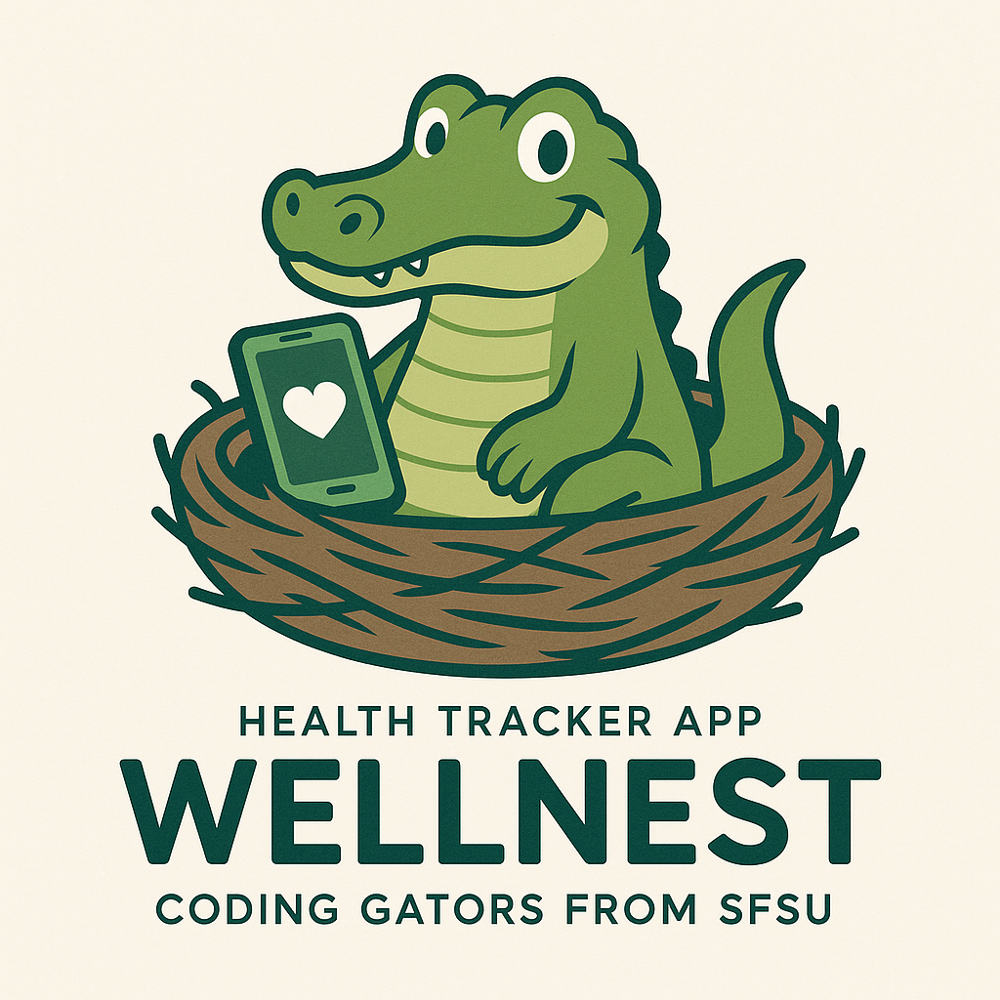
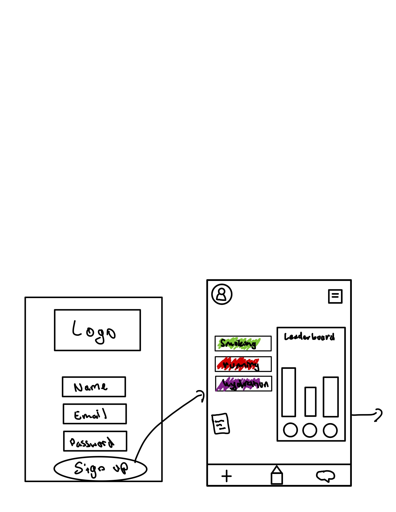

# SW Engineering CSC648-848-03 Summer 2025

## &#x20;<mark style="background-color:purple;">WELLNEST</mark> &#x20;

## <mark style="background-color:blue;">Team 03</mark>&#x20;

**Team Lead & Technical Writer:** Jacob Cordano - [jcordano1@sfsu.edu](mailto:jcordano1@sfsu.edu)

**Scrum Master:** Hamed Emari

**Frontend Lead:** Jacob Vuong

**Backend lead:** Shivani Bokka

**GitHub Master and Database Lead:** Kevin Hu

**Software Architect:** Diego Antunez

## <mark style="color:blue;">Version History</mark>

| Milestone   | Version   | Date    |
| ----------- | --------- | ------- |
| Milestone 2 | Version 1 | 7/3/25  |
| Milestone 1 | Version 2 | 6/30/25 |
| Milestone 1 | Version 1 | 6/16/25 |

## <mark style="color:blue;">Table of Contents:</mark>

<table><thead><tr><th width="638">Content</th></tr></thead>

<tr><td><a href="./#Data-Definition">Data Definition</a></td></tr>
<tr><td><a href="./#Prioritized-High-Level-Functional-Requirements">Prioritized High-Level Functional Requirements</a></td></tr>
<tr><td><a href="./#UI-Mockup-and-Storyboards">UI Mockup and Storyboards</a></td></tr>
<tr><td><a href="./#high-level-system-design">High-Level System Design</a></td></tr>
<tr><td><a href="./#current-key-risks">Current Key Risks</a></td></tr>
<tr><td><a href="./#project-management">Project management</a></td></tr>
<tr><td><a href="./#list-of-team-controbutions">List of Team Contributions</a></td></tr>
</tbody></table>

## <mark style="color:blue;">Data Definition</mark>

**User**

- ID will be an integer which will auto increase. Is used to maintain relationships with other entities
- Name will be a varchar which will contain a maximum of 100 characters and cannot be null. It will contain the user’s full name.
- Email will be a varchar which will contain a maximum of 100 characters and cannot be null. It will be used for things like logging in.
- Encrypted password will be a varchar which will contain a maximum of 255 characters and cannot be null. It will be used for things such as logging in.
- Created at will be a timestamp which cannot be null. It will be used to see when the user’s account was created

**Health Metrics**

- ID will be an integer which will auto increase. Is used to maintain relationships with other entities
- weight_kg will be a decimal which will contain a maximum of 5 digits and will have 2 decimal spaces. It will be used to calculate things such as the user’s bmi.
- bmi will be a decimal which will contain a maximum of 4 digits and will have 2 decimal spaces.
- user_id will be a bigint which cannot be null. It will make sure the health metrics connect to a specific user.
- height_cm will be a decimal which will contain a maximum of 6 digits and will have 2 decimal spaces. It will be used to calculate things such as the user’s bmi.
- age_years will be an int ranging through 13\*100. It will be used to verify a user’s minimum age before registration
- body_fat_percentage will be a decimal which will contain a maximum of 5 digits and will have 2 decimal spaces.
- muscle_mass_percentage will be a decimal which will contain a maximum of 5 digits and will have 2 decimal spaces.
- timestamp will be a timestamp and will be used for things such as progress reports

**Notification**

- ID will be an integer which will auto increase. Is used to maintain relationships with other entities
- user_id will be a bigint which cannot be null. It will make sure the notifications connect to a specific user.
- area_type which will be an enum.
- sent_at which will be a timestamp. Will be used to track when a notification is sent
- status which will be a boolean. Will be used to track if a notification was successfully sent or not

**Calendar Entry**

- ID will be an integer which will auto increase. Is used to maintain relationships with other entities
- user_id will be a bigint which cannot be null. It will make sure the calendar entries connect to a specific user.
- date which will be a date.
- entry_type which will be an enum. It will be used to specify the type of calendar entry
- ref_id

**Group Participation**

- ID will be an integer which will auto increase. Is used to maintain relationships with other entities
- user_id will be a bigint which cannot be null. It will make sure the group participation entries connect to a specific user.
- joined_at which will be a timestamp. It will be used to track when a user participates
- group_id which will be an int. It will connect with a certain group
- challenge_completed which will be a boolean. It will track if a group completes an activity

**Group**

- ID will be an integer which will auto increase. Is used to maintain relationships with other entities
- name which will be a varchar with a maximum of 100 characters. It will be used so users can see the group name
- start_date will be a date. It will be used so users can see when they created the date
- description will be a text. It will be used so users can see what the group does
- end_date which will be a date

**Group Challenge**

- ID will be an integer which will auto increase. Is used to maintain relationships with other entities
- goal_value will be an
- group_id which will be an int. It will connect with a certain group
- goal_type which will be an enum. It will be used so users can select which type of challenge they want to create
- goal_description will be a text. It will be used so other users can see what the challenge is

**Leaderboard**

- ID will be an integer which will auto increase. Is used to maintain relationships with other entities
- group_id which will be an int. It will connect with a certain group
- last_updated which will be a timestamp. It will be used so users can check when it was last updated
- score which will be an int. It will be used so we can organize the leaderboard
- user_id which will be id to connect to a user

**Habit**

- ID will be an integer which will auto increase. Is used to maintain relationships with other entities
- user_id which will be id to connect to a user
- name which will be a varchar containing a maximum of 100 characters. It will be used to identify a habit
- is_predefined which will be a boolean

**Habit Log**

- ID will be an integer which will auto increase. Is used to maintain relationships with other entities
- user_id which will be id to connect to a user
- habit_id which will be id to connect to a habit
- timestamp will be a timestamp
- recorded_value which will be a varchar containing a maximum of 100 characters

**Workout Log**

- ID will be an integer which will auto increase. Is used to maintain relationships with other entities
- user_id which will be id to connect to a user
- workout_type which will be an enum. It will be used to select a type of workout
- timestamp will be a timestamp
- duration_minutes which will be an int. It will be used to see how long a user worked out for
- calories_burned which will be an int. It will be used to track a users calories burned

**Sleep Log**

- ID will be an integer which will auto increase. Is used to maintain relationships with other entities
- user_id which will be id to connect to a user
- sleep_start which will be a timestamp. It will be used to calculate how much time the user has slept for
- sleep_end which will be a timestamp. It will be used to calculate how much time the user has slept for
- duration_hours which will be a decimal containing a maximum of 4 digits and will have 2 decimal values

**Food Intake**

- ID will be an integer which will auto increase. Is used to maintain relationships with other entities
- user_id which will be id to connect to a user
- calories which will be an int. It will track how many calories was consumed by the user
- number_of_servings which will be an int. It will be used to calculate how many calories were consumed
- timestamp will be a timestamp
- meal_type which will be an enum. It will track when the user ate their meal
- food_name will be a varchar containing a maximum of 100 characters. It will be used so the user can see what type of food it was

**Water Intake**

- ID will be an integer which will auto increase. Is used to maintain relationships with other entities
- user_id which will be id to connect to a user
- amount_ml which will be an int. It will be used to track how much water a user has drank
- timestamp will be a timestamp

## <mark style="color:blue;">Prioritized High-Level Functional Requirements</mark>

**Priority 1**

**Registered Users**

1. Users shall be able to create and register an account
1. Users shall be able to edit their profile information
1. Users shall be able to delete their accounts
1. Users shall be able to track their progress
1. Users shall be able to navigate the app without complication

**User Personal Survey**

1. Users shall be asked onboard questions for curated habit suggestions
1. Users shall be able to skip survey

**Personal Health Tracker**

1. Users shall track number of consecutive habit sessions
1. Users shall be able to monitor indications of completed habits
1. User shall have an indication of missed habits
1. Users shall be able to remove suggested habits by the app

**Habit Tracking**

1. Users shall be able to add habits
1. Users shall be able to delete habits
1. Users shall be able to modify habits
1. Users shall be able to name habits
1. Users shall be able to track pre-defined habits
1. Users shall be able to view suggested habits to track

**Calendar**

1. Users shall be able to view their weekly progress
1. Users shall be able to change the time of their habit
1. Users shall be able to change the duration of the habit

**Notifications**

1. Users shall receive notifications through the app

**Settings**

1. Users shall be able to turn off notifications
1. Users shall be able to change their information
1. Users shall be able to delete their account

**For Family Leaders**

1. Users shall be able to create a group and invite family members.
1. Users shall be able to set a challenge (steps, water intake, sleep).
1. Users shall be able to view group leaderboard and stats.
1. Users shall be able to add family members
1. Users shall be able to Kick family members
1. Users shall be able to name their family/habit circle
1. Users shall be able to change the name of their habit circle
1. Users shall be able to delete the family circle

**For Friends**

1. Users shall be able to create challenges.
1. Users shall be able to view leaderboard
1. Users shall be able to view individual friends habits
1. Users shall be able to add friends
1. Users shall be able to delete friends
1. Users shall be able to change their shared habits if they are the owner of the habit

**Leaderboards and Progress**

1. Users shall be able to track their progression
1. Users shall be able to compete with other users through a leaderboard
1. Users shall gain points based off of their progress
1. User shall be able to have tiered awards

**Priority 2**

**Registered Users**

1. Users shall be able to create a profile picture
1. Users shall be guided through helpful onboarding

**User Personal Survey**

1. Users shall be able to skip individual questions

**Personal Health Tracker**

1. Users shall be able to journal their thoughts on each habit session

**Habit Tracking**

1. Users shall be able to track custom habits

**Calendar**

1. User shall be able to filter calendar view by type (habits, moods, journal, challenges).
1. Users shall be able to view monthly progress

**Settings**

1. Users shall be able to customize habits viewable by others
1. Users shall be able to block other users

**For Family Leaders**

1. Users shall be able to Send encouragement to family chat.
1. Users shall be able to change their family habit

**For Friends**

1. Users shall be able to have joint habit tracking
1. Users shall be able to see suggested friends on the app

**Priority 3**

**Registered Users**

1. Users shall be able to log in with their social profiles
1. Users shall be able to connect their AI assistance to the app
1. Users shall be able to connect to the app from multiple devices
1. Users shall be able to share the app with their App Store family

**User Personal Survey**

1. Users shall be able to rate the survey
1. Users shall be able to report the survey

**Personal Health Tracker**

1. Users shall be able to view calorie goals met
1. Users shall be able to see calorie loss goals
1. Users shall be able to ask the AI assistant to suggest better habits
1. Users shall be able to copy family goals to their own personal archive

**Habit Tracking**

1. Users shall be able to add AI-suggested habits

**Calendar**

1. Users shall be able to filter calendar view by month week year
1. Users shall be able to connect their calendar to their google calendar
1. Users shall be able to share their Wellnest Calendar with Google Calendar users
1. Users shall change their Calendar System (Gregorian, Indian, Islamic, Chinese)

**Notification**

1. Users shall receive reminders to continue habits not logged
1. Users shall receive notification of friend activity
1. User shall receive notification of suggested habits
1. Users shall receive a notification of habit to log each day
1. Users shall receive notifications through email

**Settings**

1. Users shall be able to modify privacy settings for profile viewership
1. Users shall have Wellnest contact email and socials
1. Users shall be able to change the language
1. Users shall be able to change accessibility functionalities
1. Users shall be able to change the Font and Color
1. Users shall be able to change between Light and Dark mode
1. Users shall be able to change the time and calendar
1. Users shall be able to change their account
1. Users shall be able to connect their account to playstore
1. Users shall be able to connect their account to appstore

**For Family Leaders**

1. Users shall be able to create more than one challenge
1. Users shall be able to share their family link on other apps

**For Friends**

1. Users shall be able to nudge friend.
1. Users shall be able to see suggested friends from their contacts
1. Users shall be able to see suggested friends from their Google or social accounts

**Leaderboard and Progress**

1. Users shall be able to share completed goals to social media
1. Users shall be able to see AI analysis of their progress
1. Users shall be able to remove themselves from leaderboards and competing
1. Users shall be able to change the view of the leader board (Histogram, pie chart, etc)

## <mark style="color:blue;">UI Mockup and Storyboards</mark>

### Rhea Sign-up Scenario

Reah Sign-ins to the Wellnest app after inputting her Username, Email, and Password. In the Main page she sees a calendar, an inspirational quote, and a text from the app welcoming her. She has not created any pre-existing nor custom habits, but she has a notification from a friend who suggested the app to her. She clicks on the notification and navigates to the socials page. She has not added any friends but she can join a wellness circle managed by Jake. After accepting the challenge, she navigates to the challenge page and sees the progress everyone has made towards the challenge, her standing on the leaderboard, and the participants of the challenge in her Wellness circle.

### Creating Habits Scenario

Devon uses the Wellnest app every day. Today, he opened the app and sees that he has 3 habits left to do today: Walking, Reading, and Not Smoking. He wishes to add another custom habit / task. He clicks on the add habit button in the nav bar or under the To Do list and an overlay opens for him to customize a new task. He can choose the task name, description, time, duration, etc. After he is done he will click the Done button, and the overlay will close.

### Habits / Challenges types and pages

Mary opens the Wellnest app and sees three different kinds of tasks/ habits that Wellnest offers:

1. Personal habits that are pre-existing or she has customly created for herself.
1. Group habits that have been created by other people and she has joined.
1. Friendly challenges that only she and her friend are a part of.

She clicks on one of the challenges and navigates to the page of that challenge, viewing the information, statistics, and leaderboard of the challenge.

These were some more of the rough designs that we had as well.

## <mark style="color:blue;">High-Level System Design</mark>

### <mark style="color:blue;">Database Architecture</mark>

Our app’s backend database is designed to support both individual health tracking and group-based wellness challenges. Users can log daily health activities like water intake, food intake, sleep, workouts, and habits. In addition, users can monitor health metrics such as weight, BMI, body fat percentage, muscle mass, height, and age.
While group challenges are available, users are not required to join a group to use the app. The system also tracks progress streaks. The structure emphasizes clean data organization, time-based tracking, and performance.

**DBMS Selection**
We selected MySQL, hosted on AWS EC2, as our backend database. MySQL integrates well with our Django framework and supports relational models, foreign keys, and indexing — all of which are critical for managing user-specific logs and group tracking in a scalablity, and reliability.

- A User can log multiple entries across all tracking tables
- A User can join multiple Groups
- Each Group has one GroupChallenge
- GroupParticipation logs each user's membership and completion status
- Leaderboard tracks performance by group and user
- HabitLog is used to record numerical data related to habits (e.g., “drank 2 cups of coffee”)

**Media Storage**
The application does not support any media uploads. All data is purely structured (text and numeric), making the system easier to scale and manage. This choice also improves performance by eliminating the need to handle binary files or external storage systems.

### <mark style="color:blue;">Backend Architecture</mark>

**Architecture Summary**

Our system is built using a microservices architecture, with separate services for handling user data and group management. These services interact with a shared MySQL database. We plan to deploy them on an AWS EC2 instance Apache 2 server, using Jenkins for continuous integration and deployment.
We might also use containers (Docker) to package and run our microservices, which would make it easier to scale them in the future and ensure consistent environments across development and production.
From a security standpoint, we will ensure that all data exchanged between components is encrypted using HTTPS, and sensitive user data (like passwords) is stored securely using hashing and encryption mechanisms in the database.

### UML Diagram

**placeholder for descriptions 6.2**

### Application Network and Deployment Design

This illustrates the network and deployment architecture of our web application hosted on an AWS EC2 (t2.micro) instance running Ubuntu 24.04. All services are deployed directly on the EC2 host. Incoming HTTPS requests (port 443) from users are handled by Nginx, which serves as a reverse proxy and manages SSL certificates via Let's Encrypt. Nginx routes frontend requests to a stat HTML/CSS/JS interface served on port 3000 and backend API traffic to a Django 5.2.3 application running on Gunicorn. All inter service communcation occurs over localhost for added security, with the backend connecting to a MySQL database on port 3306.

### High Level APIs and Main Algorithms

For this project, we will implement a set of APIs split across microservices (User Service, Group Service). These APIs will manage user data, group participation, logging various health-related data, and provides personalized evaluation report to users.

**User Service APIs**

- Manage user profiles (creation, deletion, update)
- Record health metrics (BMI, muscle mass, body fat, etc.)
- Log water intake, food intake, sleep, and workout sessions
- Retrieve personalized user summaries based on recent activity and trends

**Group Service APIs**

- Create and manage groups
- Allow users to join or leave groups
- Track group challenge participation and completion status
- Maintain leaderboards showing group rankings

**Main Algorithms**

**Personalized Evaluation Report Page**

- A user-friendly page in the app where users can view a summary of their health metrics, logs, and progress. This page allows users to check both hourly logs and a daily summary in one place. The system does not continuously evaluate data or push updates; instead, users can visit the page anytime to view their personalized information.

## <mark style="color:blue;">Current Key Risks</mark>

### Skills

**Risks**

- Varying skills and technical backgrounds

**Proposed Solution:**

- Choosing tasks and work carefully, working closely with the task lead

### Schedule

**Risks**

- Time constraints during the summer semester
- Team members being unable to join meetings

**Proposed Solution**

- Checking the Tracker regularly
- Watching meeting recordings

### Technical

**Risks**

- Most members lack experience working with Python
- Most members lack experience working with SQL
- All members lack experience working with cloud services

**Proposed Solution**

- Members should watch videos and learn on their own time
- Members should team up with more experienced task leads
- Communicating with team if they don’t feel confident about completing a task

### Teamwork

**Risks**

- First time for many members working on an Agile project
- Time conflict for members working on the same task

**Proposed Solution**

- Checking the Tracker regularly
- Communicating with the team

### Legal/Content

**Risks**

- Using copyrighted artwork
- Using copyrighted elements
- Using copied code

**Proposed Solution**

- Using Loyalty Free elements
- Creating original artwork
- Regular quality control

## <mark style="color:blue;">Project Management</mark>

Our Project has 3 simultaneous tracks, Back-end, Front-end, Database System, that are managed by developer leads corresponding to those tracks. The team lead assigns tasks according to each person’s desired skill set and strengths, and team members are allowed to request a change in task if they don’t feel confident about completing a task. Deadlines are set realistically, and the team lead checks in with members regularly to make sure quality standards are met, the project is on track, and members have unconditional support from the team. The members will push their work to the development branch, and the team lead will push to the main branch after revising and quality checking. Microsoft Excel is used as the main tracker for our WellNest project. Members can find their tasks, resources, task descriptions, and due dates on the tracker. Members can report their task percentage completed on the tracker, so other members working on related and simultaneous tasks know when the handover will happen. Meeting scheduling takes place on Discord along with all team communication. If a member fails to join a meeting, a recording of the meeting will be posted on Discord, and their tasks will be posted on the tracker. Members working together on a task should set their own deadlines, and push their completed work to the GitHub repo before its due date. All major decisions will be made in consultation with the entire team and finalized based on majority agreement.

## <mark style="color:blue;">List of Team Contributions</mark>

<mark style="color:blue;">Jacob Cordano (Team Lead, Technical Writer)</mark> 10/10

- Organized file structure
- Removed header table in technical documentation
- List of contributions
- Moved M1V1 to M1 folder
- Organized and scheduled meetings
- Created project tracker todo list
- Created M2 document
- Revised, edited, and formatted M2
- M2 Table of contents
- Contributions list
- Imported and formated team documents to technical documentation
- Recongifured Nginx for site hosting
- Created cloud drive for team document hosting

<mark style="color:blue;">Hame Emari (Scrum Master)</mark> 10/10

- Revised functional requirements
- Added non functional reqirements and priorities
- Project management description
- Designed Mockups
- Calculated team/project risks
- CSS/HTML/Javascript for home page, signup, and friends and family page

<mark style="color:blue;">Jacob Vuong (Front-end Lead)</mark> 10/10

- Mockup Design
- Search Bar
- Rating feature
- Home page
- Implement data definitions

<mark style="color:blue;">Shivani Bokka (Back-end Lead)</mark> 9/10

- Back end algorithms
- Database architecture and microservices layout
- ERD Diagram
- Microservices and Scalability Diagram
- UML Diagram
- High-level API structure

<mark style="color:blue;">Diego Antunez (Software Architecitect)</mark> <mark style="color:blue;"></mark> 8/10

- Network and Deployment Diagrams
- Application Networks Diagram
- Deployment Diagram

<mark style="color:blue;">Kevin Hu (Database Lead, Github Master)</mark> 8/10

- Created Data Definitions
- User Table In SQL
- DBMS Selection
