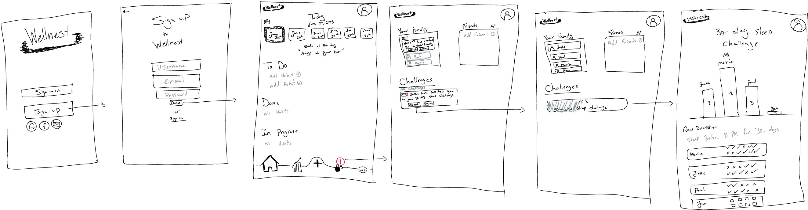
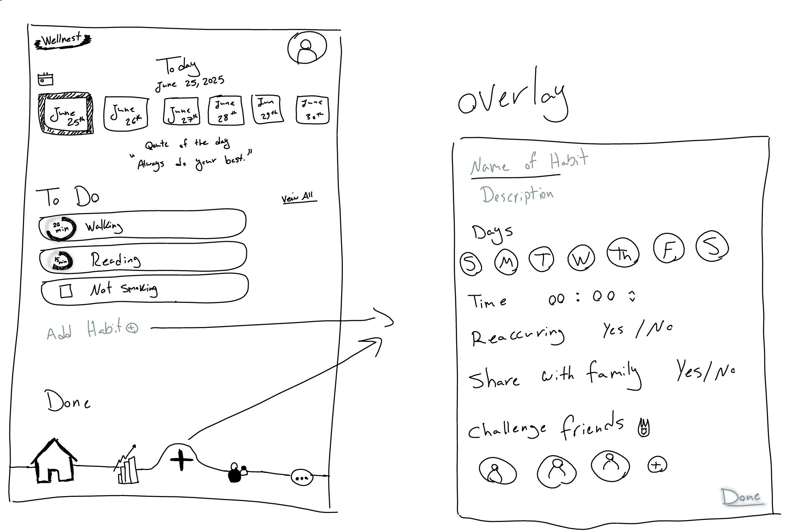
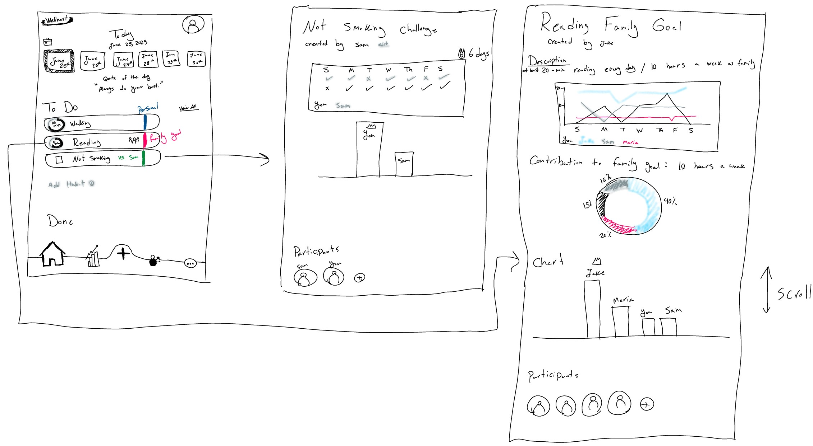
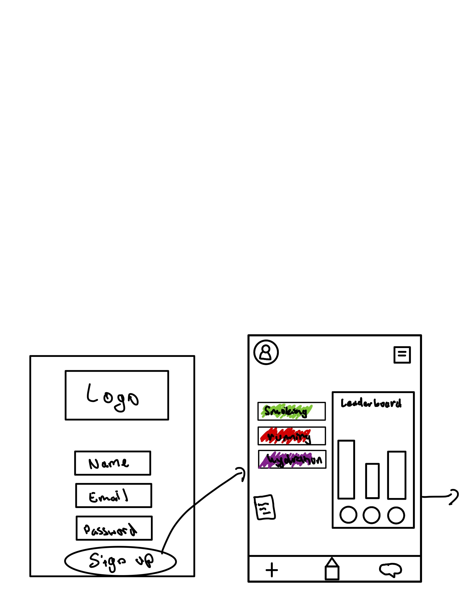
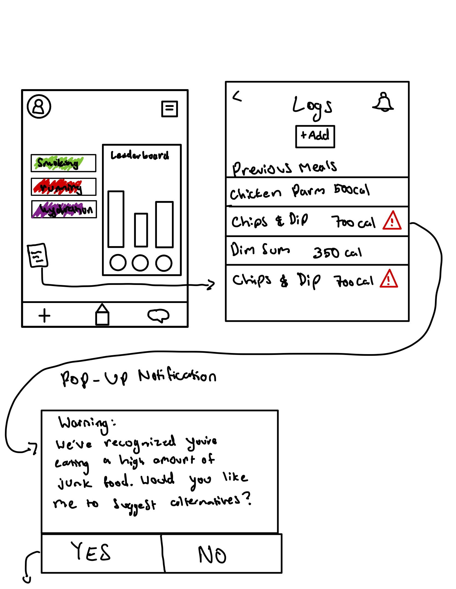
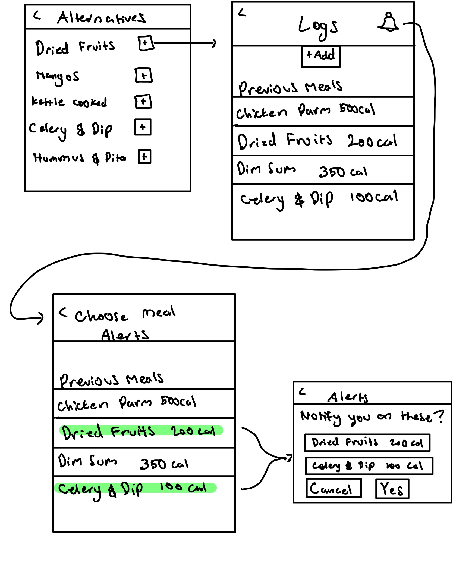
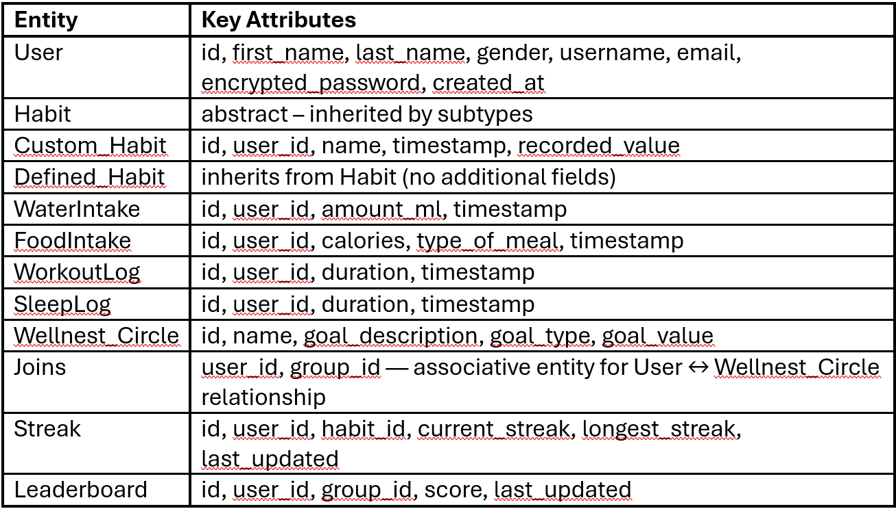
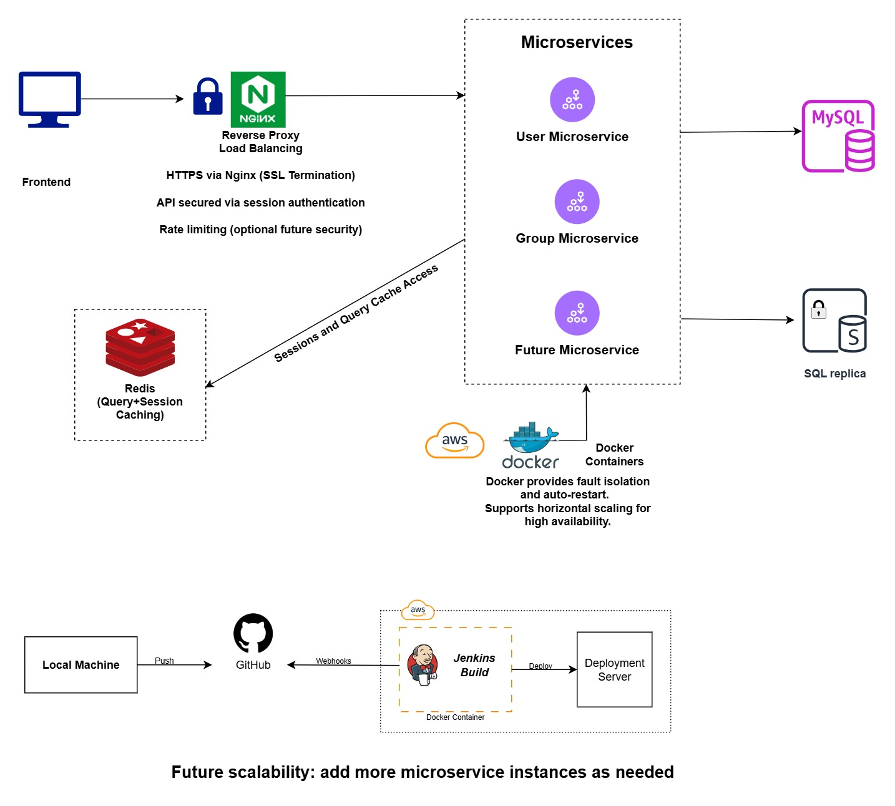
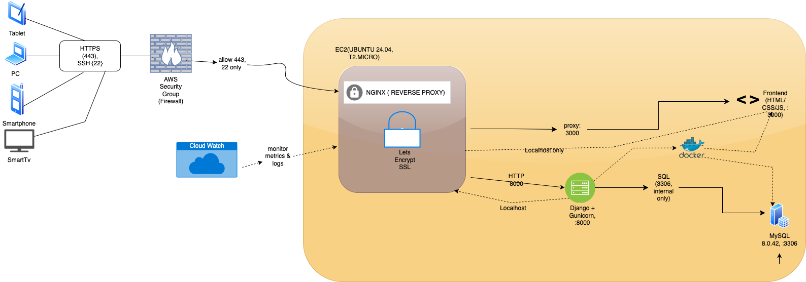

# SW Engineering CSC648-848-03 Summer 2025

## &#x20;<mark style="background-color:purple;">WELLNEST</mark> &#x20;

## <mark style="background-color:blue;">Team 03</mark>&#x20;

**Team Lead & Technical Writer:** Jacob Cordano - [jcordano1@sfsu.edu](mailto:jcordano1@sfsu.edu)

**Scrum Master:** Hamed Emari

**Frontend Lead:** Jacob Vuong

**Backend Lead:** Shivani Bokka

**GitHub Master and Database Lead:** Kevin Hu

**Software Architect:** Diego Antunez

## <mark style="color:blue;">Version History</mark>

| Milestone   | Version   | Date    |
| ----------- | --------- | ------- |
| Milestone 2 | Version 2 | 7/22/25 |
| Milestone 2 | Version 1 | 7/3/25  |
| Milestone 1 | Version 2 | 6/30/25 |
| Milestone 1 | Version 1 | 6/16/25 |

## Table of Contents

- [Data Definitions](#data-definitions)
- [Prioritized High-Level Functional Requirements](#prioritized-high-level-functional-requirements)
- [UI Mockup and Storyboards](#ui-mockup-and-storyboards)
- [High-Level System Design](#high-level-system-design)
- [Current Key Risks](#current-key-risks)
- [Project management](#project-management)
- [List of Team Contributions](#list-of-team-contributions)

## Data Definitions

**1. User**

- Users are the people who interact with the app. Each person has a profile that includes their username, first and last name, email, gender, and a securely encrypted password. The system also tracks the date the user joined (`created_at`). Users can create custom habits and participate in wellness circles. 

**2. Habit**

- This is an abstract table that serves as the general structure for all habits. It does not store any attributes itself but acts as a parent to both `Custom_Habit` and `Defined_Habit`. Its purpose is to provide a unified structure for different types of habits that can be tracked in the system.

**3. Custom_Habit**

- Custom habits are routines defined by users themselves. Each habit includes a descriptive name, the value recorded (like “2L” for water or “30 mins” for a workout), and the timestamp of when it was recorded. Every custom habit is tied to the `user_id` of the person who created it. This model directly inherits from the abstract Habit class.

**4. Defined_Habit**

- Defined habits are preconfigured routines that come built into the app, such as “Drink Water” or “Morning Walk.” These habits inherit from the abstract Habit entity and do not contain any additional attributes. They offer users a quick-start option and promote uniformity across wellness circles.

**5. Wellnest_Circle**

- A Wellnest Circle is a group created to support shared health goals. Each group can have only one goal assigned to it. Users can join multiple wellness circles—either by creating one themselves or by joining a group started by another user.

**6. Joins**

- This is an associative entity that links users to wellness circles. Since users can belong to many groups and groups can have many users, this table handles the many-to-many relationship cleanly.

**7. Leaderboard**

- The leaderboard keeps track of each user’s score within a specific wellness circle. It records the total score for each user, the group it belongs to, and the last time the leaderboard was updated. This brings in a sense of progress and healthy competition among users.

**8. Streak**

- Streaks monitor how consistently users stick to a habit. For each user-habit pair, we record the current streak length, the longest streak they've ever had, and when the streak was last updated. It rewards users for forming long-lasting routines.

**9. WaterIntake**

- This table captures daily water consumption. For every log, it stores how much water was consumed (in milliliters), the user’s ID, and the timestamp of the entry.

**10. FoodIntake**

- This tracks what the user eats and when. It records the calorie count, timestamp, and type of meal—whether it’s breakfast, lunch, or dinner. Each entry also ties back to the user who logged it.

**11. SleepLog**

- Sleep logs help track rest. Each entry records the user’s ID, when they fell asleep, when they woke up, and the total number of hours slept. This data helps users monitor sleep patterns over time.

**12. WorkoutLog**

- Workout logs track physical activity. For each session, it stores the user’s ID, how long they exercised, and when it happened. This supports habit tracking around fitness and physical wellbeing.

## Prioritized High-Level Functional Requirements

**Priority 1**

**Registered Users**

1. Users shall be able to create and register an account
1. Users shall be able to edit their profile information
1. Users shall be able to delete their accounts
1. Users shall be able to track their progress
1. Users shall be able to navigate the app without complication

**User Personal Survey**

1. Users shall be asked onboard questions for curated habit suggestions
1. Users shall be able to skip survey

**Personal Health Tracker**

1. Users shall track number of consecutive habit sessions
1. Users shall be able to monitor indications of completed habits
1. User shall have an indication of missed habits
1. Users shall be able to remove suggested habits by the app

**Habit Tracking**

1. Users shall be able to add habits
1. Users shall be able to delete habits
1. Users shall be able to modify habits
1. Users shall be able to name habits
1. Users shall be able to track pre-defined habits
1. Users shall be able to view suggested habits to track

**Calendar**

1. Users shall be able to view their weekly progress
1. Users shall be able to change the time of their habit
1. Users shall be able to change the duration of the habit

**Notifications**

1. Users shall receive notifications through the app

**Settings**

1. Users shall be able to turn off notifications
1. Users shall be able to change their information
1. Users shall be able to delete their account

**For Family Leaders**

1. Users shall be able to create a group and invite family members.
1. Users shall be able to set a challenge (steps, water intake, sleep).
1. Users shall be able to view group leaderboard and stats.
1. Users shall be able to add family members
1. Users shall be able to Kick family members
1. Users shall be able to name their family/habit circle
1. Users shall be able to change the name of their habit circle
1. Users shall be able to delete the family circle

**For Friends**

1. Users shall be able to create challenges.
1. Users shall be able to view leaderboard
1. Users shall be able to view individual friends habits
1. Users shall be able to add friends
1. Users shall be able to delete friends
1. Users shall be able to change their shared habits if they are the owner of the habit

**Leaderboards and Progress**

1. Users shall be able to track their progression
1. Users shall be able to compete with other users through a leaderboard
1. Users shall gain points based off of their progress
1. User shall be able to have tiered awards

**Priority 2**

**Registered Users**

1. Users shall be able to create a profile picture
1. Users shall be guided through helpful onboarding

**User Personal Survey**

1. Users shall be able to skip individual questions

**Personal Health Tracker**

1. Users shall be able to journal their thoughts on each habit session

**Habit Tracking**

1. Users shall be able to track custom habits

**Calendar**

1. User shall be able to filter calendar view by type (habits, moods, journal, challenges).
1. Users shall be able to view monthly progress

**Settings**

1. Users shall be able to customize habits viewable by others
1. Users shall be able to block other users

**For Family Leaders**

1. Users shall be able to Send encouragement to family chat.
1. Users shall be able to change their family habit

**For Friends**

1. Users shall be able to have joint habit tracking
1. Users shall be able to see suggested friends on the app

**Priority 3**

**Registered Users**

1. Users shall be able to log in with their social profiles
1. Users shall be able to connect their AI assistance to the app
1. Users shall be able to connect to the app from multiple devices
1. Users shall be able to share the app with their App Store family

**User Personal Survey**

1. Users shall be able to rate the survey
1. Users shall be able to report the survey

**Personal Health Tracker**

1. Users shall be able to view calorie goals met
1. Users shall be able to see calorie loss goals
1. Users shall be able to ask the AI assistant to suggest better habits
1. Users shall be able to copy family goals to their own personal archive

**Habit Tracking**

1. Users shall be able to add AI-suggested habits

**Calendar**

1. Users shall be able to filter calendar view by month week year
1. Users shall be able to connect their calendar to their google calendar
1. Users shall be able to share their Wellnest Calendar with Google Calendar users
1. Users shall change their Calendar System (Gregorian, Indian, Islamic, Chinese)

**Notification**

1. Users shall receive reminders to continue habits not logged
1. Users shall receive notification of friend activity
1. User shall receive notification of suggested habits
1. Users shall receive a notification of habit to log each day
1. Users shall receive notifications through email

**Settings**

1. Users shall be able to modify privacy settings for profile viewership
1. Users shall have Wellnest contact email and socials
1. Users shall be able to change the language
1. Users shall be able to change accessibility functionalities
1. Users shall be able to change the Font and Color
1. Users shall be able to change between Light and Dark mode
1. Users shall be able to change the time and calendar
1. Users shall be able to change their account
1. Users shall be able to connect their account to playstore
1. Users shall be able to connect their account to appstore

**For Family Leaders**

1. Users shall be able to create more than one challenge
1. Users shall be able to share their family link on other apps

**For Friends**

1. Users shall be able to nudge friend.
1. Users shall be able to see suggested friends from their contacts
1. Users shall be able to see suggested friends from their Google or social accounts

**Leaderboard and Progress**

1. Users shall be able to share completed goals to social media
1. Users shall be able to see AI analysis of their progress
1. Users shall be able to remove themselves from leaderboards and competing
1. Users shall be able to change the view of the leader board (Histogram, pie chart, etc)

## UI Mockup and Storyboards

### Rhea Sign-up Scenario

Reah Sign-ins to the Wellnest app after inputting her Username, Email, and Password. In the Main page she sees a calendar, an inspirational quote, and a text from the app welcoming her. She has not created any pre-existing nor custom habits, but she has a notification from a friend who suggested the app to her. She clicks on the notification and navigates to the socials page. She has not added any friends but she can join a wellness circle managed by Jake. After accepting the challenge, she navigates to the challenge page and sees the progress everyone has made towards the challenge, her standing on the leaderboard, and the participants of the challenge in her Wellness circle.

### Creating Habits Scenario

Devon uses the Wellnest app every day. Today, he opened the app and sees that he has 3 habits left to do today: Walking, Reading, and Not Smoking. He wishes to add another custom habit / task. He clicks on the add habit button in the nav bar or under the To Do list and an overlay opens for him to customize a new task. He can choose the task name, description, time, duration, etc. After he is done he will click the Done button, and the overlay will close.

### Habits / Challenges types and pages

Mary opens the Wellnest app and sees three different kinds of tasks/ habits that Wellnest offers:

1. Personal habits that are pre-existing or she has customly created for herself.
1. Group habits that have been created by other people and she has joined.
1. Friendly challenges that only she and her friend are a part of.

She clicks on one of the challenges and navigates to the page of that challenge, viewing the information, statistics, and leaderboard of the challenge.

These were some more of the rough designs that we had as well.

## High-Level System Design

### 6.1 High Level Database Architecture

**Initial Database Requirements**

Our app's backend database is designed to support a holistic wellness tracking platform. It allows users to log daily health activities such as water intake, food intake, sleep duration, and workouts. Additionally, users can create or join group wellness challenges called “Wellnest Circles,” where progress is tracked and visualized through a leaderboard.
Each user can also define and track personal habits. The system supports both solo and group engagement, with no requirement for users to join a group in order to benefit from the app’s features. A streak system is also maintained to encourage consistency.

The database emphasizes:
-	Time-based logs for accurate trend tracking
-	Normalized structure for scalable and efficient data access
-	Foreign key constraints to maintain referential integrity
-	Support for leaderboard logic in a multi-user group setting

**DBMS Selection**

We selected **MySQL**, hosted on an **AWS EC2** instance, as our backend DBMS.

MySQL offers robust support for relational modeling, foreign key enforcement, ACID compliance, and indexing, which are essential for managing user-specific logs and real-time group statistics.
It integrates smoothly with Django ORM, making backend development more efficient and secure.

**Database Organization**

Our database has ten main tables: `User`, `Custom_Habit`, `FoodIntake`, `Joins`, `Leaderboard`, `SleepLog`, `Streak`, `WaterIntake`, `Wellnest_Circle`, and `WorkoutLog`. These tables are connected using foreign keys to keep everything organized and related.  Every log is saved with a timestamp (where necessary) so we can track progress over time in a clear and structured way.

**A. Entities, Attributes, Relationships, and Domains**

- User: Stores personal data and health metrics of each registered user. Acts as the central entity.
- Custom_Habit & Defined_Habit: Support user-defined and pre-defined habits respectively.
- WaterIntake, FoodIntake, WorkoutLog, SleepLog: Time-stamped logs of user health behavior.
- Wellnest_Circle: Represents a group wellness challenge with a name, description, and creation time.
- Leaderboard: Tracks user scores in each group, supporting performance comparisons.
- Streak: Tracks a user's ongoing success in habit consistency.
- Joins: A bridge table linking users to the Wellnest Circles they've joined.

**B. Key relationships:**

- One User can have many logs (1-to-many).
- One User can belong to many Wellnest_Circles (many-to-many via Joins).
- One Leaderboard entry uniquely combines a User and a Wellnest_Circle (unique constraint).
- All logs and relational tables use foreign keys to maintain referential integrity with the User table and others where applicable.

**ERD Diagram**

An ERD was created using `draw.io` to represent the entities, their attributes, and how they relate. The diagram highlights the key functionalities of the system, such as user logging, group engagement, and progress tracking. Foreign key constraints ensure data integrity and enforce the rules of interaction between different parts of the database.

**Media Storage**
- For this project, we do not plan to store or handle any user-uploaded media files such as images, video, audio, or GPS data. Instead, users will be able to select from a set of predefined profile icons. These icons are handled as static assets on the frontend, with only a reference (e.g., file name or ID) stored in the database. This approach keeps the system efficient while still providing basic personalization features.

### Backend Architecture

**Scalability Diagram**

**Architecture Summary**

Our backend system is designed with future scalability, modularity, and security in mind, following microservices principles and anticipating production-level deployment needs. The current implementation lays the groundwork for future enhancements including containerization, replication, caching, and more robust load handling.

**A. Microservices Architecture**

- We follow a microservices architecture, where different backend functionalities are separated into independently manageable services:
    -	User Microservice: Responsible for user registration, authentication, and profile management.
    -	Group Microservice: Handles creation and management of user groups.
    -	Future Microservice: Placeholder for upcoming features (e.g., notifications, analytics).

-This design allows us to independently scale, test, and deploy each component as our needs evolve.

**B. Load Balancers (Planned for Future)**

- Although not currently deployed, we plan to integrate Nginx as a reverse proxy and load balancer. In the future, this will:
    -	Distribute traffic evenly across microservice instances,
    -	Enable SSL termination (HTTPS),
    -	Enforce API security via session-based authentication,
    -	Optionally introduce rate limiting for abuse prevention.

- For now, all requests are routed directly from the frontend to services through a basic Nginx proxy layer.

**C. Caching Strategies (Planned for Future)**

- We plan to use Redis for:
    -	Session caching to minimize repeated authentication checks,
    -	Query caching to reduce database load on frequent read operations.

- While Redis is represented in our architecture for planning purposes, it is not yet in active use.

**D. Reliability and Fault Tolerance (Planned with Containers)**

- Currently, our services are deployed directly on an AWS EC2 instance without container orchestration. As we scale, we plan to use Docker containers to enhance reliability and fault tolerance by:
    -	Isolating services to prevent one failure from affecting others,
    -	Enabling automatic restarts of crashed containers,
    -	Supporting horizontal scaling by spinning up additional container instances.

- These improvements will help us make the most of our existing cloud infrastructure and ensure the system can handle higher loads and failures gracefully.

**E. Containers (Planned with CI/CD Pipeline)**

- Although our code is currently deployed manually or with limited automation, we are planning to use Jenkins (running inside a Docker container) to automate builds and deployment:
    -	GitHub → Jenkins (build & test) → Deployment server.
    -	This will enable faster CI/CD workflows and consistent deployments.

**F.Data Replication and Consistency (Planned for Scaling Reads)**

- We plan to adopt a primary-replica database architecture using MySQL:
    -	The primary DB will handle writes,
    -	Read replicas will offload select-heavy operations to boost performance.

- This setup is not yet implemented but is part of our scalability roadmap.

**G. Security Considerations**

- We are currently implementing:
    -	SSL Termination via Nginx,
    -	Session-based authentication to validate API requests.

- We’ve included rate limiting in the architecture diagram as an optional future enhancement to protect the system from misuse. We may also introduce token-based access or API keys for microservice-to-microservice communication when needed.

### UML Diagram

**placeholder for descriptions 6.2**

### Application Network and Deployment Design

This illustrates the network and deployment architecture of our web application hosted on an AWS EC2 (t2.micro) instance running Ubuntu 24.04. All services are deployed directly on the EC2 host. Incoming HTTPS requests (port 443) from users are handled by Nginx, which serves as a reverse proxy and manages SSL certificates via Let's Encrypt. Nginx routes frontend requests to a stat HTML/CSS/JS interface served on port 3000 and backend API traffic to a Django 5.2.3 application running on Gunicorn. All inter service communcation occurs over localhost for added security, with the backend connecting to a MySQL database on port 3306.

### High Level APIs and Main Algorithms

**1. Overall API Architecture**

Our model is designed using a modular, service-oriented backend structure. The backend is divided into microservices such as the User Service and Group Service, each responsible for managing specific core functionalities like user data, group challenges, and habit tracking.

-	User Service APIs include:
    -	Managing user profiles (creation, update, deletion)
    -	Logging health metrics and daily routines (water, food, sleep, workout)
    -	Retrieving personalized user summaries based on activity trends

-	Group Service APIs include:
    -	Creating and managing wellness circles
    -	Allowing users to join and leave groups
    -	Tracking group-based challenges and progress
    -	Maintaining leaderboards for community motivation

This service split ensures scalability and clean code organization

**2. Search Functionality**

- The system supports a user-facing search bar to look up predefined habits and Wellnest Circles. When a user types a keyword, the backend uses fuzzy matching and keyword normalization to retrieve results.
	- Search endpoint example:
        GET /api/search?query=walk
        This returns a list of matching habit names or group titles such as “Morning Walk”, “Walk 5K Steps”.

    -	Search logic:
        -	Normalize text (case-insensitive, trimmed input)
        -	Search predefined habits first
        -	Then search group names from the database using LIKE
        -	Optionally, we can use simple Levenstein distance for fuzzy match improvement if needed

**3. Ranking Algorithm (Leaderboard)**

- Leaderboards track user performance inside each Wellnest Circle and ranks participants based on their progress toward the circle’s goal.

    - Ranking endpoint example:
        GET /api/leaderboard/:circle_id
        This returns users in that group, sorted by their scores in descending order.
        :circle_id  is a dynamic path parameter that should be replaced with the actual ID of the wellness circle that the user wants to look up

    - Ranking logic:
        - Each user’s score is computed when a logged habit aligns with the group's goal
        - Higher consistency and longer streaks earn more points
        - Tiebreakers are resolved by last_updated (more recent activity wins)

**4. Streak Algorithm**

- A streak tracks how many consecutive days a user has completed a specific habit.

    - Tracked using:
        Streak(`user_id`, `habit_id`, `current_streak`, `longest_streak`, `last_updated`)

    - Streak logic:
        - If user logs a habit today → current_streak += 1
        - If yesterday’s log is missing → current_streak = 1
        - longest_streak updates if current_streak exceeds it

- This encourages consistency and builds accountability in habit formation.

**5. Personalized Evaluation Algorithm**

- This algorithm powers the "Your Progress" page in the app, where users can view a daily summary of their health routines.
    - It aggregates daily logs for water, food, sleep, and workout
    - The summary reflects progress toward goals and streak status
    - Users can view their log entries for the current and previous days
    - The data is fetched on demand—no background evaluation or auto-updates

- This feature gives the user a clear and consolidated picture of their daily wellness activities without overwhelming them with detail.

**6. Rating System (Planned Future Enhancement)**

- At this stage of our project, we haven’t implemented a formal rating feature. However, it’s something we’ve identified as a valuable addition for future development.

- For example:
    - Users could rate predefined habits and wellness circles (1–5 stars)
    - These ratings could influence search results or recommendations
    - Community-rated content can improve onboarding for new users

- While it's not part of our current model, we plan to explore this feature to make the experience more interactive and community-driven.

**7.	API Design Philosophy**

- All APIs follow RESTful principles with clean and logical grouping of resources. The backend is structured using Django REST Framework, and endpoints are designed to be reusable, secure, and scalable.
    - All data is validated and sanitized before database entry.
    - Endpoints return JSON and support pagination where applicable.

## Current Key Risks

### Skills

**Risks**

- Varying skills and technical backgrounds

**Proposed Solution:**

- Choosing tasks and work carefully, working closely with the task lead

### Schedule

**Risks**

- Time constraints during the summer semester
- Team members being unable to join meetings

**Proposed Solution**

- Checking the Tracker regularly
- Watching meeting recordings

### Technical

**Risks**

- Most members lack experience working with Python
- Most members lack experience working with SQL
- All members lack experience working with cloud services

**Proposed Solution**

- Members should watch videos and learn on their own time
- Members should team up with more experienced task leads
- Communicating with team if they don’t feel confident about completing a task

### Teamwork

**Risks**

- First time for many members working on an Agile project
- Time conflict for members working on the same task

**Proposed Solution**

- Checking the Tracker regularly
- Communicating with the team

### Legal/Content

**Risks**

- Using copyrighted artwork
- Using copyrighted elements
- Using copied code

**Proposed Solution**

- Using Loyalty Free elements
- Creating original artwork
- Regular quality control

## Project Management

Our Project has 3 simultaneous tracks, Back-end, Front-end, Database System, that are managed by developer leads corresponding to those tracks. The team lead assigns tasks according to each person’s desired skill set and strengths, and team members are allowed to request a change in task if they don’t feel confident about completing a task. Deadlines are set realistically, and the team lead checks in with members regularly to make sure quality standards are met, the project is on track, and members have unconditional support from the team. The members will push their work to the development branch, and the team lead will push to the main branch after revising and quality checking. Microsoft Excel is used as the main tracker for our WellNest project. Members can find their tasks, resources, task descriptions, and due dates on the tracker. Members can report their task percentage completed on the tracker, so other members working on related and simultaneous tasks know when the handover will happen. Meeting scheduling takes place on Discord along with all team communication. If a member fails to join a meeting, a recording of the meeting will be posted on Discord, and their tasks will be posted on the tracker. Members working together on a task should set their own deadlines, and push their completed work to the GitHub repo before its due date. All major decisions will be made in consultation with the entire team and finalized based on majority agreement.

## List of Team Contributions

<mark style="color:blue;">Jacob Cordano (Team Lead, Technical Writer)</mark> 10/10

- Organized file structure
- Removed header table in technical documentation
- List of contributions
- Moved M1V1 to M1 folder
- Organized and scheduled meetings
- Created project tracker todo list
- Created M2 document
- Revised, edited, and formatted M2
- M2 Table of contents
- Contributions list
- Imported and formated team documents to technical documentation
- Recongifured Nginx for site hosting
- Created cloud drive for team document hosting

<mark style="color:blue;">Hame Emari (Scrum Master)</mark> 10/10

- Revised functional requirements
- Added non functional reqirements and priorities
- Project management description
- Designed Mockups
- Calculated team/project risks
- CSS/HTML/Javascript for home page, signup, and friends and family page

<mark style="color:blue;">Jacob Vuong (Front-end Lead)</mark> 10/10

- Mockup Design
- Search Bar
- Rating feature
- Home page
- Implement data definitions

<mark style="color:blue;">Shivani Bokka (Database Lead)</mark> 8/10

- Created Data Definitions
- Created the High Level Database Architecture
- Created the Database Organization structure and tables
- Media Storage
- Created Scalability Diagram
- Architecture Summary
- High Level API's and Main Algorithms

<mark style="color:blue;">Diego Antunez (Software Architecitect)</mark> <mark style="color:blue;"></mark> 8/10

- Network and Deployment Diagrams
- Application Networks Diagram
- Deployment Diagram

<mark style="color:blue;">Kevin Hu (Database Lead, Github Master)</mark> 8/10

- Created Data Definitions
- User Table In SQL
- DBMS Selection
