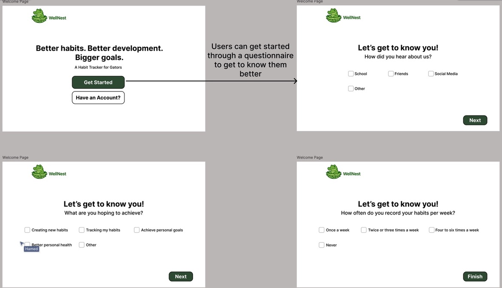
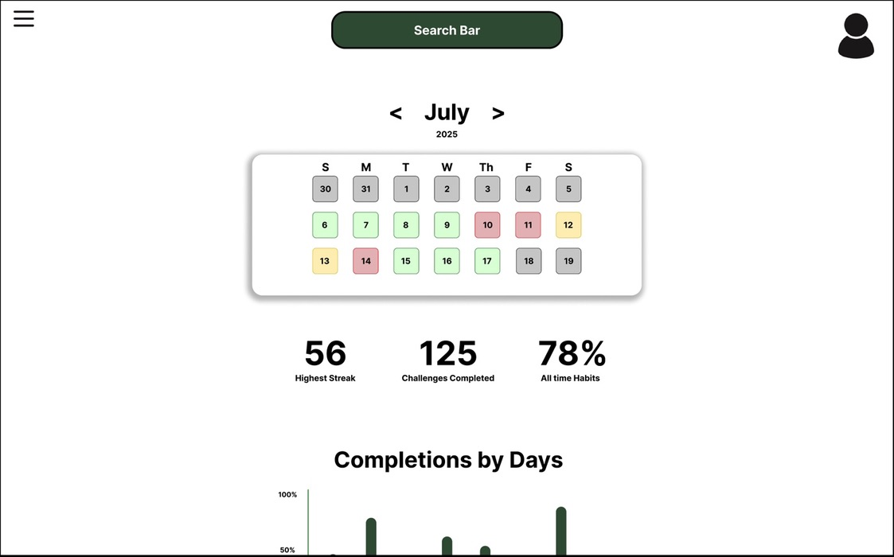

# SW Engineering CSC648-848-03 Summer 2025

## &#x20;<mark style="background-color:purple;">WELLNEST</mark> &#x20;

## <mark style="background-color:blue;">Team 03</mark>&#x20;

**Team Lead & GitHub Master:** Jacob Cordano - [jcordano1@sfsu.edu](mailto:jcordano1@sfsu.edu)

**Scrum Master & Software Architect:** Jacob Vuong

**Frontend Lead:** Kevin Hu

**Backend Lead:** Hamed Emari

**Database Lead:** Shivani Bokka

**Technical Writer:** Diego Antunez

## <mark style="color:blue;">Version History</mark>

| Milestone   | Version   | Date    |
| ----------- | --------- | ------- |
| Milestone 3 | Version 1 | 7/22/25 |
| Milestone 2 | Version 2 | 7/22/25 |
| Milestone 2 | Version 1 | 7/3/25  |
| Milestone 1 | Version 2 | 6/30/25 |
| Milestone 1 | Version 1 | 6/16/25 |

## Table of Contents

- [SW Engineering CSC648-848-03 Summer 2025](#sw-engineering-csc648-848-03-summer-2025)
  - [ WELLNEST ](#-wellnest--)
  - [Team 03 ](#team-03-)
  - [Version History](#version-history)
  - [Table of Contents](#table-of-contents)
  - [Data Definitions](#data-definitions)
  - [Prioritized High-Level Functional Requirements](#prioritized-high-level-functional-requirements)
  - [UI/UX Wireframes](#uiux-wireframes)
  - [System Design](#system-design)
    - [Database Architecture](#database-architecture)
    - [Business Rules](#business-rules)
  - [Backend Architecture](#backend-architecture)
  - [Coding Standard](#coding-standard)
  - [Frameworks Deployment](#frameworks-deployment)
  - [Team Contributions](#team-contributions)

## Data Definitions

1. User

   Users are the people who interact with the app. Each person has a profile that includes their username, first and last name, email, gender, and a securely encrypted password. The system also tracks the date the user joined (created_at). Users can create custom habits and participate in wellness circles.
   Users are the people who interact with the app. Each person has a profile that includes their username, first and last name, email, gender, and a securely encrypted password. The system also tracks the date the user joined (created_at). Users can create custom habits and participate in wellness circles.

2. Habit

   This is an abstract table that serves as the general structure for all habits. It does not store any attributes itself but acts as a parent to both Custom_Habit and Defined_Habit. Its purpose is to provide a unified structure for different types of habits that can be tracked in the system.
   This is an abstract table that serves as the general structure for all habits. It does not store any attributes itself but acts as a parent to both Custom_Habit and Defined_Habit. Its purpose is to provide a unified structure for different types of habits that can be tracked in the system.
   This is an abstract table that serves as the general structure for all habits. It does not store any attributes itself but acts as a parent to both Custom_Habit and Defined_Habit. Its purpose is to provide a unified structure for different types of habits that can be tracked in the system.

3. Custom_Habit

   Custom habits are routines defined by users themselves. Each habit includes a descriptive name, the value recorded (like “2L” for water or “30 mins” for a workout), and the timestamp of when it was recorded. Every custom habit is tied to the user_id of the person who created it. This model directly inherits from the abstract Habit class.

4. Defined_Habit

   Defined habits are preconfigured routines that come built into the app, such as “Drink Water” or “Morning Walk.” These habits inherit from the abstract Habit entity and do not contain any additional attributes. They offer users a quick-start option and promote uniformity across wellness circles.

5. Wellnest_Circle

   A Wellnest Circle is a group created to support shared health goals. Each group can have only one goal assigned to it. Users can join multiple wellness circles—either by creating one themselves or by joining a group started by another user.

6. Joins

   This is an associative entity that links users to wellness circles. Since users can belong to many groups and groups can have many users, this table handles the many-to-many relationship cleanly.

7. Leaderboard

   The leaderboard keeps track of each user’s score within a specific wellness circle. It records the total score for each user, the group it belongs to, and the last time the leaderboard was updated. This brings in a sense of progress and healthy competition among users.

8. Streak

   Streaks monitor how consistently users stick to a habit. For each user-habit pair, we record the current streak length, the longest streak they've ever had, and when the streak was last updated. It rewards users for forming long-lasting routines.

9. WaterIntake

   This table captures daily water consumption. For every log, it stores how much water was consumed (in milliliters), the user’s ID, and the timestamp of the entry.
   This table captures daily water consumption. For every log, it stores how much water was consumed (in milliliters), the user’s ID, and the timestamp of the entry.
   This table captures daily water consumption. For every log, it stores how much water was consumed (in milliliters), the user’s ID, and the timestamp of the entry.

10. FoodIntake

    This tracks what the user eats and when. It records the calorie count, timestamp, and type of meal—whether it’s breakfast, lunch, or dinner. Each entry also ties back to the user who logged it.

11. SleepLog

    Sleep logs help track rest. Each entry records the user’s ID, when they fell asleep, when they woke up, and the total number of hours slept. This data helps users monitor sleep patterns over time.

12. WorkoutLog

    Workout logs track physical activity. For each session, it stores the user’s ID, how long they exercised, and when it happened. This supports habit tracking around fitness and physical wellbeing.

## Prioritized High-Level Functional Requirements

### Priority 1

### 1. Registered Users

1.1 Users shall be able to create and register an account.

1.2 Users shall be able to edit their profile information.

1.3 Users shall be able to delete their accounts.

1.4 The system shall track user progress.

1.5 Users shall be able to navigate the app without complication.

### User Personal Survey

2.1 The app shall prompt users with onboarding questions for curated habit suggestions.

2.2 Users shall be able to skip the survey.

### 3. Personal Health Tracker

3.1 The personal health tracker shall track the number of consecutive habit sessions for each user.

3.2 The system shall display indications of completed habits.

3.3 The system shall provide notifications for missed habits.

3.4 Users shall be able to remove habits suggested by the app.

### 4. Habit Tracking

4.1 Users shall be able to add habits.

4.2 Users shall be able to delete habits.

4.3 Users shall be able to modify habits.

4.4 Users shall be able to name habits.

4.5 Users shall be able to track pre-defined habits.

4.6 The system shall display suggested habits for users to track.

### 5. Calendar

5.1 The calendar system shall display weekly progress for users.

5.2 Users shall be able to change the time of their habit.

5.3 Users shall be able to change the duration of their habit.

### 6. Settings

6.1 Users shall be able to change their account information.

6.2 Users shall be able to delete their account.

### 7. For Friends

7.1 Users shall be able to create challenges.

7.2 Users shall be able to view the leaderboard.

7.3 Users shall be able to add friends using a link.

7.4 Users shall be able to delete friends.

### 8. Leaderboards and Progress

8.1 The system shall track user progression.

8.2 Users shall be able to compete with others through a leaderboard.

8.3 The system shall assign points based on user progress.

8.4 The system shall assign tiered awards and badges to signify leaderboard status in a “king of the hill” format.

### Priority 2

### 1. Registered Users

1.1 Users shall be able to create a profile picture.

1.2 The app shall guide users through a helpful onboarding experience.

### 2. User Personal Survey

2.1 Users shall be able to skip individual questions in the survey.

2.2 Users shall be able to rate the page and experience.

### 3. Habit Tracking

3.1 Users shall be able to track custom habits.

### 4. Calendar

4.1 Users shall be able to filter the calendar view by type (habits, moods, journal, challenges).

4.2 The calendar system shall display monthly progress.

### 5. Notifications

5.1 The system shall send notifications to the app.

### 6. Settings

6.1 Users shall be able to block other users.

6.2 Users shall be able to turn off notifications

### 7.For Friends

7.1 Users shall be able to participate in joint habit tracking.

7.2 The system shall display suggested friends in the app.

### Priority 3

### 1. Registered Users

1.1 Users shall be able to connect their AI assistant to the app.

1.2 Users shall be able to connect to the app from multiple devices.

1.3 Users shall be able to share the app with their App Store family.

### 2. User Personal Survey

2.1 Users shall be able to rate the page and experience.

### 3. Notifications

3.1 The system shall send reminders to continue unlogged habits.

3.2 The system shall notify users of friend activity.

3.3 The system shall notify users of suggested habits.

3.4 The system shall send daily reminders to log habits.

3.5 The system shall send notifications via email.

### 4. Settings

4.1 Users shall be able to modify privacy settings for profile viewership.

4.2 The app shall display Wellnest contact email and social links.

4.3 Users shall be able to change the app language.

4.4 Users shall be able to modify accessibility functionalities.

4.5 Users shall be able to change the app’s font and color scheme.

4.6 Users shall be able to toggle between Light and Dark mode.

4.7 Users shall be able to change the time and calendar settings.

4.8 Users shall be able to switch between different accounts.

4.9 Users shall be able to connect their account to the Play Store.

4.10 Users shall be able to connect their account to the App Store.

## UI/UX Wireframes

User Welcome page and Signup Page

User Profile editing and saving new changes

Users social groups

Users can join or create their own social groups that have common interests, and to explore different user's progression as well.

Homepage for the user

There is a feature for adding new habits along with seeing their current habits tracked.

User Progression tracker

Users can track their progression through a span of a month, with their highest streaks for habits tracked, and how well they are sticking to their new habits, as well as completed ones for the week.

## System Design

### Database Architecture

### Business Rules

1. Users must create an account after completing the WellNest Survey
2. Only registered users can create Habits
3. Only registered users can join WeellNest Circles
4. A user shall be able to use many devices to login to their account
5. A user can create many Habits
6. A user can join many WellNest Circles

ERD Diagram

EER Diagram

**Database Organization**

The database structure for our WellNest app has been thoughtfully designed to align with the app’s current functionality, while keeping future improvements in mind. We’re using MySQL as our relational database, and Django for the backend. Instead of relying on Django’s built-in user model, we chose to define custom tables to maintain full control over the schema and adapt it to our specific needs.

At this stage, our schema consists of 10 main tables: User, Custom_Habit, WaterIntake, FoodIntake, WorkoutLog, SleepLog, Wellnest_Circle, Joins, Streak, and Leaderboard. While our conceptual model includes abstract or inherited entities like Habit and Defined_Habit, these do not translate into physical tables in the database.

The schema is well-normalized, which helps reduce redundancy and ensures consistent, reliable data. At the center of the design is the User table, which connects directly to various personal health logs such as WaterIntake, FoodIntake, WorkoutLog, and SleepLog. Each of these includes a foreign key to the User table and uses timestamps for accurate chronological tracking. Foreign keys are used consistently throughout the schema to maintain referential integrity and enforce proper relationships between tables.

To support user-driven habit formation, the Custom_Habit table allows users to define and track their own routines. Consistency over time is tracked via the Streak table, which contributes to user rankings in the Leaderboard. Social engagement is encouraged through wellness groups, which are implemented using the Wellnest_Circle and Joins tables to support many-to-many participation.

As shown in the ER and EER diagrams, each entity has a clearly defined role, and the inheritance logic is handled cleanly through the separation of Custom_Habit and Defined_Habit.

Given the current scope of the project, we've prioritized building a solid foundation with the flexibility to scale in the future. While the current setup is intentionally kept simple for a small user base, it’s been built with future enhancements in mind—such as Docker-based containerization and broader deployment.

In terms of practical use, the schema allows for efficient queries such as: - Retrieving a user's daily water, food, workout, or sleep logs - Listing all wellness circles a user is part of - Identifying users with the longest streaks - Fetching top scorers in each wellness circle - Aggregating health metrics for leaderboard calculations

Overall, the database is cleanly organized, logically structured, and well-prepared to support both the app’s current goals and potential future developments.

## Backend Architecture

**Scalability Diagram**

**Architecture Summary**

Our backend system is designed with future scalability, modularity, and security in mind, following microservices principles and anticipating production-level deployment needs. The current implementation lays the groundwork for future enhancements including containerization, replication, caching, and more robust load handling.

**A. Microservices Architecture**

- We follow a microservices architecture, where different backend functionalities are separated into independently manageable services:
  - User Microservice: Responsible for user registration, authentication, and profile management.
  - Group Microservice: Handles creation and management of user groups.
  - Future Microservice: Placeholder for upcoming features (e.g., notifications, analytics).
  - User Microservice: Responsible for user registration, authentication, and profile management.
  - Group Microservice: Handles creation and management of user groups.
  - Future Microservice: Placeholder for upcoming features (e.g., notifications, analytics).

-This design allows us to independently scale, test, and deploy each component as our needs evolve.

**B. Load Balancers (Planned for Future)**

- Although not currently deployed, we plan to integrate Nginx as a reverse proxy and load balancer. In the future, this will:

  - Distribute traffic evenly across microservice instances,
  - Enable SSL termination (HTTPS),
  - Enforce API security via session-based authentication,
  - Optionally introduce rate limiting for abuse prevention.

  - Distribute traffic evenly across microservice instances,
  - Enable SSL termination (HTTPS),
  - Enforce API security via session-based authentication,
  - Optionally introduce rate limiting for abuse prevention.

  - Distribute traffic evenly across microservice instances,
  - Enable SSL termination (HTTPS),
  - Enforce API security via session-based authentication,
  - Optionally introduce rate limiting for abuse prevention.

- For now, all requests are routed directly from the frontend to services through a basic Nginx proxy layer.

**C. Caching Strategies (Planned for Future)**

- We plan to use Redis for:

  - Session caching to minimize repeated authentication checks,
  - Query caching to reduce database load on frequent read operations.

  - Session caching to minimize repeated authentication checks,
  - Query caching to reduce database load on frequent read operations.

- While Redis is represented in our architecture for planning purposes, it is not yet in active use.

**D. Reliability and Fault Tolerance (Planned with Containers)**

- Currently, our services are deployed directly on an AWS EC2 instance without container orchestration. As we scale, we plan to use Docker containers to enhance reliability and fault tolerance by:

  - Isolating services to prevent one failure from affecting others,
  - Enabling automatic restarts of crashed containers,
  - Supporting horizontal scaling by spinning up additional container instances.

  - Isolating services to prevent one failure from affecting others,
  - Enabling automatic restarts of crashed containers,
  - Supporting horizontal scaling by spinning up additional container instances.

- These improvements will help us make the most of our existing cloud infrastructure and ensure the system can handle higher loads and failures gracefully.

**E. Containers (Planned with CI/CD Pipeline)**

- Although our code is currently deployed manually or with limited automation, we are planning to use Jenkins (running inside a Docker container) to automate builds and deployment:
  - GitHub → Jenkins (build & test) → Deployment server.
  - This will enable faster CI/CD workflows and consistent deployments.

**F.Data Replication and Consistency (Planned for Scaling Reads)**

- We plan to adopt a primary-replica database architecture using MySQL:

  - The primary DB will handle writes,
  - Read replicas will offload select-heavy operations to boost performance.

  - The primary DB will handle writes,
  - Read replicas will offload select-heavy operations to boost performance.

- This setup is not yet implemented but is part of our scalability roadmap.

**G. Security Considerations**

- We are currently implementing:

  - SSL Termination via Nginx,
  - Session-based authentication to validate API requests.

- We’ve included rate limiting in the architecture diagram as an optional future enhancement to protect the system from misuse. We may also introduce token-based access or API keys for microservice-to-microservice communication when needed.

### UML Diagram

## Coding Standard

Our coding standard is up to par, as our stack is fully utilizing all of the languages that we set out to use for this project. We mainly used CSS, HTML, and python in order to create the websites frontend, and python for the backend. In addition to this, the EER and ERD naming conventions also matched with our functions and methods in each file, maintaining consistency. Overall, the code is clean and very readable to those who might want to take a look at how everything was created. Therefore, when building the documentation, we were able to refer to many of the files in order to track what was done and what hasn't with the naming schemes in our code.

## Frameworks Deployment

When applying the frameworks, we insisted on working with Django, and in order to do so, we had to install the most recent version. In order to fully work with the backend python code, we utilized Django for majority of it. Since utilizing Django, it has created a more structured environment when it came to the python code, along with a more efficient design. Without Django, our backend and front end wouldn't have been possible when it came to running our EC2.

In addition to this, another framework that was a huge help was the EER diagram/table that was made. The diagram allowed us to ensure that the tables and databases that we're connecting to the backend are working correctly with their unique keys. With the tables and keys established in the EER, the relationships have helped greatly when working with the features and design of our product.

## Team Contributions

<mark style="color:blue;">Jacob Cordano (Team Lead, GitHub Master)</mark> 10/10

- Organized file structure
- Revised high level Functional Requirements
- Welcome pages
- GitHub ORganization
- GitHub Merges
- Code Review
- Documentation Review
- Meeting organization
- Task tracker organization
- EC2 Management
- Team Contributions
- Checkpoint 1 Email
- Checkpoint 2 Email
- Strategized on and implemented live document organization for team commit credit
- Implemented feature branching organization

<mark style="color:blue;">Hamed Emari (Back End Lead)</mark> 10/10

- Revised high level functional requirements
- High level database architecture
- Back end architecture
- Search functionality
- Q/A review
- Interactive elements
- Form handling
- Wireframe implementation
- Calendar/Home page
- ERD revision
- UML document
- User table
- Cleaned up technical documentation
- Django configuration
- Socials page
- Rating, ranking, and search algorithms
- Checkpoint email

<mark style="color:blue;">Jacob Vuong (Front-end Lead)</mark> 10/10

- Data Definitions
- Profile page
- Wireframe UI
- Wireframe streaks
- Tracker organization
- Lead the revision of high level functional requirements
- Frameworks development
- Q/A testing
- Meeting minutes
- Assist with navigation flow
- Assit with data definitions
- Checkpoint email

<mark style="color:blue;">Shivani Bokka (Database Lead)</mark> 8/10

- Updated data definitions
- Revised Scalability diagram
- Rating, ranking, and search algorithms
- Profile page
- Database organization
- High level database architecture
- Back end architecture
- Data definitions

<mark style="color:blue;">Diego Antunez (Technical Writer)</mark> <mark style="color:blue;"></mark> 7/10

- Title page for M3
- M2V2 table of contents revision
- Diagrams migration from M2 to M3
- Typo correction
- M2V2 format revision

<mark style="color:blue;">Kevin Hu (Database Lead, Github Master)</mark> 8/10

- Django configuration
- Search functionality
- Prototype file consolidation
- Implementation of wireframe design to front end
- Home page
- Calendar
- Navigation flow
- Usability testing
- Q/A testing
