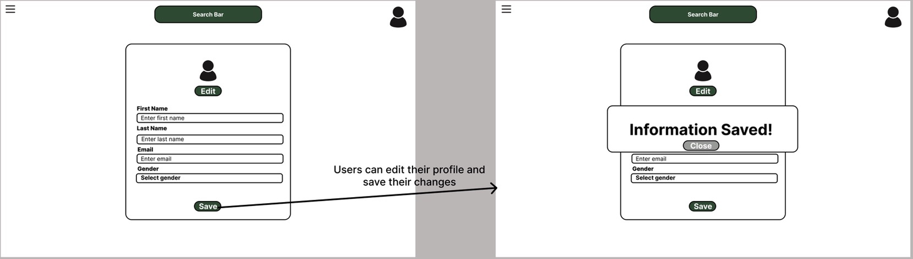

# SW Engineering CSC648-848-03 Summer 2025

## &#x20;<mark style="background-color:purple;">WELLNEST</mark> &#x20;

## <mark style="background-color:blue;">Team 03</mark>&#x20;

**Team Lead & GitHub Master:** Jacob Cordano - [jcordano1@sfsu.edu](mailto:jcordano1@sfsu.edu)

**Scrum Master & Software Architect:** Jacob Vuong

**Frontend Lead:** Kevin Hu

**Backend lead:** Hamed Emari

**Database Lead:** Shivani Bokka

## <mark style="color:blue;">Version History</mark>

| Milestone   | Version   | Date    |
| ----------- | --------- | ------- |
| Milestone 3 | Version 1 | 7/15/25 |
| Milestone 2 | Version 2 | 7/13/25 |
| Milestone 2 | Version 1 | 7/3/25  |
| Milestone 1 | Version 2 | 6/30/25 |
| Milestone 1 | Version 1 | 6/16/25 |

## Table of Contents

- [Data Definitions](#data-definitions)   
- [Prioritized High-Level Functional Requirements](#prioritized-high-level-functional-requirements)    
- [UI/UX Wireframes](#uiux-wireframes)    
- [System Design](#system-design)    
      - [Database Architecture](#database-architecture)    
      - [Backend Architecture](#backend-architecture)    
- [Team Contributions](#team-contributions)

## Data Definitions\*\*

##
**1. User**

- Users are the people who interact with the app. Each person has a profile that includes their username, first and last name, email, gender, and a securely encrypted password. The system also tracks the date the user joined (`created_at`). Users can create custom habits and participate in wellness circles. 

**2. Habit**

- This is an abstract table that serves as the general structure for all habits. It does not store any attributes itself but acts as a parent to both `Custom_Habit` and `Defined_Habit`. Its purpose is to provide a unified structure for different types of habits that can be tracked in the system.

**3. Custom_Habit**

- Custom habits are routines defined by users themselves. Each habit includes a descriptive name, the value recorded (like “2L” for water or “30 mins” for a workout), and the timestamp of when it was recorded. Every custom habit is tied to the `user_id` of the person who created it. This model directly inherits from the abstract Habit class.

**4. Defined_Habit**

- Defined habits are preconfigured routines that come built into the app, such as “Drink Water” or “Morning Walk.” These habits inherit from the abstract Habit entity and do not contain any additional attributes. They offer users a quick-start option and promote uniformity across wellness circles.

**5. Wellnest_Circle**

- A Wellnest Circle is a group created to support shared health goals. Each group can have only one goal assigned to it. Users can join multiple wellness circles—either by creating one themselves or by joining a group started by another user.

**6. Joins**

- This is an associative entity that links users to wellness circles. Since users can belong to many groups and groups can have many users, this table handles the many-to-many relationship cleanly.

**7. Leaderboard**

- The leaderboard keeps track of each user’s score within a specific wellness circle. It records the total score for each user, the group it belongs to, and the last time the leaderboard was updated. This brings in a sense of progress and healthy competition among users.

**8. Streak**

- Streaks monitor how consistently users stick to a habit. For each user-habit pair, we record the current streak length, the longest streak they've ever had, and when the streak was last updated. It rewards users for forming long-lasting routines.

**9. WaterIntake**

- This table captures daily water consumption. For every log, it stores how much water was consumed (in milliliters), the user’s ID, and the timestamp of the entry.

**10. FoodIntake**

- This tracks what the user eats and when. It records the calorie count, timestamp, and type of meal—whether it’s breakfast, lunch, or dinner. Each entry also ties back to the user who logged it.

**11. SleepLog**

- Sleep logs help track rest. Each entry records the user’s ID, when they fell asleep, when they woke up, and the total number of hours slept. This data helps users monitor sleep patterns over time.

**12. WorkoutLog**

- Workout logs track physical activity. For each session, it stores the user’s ID, how long they exercised, and when it happened. This supports habit tracking around fitness and physical wellbeing.

## Prioritized High-Level Functional Requirements

##

## UI/UX Wireframes\*\*

User Welcome page and Signup Page

User Profile editing and saving new changes

Users social groups

Users can join or create their own social groups that have common interests, and to explore different user's progression as well.

Homepage for the user

There is a feature for adding new habits along with seeing their current habits tracked.

User Progression tracker

Users can track their progression through a span of a month, with their highest streaks for habits tracked, and how well they are sticking to their new habits, as well as completed ones for the week.

##

## System Design\*\*

##

## Database Architecture\*\*

### Business Rules
1. Users must create an account after completing the WellNest Survey
2. Only registered users can create Habits
3. Only registered users can join WeellNest Circles
4. A user shall be able to use many devices to login to their account
5. A user can create many Habits
6. A user can join many WellNest Circles
 

ERD Diagram

EER Diagram

**Database Organization**

The database structure for our WellNest app has been thoughtfully designed to align with the app’s current functionality, while keeping future improvements in mind. We’re using MySQL as our relational database, and Django for the backend. Instead of relying on Django’s built-in user model, we chose to define custom tables to maintain full control over the schema and adapt it to our specific needs.

At this stage, our schema consists of 10 main tables: User, Custom_Habit, WaterIntake, FoodIntake, WorkoutLog, SleepLog, Wellnest_Circle, Joins, Streak, and Leaderboard. While our conceptual model includes abstract or inherited entities like Habit and Defined_Habit, these do not translate into physical tables in the database.

The schema is well-normalized, which helps reduce redundancy and ensures consistent, reliable data. At the center of the design is the User table, which connects directly to various personal health logs such as WaterIntake, FoodIntake, WorkoutLog, and SleepLog. Each of these includes a foreign key to the User table and uses timestamps for accurate chronological tracking. Foreign keys are used consistently throughout the schema to maintain referential integrity and enforce proper relationships between tables.

To support user-driven habit formation, the Custom_Habit table allows users to define and track their own routines. Consistency over time is tracked via the Streak table, which contributes to user rankings in the Leaderboard. Social engagement is encouraged through wellness groups, which are implemented using the Wellnest_Circle and Joins tables to support many-to-many participation.

As shown in the ER and EER diagrams, each entity has a clearly defined role, and the inheritance logic is handled cleanly through the separation of Custom_Habit and Defined_Habit.

Given the current scope of the project, we've prioritized building a solid foundation with the flexibility to scale in the future. While the current setup is intentionally kept simple for a small user base, it’s been built with future enhancements in mind—such as Docker-based containerization and broader deployment.

In terms of practical use, the schema allows for efficient queries such as:
      - Retrieving a user's daily water, food, workout, or sleep logs
      - Listing all wellness circles a user is part of
      - Identifying users with the longest streaks
      - Fetching top scorers in each wellness circle
      - Aggregating health metrics for leaderboard calculations

Overall, the database is cleanly organized, logically structured, and well-prepared to support both the app’s current goals and potential future developments.

## 
