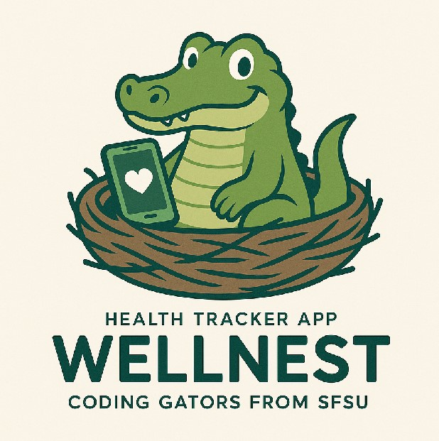

# **WELLNEST**

# ****

#

#

# **Team 03**

## **Team Lead & GitHub Master: Jacob Cordano \- [jcordano1@sfsu.edu](mailto:jcordano1@sfsu.edu)**

## **Technical Writer: Diego Antunez**

## **Scrum Master & Software Architect: Jacob Vuong**

## **Frontend Lead: Kevin Hu**

## **Backend Lead: Hamed Emari**

## **Database Lead: Shivani Bokka**

## **Milestone 3**

July 9, 2025

## **Version History**

| Milestone   | Version   | Date    |
| :---------- | :-------- | :------ |
| Milestone 3 | Version 1 | N/A     |
| Milestone 2 | Version 1 | 7/3/25  |
| Milestone 1 | Version 2 | 6/30/25 |
| Milestone 1 | Version 1 | 6/16/25 |

## Table of Contents

**[Data Definitions](#data-definitions)**  
**[Prioritized High-Level Functional Requirements](#prioritized-high-level-functional-requirements)**  
**[UI/UX Wireframes](#uiux-wireframes)**  
**[System Design](#system-design)**  
 **[Database Architecture](#database-architecture)**  
 **[Backend Architecture](#backend-architecture)**  
**[Team Contributions](#team-contributions)**

## Data Definitions\*\*

##

## Prioritized High-Level Functional Requirements

##

## UI/UX Wireframes\*\*

User Welcome page and Signup Page

User Profile editing and saving new changes

Users social groups

Users can join or create their own social groups that have common interests, and to explore different user's progression as well.

Homepage for the user

There is a feature for adding new habits along with seeing their current habits tracked.

User Progression tracker

Users can track their progression through a span of a month, with their highest streaks for habits tracked, and how well they are sticking to their new habits, as well as completed ones for the week.

##

## System Design\*\*

##

## Database Architecture\*\*

### Business Rules
1. Users must create an account after completing the WellNest Survey
2. Only registered users can create Habits
3. Only registered users can join WeellNest Circles
4. A user shall be able to use many devices to login to their account
5. A user can create many Habits
6. A user can join many WellNest Circles
 

ERD Diagram

EED Diagram

### Database
MySQL shall be used for all WellNest relational databases and stored information. 

##

## Backend Architecture\*\*

UML Diagram

NetworkDiagram

Deployment Diagram

##

## Team Contributions\*\*

##

##
