# SW Engineering CSC648-848-03 Summer 2025

## &#x20;<mark style="background-color:purple;">WELLNEST</mark> &#x20;

## <mark style="background-color:blue;">Team 03</mark>&#x20;

**Team Lead & GitHub Master:** Jacob Cordano - [jcordano1@sfsu.edu](mailto:jcordano1@sfsu.edu)

**GitHub Master & Technical Writer:** Jacob Vuong

**Scrum Master:** Kevin Hu

**Database Lead:** Hamed Emari

**Front End Lead:** Shivani Bokka

**Back End Lead:** Diego Antunez

**Milestone 4**

## <mark style="color:blue;">Version History</mark>

| Milestone   | Version   | Date    |
| ----------- | --------- | ------- |
| Milestone 4 | Version 1 | 7/24/25 |
| Milestone 3 | Version 1 | 7/22/25 |
| Milestone 2 | Version 2 | 7/22/25 |
| Milestone 2 | Version 1 | 7/3/25  |
| Milestone 1 | Version 2 | 6/30/25 |
| Milestone 1 | Version 1 | 6/16/25 |

## Table of Contents

- [SW Engineering CSC648-848-03 Summer 2025](#sw-engineering-csc648-848-03-summer-2025)
- [ WELLNEST ](#wellnest)
- [Team 03 ](#team-03)
- [Version History](#version-history)
- [Table of Contents](#table-of-contents)
- [Product Summary](#product-summary)
- [Usabilility Test Plan](#usability-test-plan)
- [QA Test Plan](#qa-test-plan)
- [Localization Testing](#localization-testing)
- [Code Review](#code-review)
- [Self-Check on Security Practices](#self-check-on-security-practices)
- [Self-Check Adherence to Non-Functional Specs](#self-check-adherence-to-non-functional-specs)
- [Team Contributions](#team-contributions)

## Product Summary

### Prioritized High-Level Functional Requirements

### Priority 1

#### 1. Registered Users

1.1 Users shall be able to create and register an account.

1.2 Users shall be able to edit their profile information.

1.3 Users shall be able to delete their accounts.

1.4 The system shall track user progress.

1.5 Users shall be able to navigate the app without complication.

#### User Personal Survey

2.1 The app shall prompt users with onboarding questions for curated habit suggestions.

2.2 Users shall be able to skip the survey.

#### 3. Personal Health Tracker

3.1 The personal health tracker shall track the number of consecutive habit sessions for each user.

3.2 The system shall display indications of completed habits.

3.3 The system shall provide notifications for missed habits.

3.4 Users shall be able to remove habits suggested by the app.

#### 4. Habit Tracking

4.1 Users shall be able to add habits.

4.2 Users shall be able to delete habits.

4.3 Users shall be able to modify habits.

4.4 Users shall be able to name habits.

4.5 Users shall be able to track pre-defined habits.

4.6 The system shall display suggested habits for users to track.

#### 5. Calendar

5.1 The calendar system shall display weekly progress for users.

5.2 Users shall be able to change the time of their habit.

5.3 Users shall be able to change the duration of their habit.

#### 6. Settings

6.1 Users shall be able to change their account information.

6.2 Users shall be able to delete their account.

#### 7. WellNest circle with Friends

7.1 Users shall be able to create challenges.

7.2 Users shall be able to view the leaderboard.

7.3 Users shall be able to add friends using a link.

7.4 Users shall be able to delete friends.

#### 8. Leaderboards and Progress

8.1 The system shall track user progression.

8.2 Users shall be able to compete with others through a leaderboard.

8.3 The system shall assign points based on user progress.

8.4 The system shall assign tiered awards and badges to signify leaderboard status in a “king of the hill” format.

### Priority 2

#### 1. Registered Users

1.1 Users shall be able to create a profile picture.

1.2 The app shall guide users through a helpful onboarding experience.

#### 2. User Personal Survey

2.1 Users shall be able to skip individual questions in the survey.

2.2 Users shall be able to rate the page and experience.

#### 3. Habit Tracking

3.1 Users shall be able to track custom habits.

#### 4. Calendar

4.1 Users shall be able to filter the calendar view by type (habits, moods, journal, challenges).

4.2 The calendar system shall display monthly progress.

#### 5. Notifications

5.1 The system shall send notifications to the app.

#### 6. Settings

6.1 Users shall be able to block other users.

6.2 Users shall be able to turn off notifications

#### 7. For Friends

7.1 Users shall be able to participate in joint habit tracking.

7.2 The system shall display suggested friends in the app.

### Unique Features

- Mood Tracking
- Smoking/Alchohol Habit Tracking
- Personalized AI Nudges
- WellNest Circles

### Deployment URL

**--------------Product Summary Draft End-----------**

##

## Usability Test Plan

**Test Objective**

The main purpose of this usability test is to see how easy and clear it is for users to interact with five key features in our app: Personal Health Tracker, Habit Tracking, Calendar, Challenge & Leaderboard, and the Onboarding Survey. These are some of the most important functions we’ve built so far, and they represent the core experience we want to offer — helping users build habits, track their progress, and stay motivated through community features.
We chose these features because they’re meant to be used regularly, and if they’re confusing or frustrating in any way, that could really affect how people feel about the app as a whole. Through this test, we’re hoping to see whether users can complete each task without help, how long it takes them, and how confident they feel doing it. We also want to understand where users might get stuck or hesitate, so we can make the app more intuitive moving forward.
Our goal is to get honest, practical feedback from people who haven’t used the app before. This will help us figure out what’s working, what’s not, and what could be improved as we continue developing the project.

**Test Description**

This usability test will be conducted with a small group of users who have never used our app before. The goal is to observe how they interact with five specific features: Personal Health Tracker, Habit Tracking, Calendar, Challenge & Leaderboard, and the Onboarding Survey. The version of the app being tested is the latest working prototype, which is accessible via a desktop or laptop browser.
Each test session will begin with a short introduction where the user is told they’re helping us evaluate how easy and smooth our app is to use. We will not give them any hints unless absolutely necessary. They’ll be given a set of five tasks to complete, one for each feature, and we will observe their process, take notes, and record the time taken for each task. If the user gets stuck, we’ll note when and where that happens, but we’ll let them try to figure it out on their own first.
Here are the five test tasks:

1. Onboarding Survey: Complete the onboarding survey that appears when the app starts.
2. Habit Tracking: Add a new habit (e.g., "Drink water"), set its duration, and mark one session as complete.
3. Personal Health Tracker: View your current streak and check which habits you’ve missed or completed today.
4. Calendar: Go to the calendar view, find the current week, and see your habit progress for the last three days.
5. Challenge & Leaderboard: Create a simple challenge (e.g., “Walk 5,000 steps daily”), invite a friend, and check the leaderboard to see your rank.

All users will perform these tasks on the same system setup: a Chrome browser on a laptop, with access to the prototype via [insert URL here]. We will also give them a short Likert-style questionnaire at the end to rate their experience with each feature. These users will be regular students with no prior exposure to our app, which helps us see how a new user might feel when using it for the first time.

**Test Participants (User Profiles)**

To reflect a range of real-world users, we involved five participants from diverse academic backgrounds and varying levels of tech familiarity. Each user was asked to complete a series of tasks using our app, and their interactions were observed to help us assess usability, clarity, and overall experience.

1. Soundarya Srinivas
   Program: Graduate – Electrical Engineering
   Tech Comfort: Comfortable with digital tools and organized
   Notes: Found onboarding and calendar pages easy to use. Noted that the “Create Habit” button could be more obvious.

2. Sani Hasan
   Program: Graduate – Robotics and Computer Science
   Tech Comfort: Very confident and experienced with apps
   Notes: Completed all tasks smoothly and quickly. Understood layout, calendar, and habit tracking features without any confusion.

3. Neha Desai
   Program: Graduate – Electrical Engineering
   Tech Comfort: Moderately confident
   Notes: Skipped part of the onboarding survey. Took longer to find the calendar and had trouble figuring out how to mark a habit as complete.

4. Madhura Gowda
   Program: Graduate – Electrical Engineering
   Tech Comfort: Comfortable and tech-aware
   Notes: Very smooth experience. Found all features intuitive and responded positively to layout and overall flow.

5. Navneet Kaur
   Program: Undergraduate – Political Science & International Relations
   Tech Comfort: Relatively new to health apps
   Notes: Liked the onboarding survey but needed some help understanding the health tracker and how to create a challenge. Found the calendar and navigation clear.

**Effectiveness Table**

| Feature                 | Soundarya | Sani Hasan | Neha Desai | Madhura Gowda | Navneet Kaur | Notes                                                       |
| ----------------------- | --------- | ---------- | ---------- | ------------- | ------------ | ----------------------------------------------------------- |
| Onboarding Survey       | Yes       | Yes        | Partial    | Yes           | Yes          | Neha skipped halfway; others completed easily               |
| Habit Tracking          | Yes       | Yes        | No         | Yes           | Yes          | Neha couldn’t find “Mark as Done” button                    |
| Personal Health Tracker | Yes       | Yes        | Yes        | Yes           | Partial      | Navneet didn’t fully understand streak indicators           |
| Calendar                | Yes       | Yes        | Yes        | Yes           | Yes          | All users found calendar                                    |
| Challenge & Leaderboard | Yes       | Yes        | Yes        | Yes           | Partial      | Navneet needed help understanding how to create a challenge |

**Efficiency Table**

| Feature                 | User          | Time (sec) | Steps Taken | Expected Steps | Notes                                |
| ----------------------- | ------------- | ---------- | ----------- | -------------- | ------------------------------------ |
| Onboarding Survey       | Soundarya     | 30         | 3           | 3              | Smooth experience                    |
|                         | Sani Hasan    | 28         | 3           | 3              | Quick and efficient                  |
|                         | Neha Desai    | 25         | 2           | 3              | Skipped some questions               |
|                         | Madhura Gowda | 32         | 3           | 3              | Normal flow                          |
|                         | Navneet Kaur  | 34         | 3           | 3              | Read questions slowly                |
| Habit Tracking          | Soundarya     | 45         | 4           | 4              | Slight UI hesitation                 |
|                         | Sani Hasan    | 40         | 4           | 4              | No issues                            |
|                         | Neha Desai    | 60         | 5           | 4              | Confused about habit completion      |
|                         | Madhura Gowda | 38         | 4           | 4              | Smooth process                       |
|                         | Navneet Kaur  | 44         | 4           | 4              | Completed confidently                |
| Personal Health Tracker | Soundarya     | 20         | 2           | 2              | All visuals clear                    |
|                         | Sani Hasan    | 18         | 2           | 2              | Very fast                            |
|                         | Neha Desai    | 30         | 3           | 2              | Took a second to interpret           |
|                         | Madhura Gowda | 21         | 2           | 2              | No issues                            |
|                         | Navneet Kaur  | 35         | 4           | 2              | Needed explanation                   |
| Calendar                | Soundarya     | 30         | 3           | 3              | Could be more obvious for habit edit |
|                         | Sani Hasan    | 26         | 3           | 3              | Quick and intuitive                  |
|                         | Neha Desai    | 46         | 4           | 3              | Took extra clicks                    |
|                         | Madhura Gowda | 28         | 3           | 3              | Smooth usage                         |
|                         | Navneet Kaur  | 33         | 3           | 3              | Completed confidently                |
| Challenge & Leaderboard | Soundarya     | 50         | 4           | 4              | Straightforward                      |
|                         | Sani Hasan    | 42         | 4           | 4              | Smooth flow                          |
|                         | Neha Desai    | 55         | 4           | 4              | Slight delay finding leaderboard     |
|                         | Madhura Gowda | 44         | 4           | 4              | No issues                            |
|                         | Navneet Kaur  | 62         | 5           | 4              | Struggled with creating challenge    |

## User Satisfaction Questionnaire (Likert Scale)

**Instructions:**  
Ask users to rate the following 15 statements on a scale from 1 to 5:  
(1 = Strongly Disagree, 5 = Strongly Agree)

---

### **Onboarding Survey**

1. The survey was simple and easy to follow.
2. The questions made sense and felt relevant to the app.
3. I would prefer to complete this kind of survey when first using an app.

---

### **Habit Tracking**

4. It was easy to add and set up a new habit.
5. I could clearly see how to mark a habit as complete.
6. I felt confident using this feature without help.

---

### **Personal Health Tracker**

7. I could quickly understand my progress at a glance.
8. The display for missed/completed habits was clear.
9. I would use this tracker regularly to monitor my habits.

---

### **Calendar**

10. It was easy to switch to the calendar view.
11. I could easily find and interpret my weekly progress.
12. The calendar layout made sense to me.

---

### **Challenge & Leaderboard**

13. Creating a challenge was straightforward.
14. I understood how the leaderboard ranked users.
15. Competing with friends would help me stay motivated.

| Statement                                              | Soundarya | Sani Hasan | Neha Desai | Madhura Gowda | Navneet Kaur |
| ------------------------------------------------------ | --------- | ---------- | ---------- | ------------- | ------------ |
| Onboarding was simple and easy to follow               | 5         | 5          | 3          | 5             | 5            |
| Questions were relevant to the app                     | 5         | 5          | 3          | 5             | 4            |
| I’d prefer this kind of survey for setup               | 5         | 5          | 2          | 5             | 5            |
| It was easy to add and set up a new habit              | 4         | 5          | 2          | 5             | 4            |
| I could clearly mark a habit as complete               | 4         | 5          | 1          | 5             | 4            |
| I felt confident using this feature                    | 4         | 5          | 2          | 5             | 4            |
| I could quickly understand my progress at a glance     | 5         | 5          | 4          | 5             | 3            |
| The tracker clearly showed missed and completed habits | 5         | 5          | 4          | 5             | 3            |
| I would use this tracker regularly                     | 5         | 5          | 4          | 5             | 3            |
| It was easy to switch to calendar view                 | 5         | 5          | 3          | 5             | 5            |
| I could interpret my weekly progress clearly           | 5         | 5          | 4          | 5             | 4            |
| The calendar layout made sense to me                   | 4         | 5          | 3          | 5             | 4            |
| Creating a challenge was straightforward               | 5         | 5          | 4          | 5             | 2            |
| I understood how the leaderboard ranked users          | 5         | 5          | 4          | 5             | 3            |
| Competing with friends would help me stay motivated    | 5         | 5          | 4          | 5             | 4            |

## Summary and Key Insights

Testing the five main features of our app with users from different academic backgrounds gave us a clearer idea of what’s working well and what still needs some tweaking. Most people found the onboarding survey and calendar really easy to use — everyone completed those tasks without any issues, and the average satisfaction rating for the **Personal Health Tracker** was around **4.6 out of 5**. Users especially liked how clearly the progress was shown and how simple it was to view their weekly activity.

The main challenge came up during **habit tracking**. One user couldn’t immediately find the button to mark a habit as complete, and another mentioned that the “Create Habit” button could stand out more. These seem like small interface issues but could definitely impact the experience for new users. We also noticed that while most users liked the idea of creating challenges with friends, one user needed a bit of extra time to understand how that feature worked.

Overall, the app’s core features were well-received, and users were comfortable using them without much help. Moving forward, we’ll focus on making a few interface elements more visible and improving clarity in some user flows. This round of testing was helpful in showing us where users feel confident, and where a few small changes could make things even smoother.

##

## QA Test Plan

### Test Plan

This QA Test Plan outlines five non-functional requirements tested on the WELLNEST web application. Each test category targets a different area of software quality, including reliability, cross-browser compatibility, security, usability, and accessibility. For each requirement, three test cases were developed and executed.

**Environment Setup:**

- **URL:**
- **Hardware:** MacBook Pro M1 and Windows 10 PC
- **Software:**
  - Browsers: Chrome v115+, Firefox v115+, Safari v16+
  - Tools: Postman, Firefox DevTools, HTML5 validation

**Test Categories and Features:**

#### 1. Reliability – Habit Logging & Data Consistency

**Feature Tested:** Habit log API and progress graph

| Test # | Title                    | Task Description                     | Input                    | Expected Output                        | Result |
| ------ | ------------------------ | ------------------------------------ | ------------------------ | -------------------------------------- | ------ |
| 1      | Repeated Habit Log       | Log same habit 10x                   | Same POST request x10    | All 10 logs are stored without failure | PASS   |
| 2      | Consistent Progress Data | Verify progress chart after each log | Log + refresh chart page | Graph updates with each new log        | PASS   |
| 3      | Reload Stability         | Refresh page after logging a habit   | Habit log + refresh      | Data remains visible after reload      | PASS   |

#### 2. Cross-Browser Compatibility – Progress Page

**Feature Tested:** `/progress` page charts

| Test # | Title          | Task Description              | Input         | Expected Output                       | Result |
| ------ | -------------- | ----------------------------- | ------------- | ------------------------------------- | ------ |
| 1      | Chrome Render  | Load progress page on Chrome  | Chrome v115+  | Graphs and UI render correctly        | PASS   |
| 2      | Firefox Render | Load progress page on Firefox | Firefox v115+ | Same layout and performance as Chrome | PASS   |
| 3      | Safari Render  | Load progress page on Safari  | Safari v16+   | Responsive and visually consistent UI | PASS   |

#### 3. Security – Authentication and Access Control

**Feature Tested:** Login endpoint and token-protected routes

| Test # | Title               | Task Description                      | Input           | Expected Output   | Result |
| ------ | ------------------- | ------------------------------------- | --------------- | ----------------- | ------ |
| 1      | SQL Injection Login | Attempt login with `admin' OR 1=1 --` | Malicious input | Login blocked     | PASS   |
| 2      | Auth Token Tamper   | Modify auth token in cookie           | Tampered token  | Redirect to login | PASS   |
| 3      | Session Expiry      | Login and wait 1 hour                 | Stale session   | Redirect to login | PASS   |

#### 4. Usability – Navigation and Clarity

**Feature Tested:** Homepage CTA, nav bar, and form labels

| Test # | Title                | Task Description                     | Input           | Expected Output                               | Result |
| ------ | -------------------- | ------------------------------------ | --------------- | --------------------------------------------- | ------ |
| 1      | Homepage CTA Clarity | Observe if tagline is understandable | Visual Review   | Clear purpose understood by users             | PASS   |
| 2      | Menu Navigation      | New user tries all nav links         | Click all items | All nav options reachable and labeled         | PASS   |
| 3      | Form Label Check     | Check clarity of habit log labels    | Inspect form    | All inputs are clearly and accurately labeled | PASS   |

#### 5. Accessibility – Keyboard and Feedback

**Feature Tested:** Tab navigation, error messages, keyboard focus

| Test # | Title                     | Task Description                              | Input                   | Expected Output                                | Result                  |
| ------ | ------------------------- | --------------------------------------------- | ----------------------- | ---------------------------------------------- | ----------------------- |
| 1      | Tab Navigation            | Navigate UI using keyboard only               | Press Tab key           | All focusable elements are reachable           | PASS                    |
| 2      | Form Validation Feedback  | Submit form with required field(s) left blank | Empty `name` or `value` | Error message shown near field(must be filled) | PASS                    |
| 3      | Keyboard Focus Visibility | Ensure focused element is visibly highlighted | Tab key navigation      | Clear visible focus on each item               | PASS except for socials |

##

## Localization Testing

### Localization Plan

The WELLNEST application was evaluated for localization readiness across two language-region pairs:

- **en-US → es-MX (English to Mexican Spanish)**
- **en-US → en-GB (U.S. to British English)**

The goal was to verify that the application's text content, UI labels, and formatting adapt properly to different languages, cultural expressions, and regional conventions. The test focused on three core components:

1. Homepage tagline
2. Navigation bar
3. Log Habit form

Testing was conducted by manually switching UI text and labels using browser devtools and inspecting how well the layout and messages adapted to different translations and regions.

### Test Cases

| Test # | Feature          | Region/Language | Task                                             | Expected Output                                                              | Result |
| ------ | ---------------- | --------------- | ------------------------------------------------ | ---------------------------------------------------------------------------- | ------ |
| 1      | Homepage tagline | en-US → es-MX   | Replace tagline text with Spanish neutral phrase | “Track your habits” → “Sigue tus hábitos” fits and conveys same meaning      | PASS   |
| 2      | Navigation bar   | en-US → es-MX   | Translate nav items to Spanish                   | “Progress” → “Progreso”, “About” → “Acerca de” all fit and read naturally    | PASS   |
| 3      | Log Habit form   | en-US → es-MX   | Translate form labels and placeholders           | “Habit Name” → “Nombre del hábito”, “Value” → “Valor” appear clearly         | FAIL   |
| 4      | Homepage tagline | en-US → en-GB   | Reword CTA to use British tone/spelling          | “Track your habits” → “Keep track of your habits” fits UK tone               | FAIL   |
| 5      | Date Format      | en-US → en-GB   | Change date display format                       | “July 30, 2025” → “30 July 2025” on progress entries                         | PASS   |
| 6      | Units / Terms    | en-US → en-GB   | Update measurements and terminology              | “Sleep (hours)” remains same, but “Color” → “Colour” in UI (when applicable) | FAIL   |

### Results

Out of 6 test cases, only 3 passed. Spanish navigation labels and the homepage tagline adapted correctly to the `es-MX` locale. However, other elements did not update as expected due to hardcoded English text or lack of locale awareness in the UI.

##

## Code Review

### Coding Standards

The practices that our team has been following through the entirety of this project has been to utilize previous documentation and diagrams created to provide uniformity in naming conventions and direction when it comes to having a function complete it's goal. Regular review of the code created and submitted is performed by the GitMaster and Team Lead to promote working and efficient code that can be iterated on successfully and without further conflict. Regular use of comments within the code base and on GitHub has allowed easy understanding of the purpose of code and commits as review and error tracing is performed. Another key piece of organization was the use of multiple feature branches as needed so that team members had a way of segmenting their work and not impacting others.

### Github Code Review

Examples of code comments:

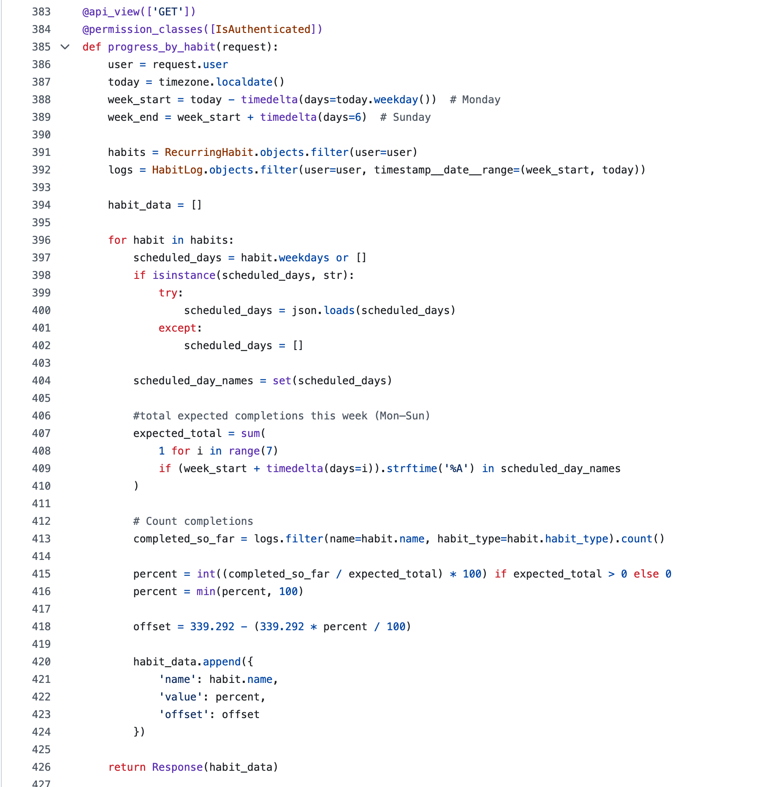

Example of GitHub comments:

Example of GitHub branches:

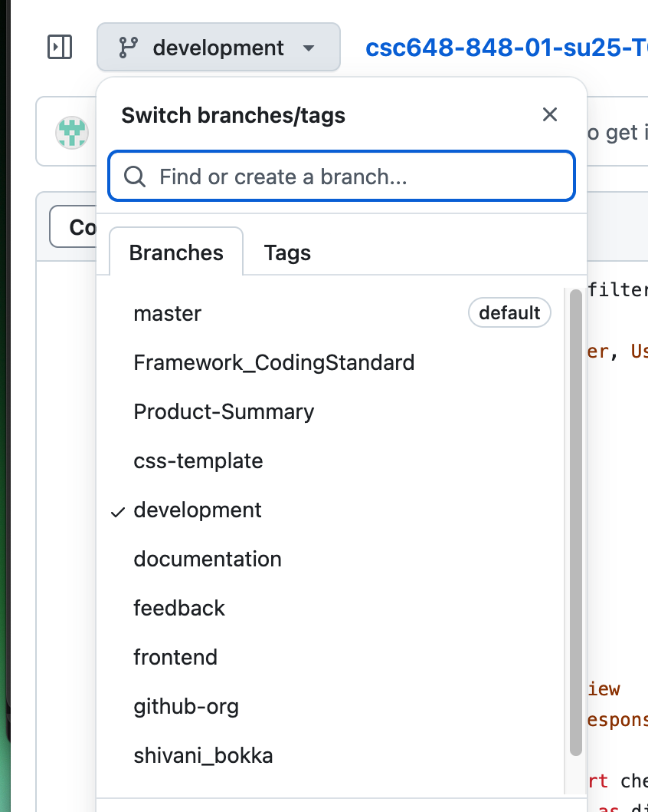

### External Code Review

We had the opportunity to review a function from team 4.

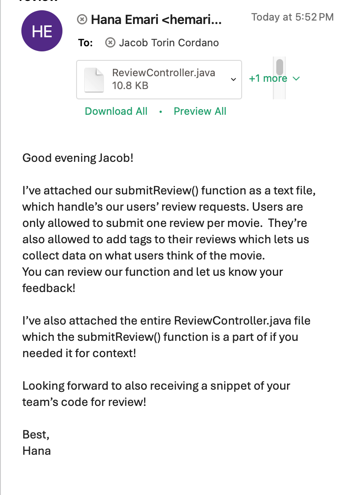

##

## Self-Check on Security Practices

### Major Assets

Assets

**User Credentials:** Usernames, passwords, email, personal details like gender and full name.

**Habit & Health Logs:** Data about pre-defined and custom habits

**Social Connections:** Friends, friend requests, circles, and notifications.

**Session Information:** Authenticated user sessions and CSRF protection.

### Password Encryption

Passwords are encrypted using Django’s built-in set_password() method, which applies a salted hash using PBKDF2 by default. On the front end side the password is not visible.

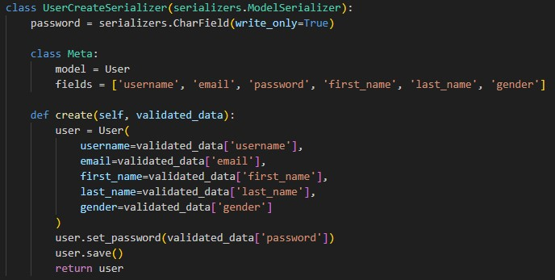

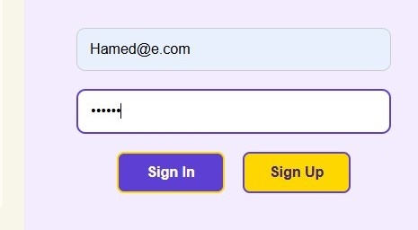

### Input Validation

In the Habit Creation process, only validated input is passed

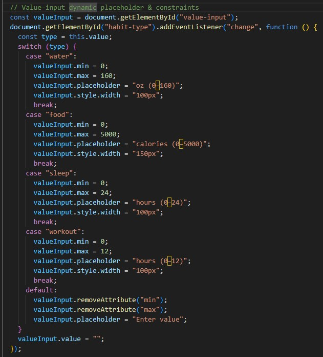
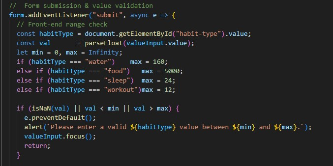

Similarly, in the search box, empty queries will not trigger to prevent unnecessary API calls

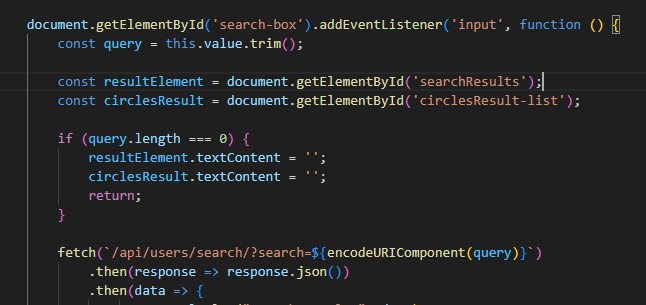

### CSRF Protection

On most HTMLS and JS files you can find traces of CSRF protection for instance in habit creation
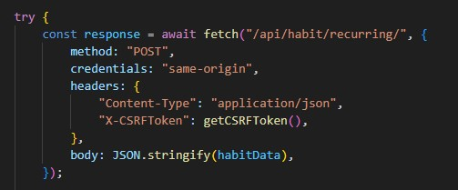

### Session Cookie

Session Cookie age is implemented to log out users after 1 hour of inactivity
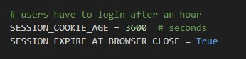

### OOP Security Practices

By using many classes with small scopes, separated functionalities, and limited exposed fields, we ensure encapsulation

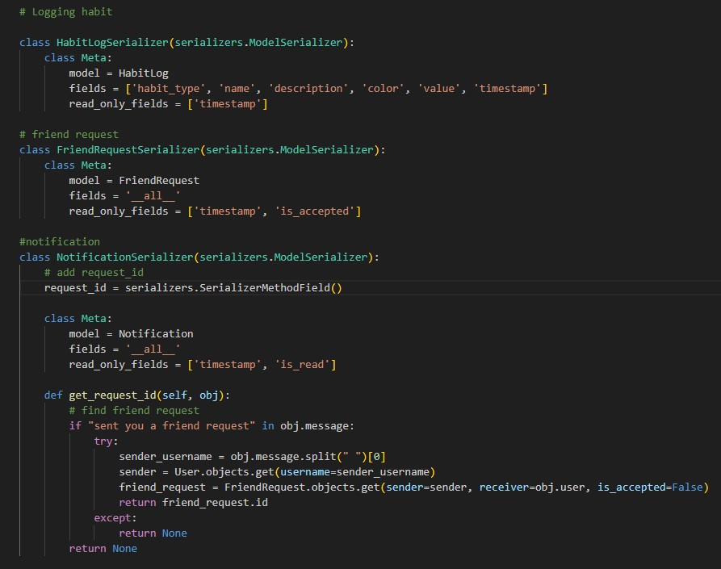

### Field Visibility

Using Model Constraints and Field Visibility, we ensure data encapsulation.
Password is write-only to limit exposure

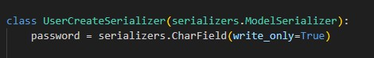

### Abstraction and Inheritance

Using Abstraction and Inheritance from the Django library, we ensure user data safety when creating an account
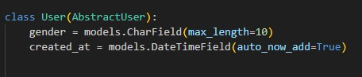

### Decorators

We limited access using decorators, such as @isAuthenticated and @login_required

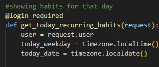

### Database Logic

Using a consistent order for our Friends model, we avoid duplicated and conflicting relations

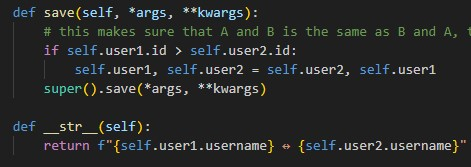

##

## Self-Check: Adherence to Non-Functional Specs

### System Requirements

1. The System shall be hosted on Amazon Web Services (DONE)
1. A MySQL database shall be created and hosted on AWS EC2 (DONE)
1. Djangox4 shall be used as the backend framework (DONE)
1. Vanilla JS and CSS shall be used for the frontend (DONE)
1. The frontend service shall run on port 3000 (DONE)
1. The backend service shall run on port 8000 (DONE)
1. Ubuntu shall be used as the Operating System on AWS (DONE)
1. A secure HTTPS website certificate is to be installed (ISSUE)

### Security Requirements

9. User information and Password shall be encrypted (DONE)
1. Each user can only have one account created with their email (DONE)
1. Each user shall be able to log in from any device and access their information (DONE)
1. Personal information shall not be shared with third party APIs (DONE)
1. Personal information shall only be stored for user log in process (DONE)

### Storage Requirements

14. User information shall be stored on a MySQL database (DONE)
1. User Habits shall be stored on the MySQL database (DONE)
1. User information shall be displayed from the database upon logging in (DONE)
1. If applied users shall be informed of their storage limitations (ON TRACK)

### Content Requirements

18. The list of user family and friends shall be saved and updated with every login (ISSUE)
1. The list of the user’s habits shall be updated with every login (DONE)
1. The Calendar shall be updated with every login (DONE)
1. The user Streak shall be saved and kept track of automatically (ON TRACK)
1. The user’s information shall be deleted automatically upon account deletion (ON TRACK)

### Usability

22. The UI shall have a user-friendly design (DONE)
1. The UI shall have a wellness-focused design (DONE)
1. The Fonts and Texts shall have a 2-4 variety and size difference (DONE)
1. The app colors shall follow CodingGator’s color theme (DONE)
1. The app shall be completely functional on mobile and desktop (ON TRACK)
1. The navigation shall be intuitive and accessible (DONE)

### Supportability

27. The front-end shall display clear, noticeable, and user-friendly errors (DONE)
1. Back-end shall capture errors and bugs allowing developers to correct them (DONE)
1. The app shall support IOS, Windows, and Linux (DONE)
1. The shall support the following engines:
   - Firefox 135
   - Chrome 134
   - Safari 18.3
   - Microsoft Edge 133
     (DONE)

### Efficiency

33. The user info shall be displayed from the database to the frontend in less than 5 seconds (DONE)
1. The app shall support at least 50 concurrent users without degradation in response time (DONE)
1. The API response time shall be reduced to a minimum (DONE)

### Coding

36. Data and Variable naming should follow CodingGator’s convention (DONE)
1. Comments shall be used frequently and should give clear explanations (DONE)
1. Code shall be encapsulated and secure (DONE)
1. Code shall be original work (DONE)

### Marketing and Legal

40. All copyrights shall belong to CodingGators (DONE)
1. User agreement terms shall be shown to the user before registering (ON TRACK)
1. The names Wellnest and CodingGators shall be included in all marketing attempts (DONE)

### Status Update

##

## Team Contributions

<mark style="color:blue;">Jacob Cordano (Team Lead, Software Architect)</mark> 10/10

- Code Review
- Documentation Review
- Meeting organization
- Task tracker organization
- EC2 Management
- Team Contributions
- Checkpoint 1 Email
- Checkpoint 2 Email
- Internal code review
- External code review

<mark style="color:blue;">Hamed Emari (Back End Lead)</mark> 10/10

- Habit creation
- Habit deletion
- Habit log
- Notifications
- Friend request
- Friends table
- Habit tags
- Zenquotes api
- Calendar tweaks
- Reocurring habits
- Friends UI

<mark style="color:blue;">Jacob Vuong (Scrum Master/Software Architect)</mark> 10/10

- Data Definitions
- Profile page
- Wireframe UI
- Wireframe streaks
- Tracker organization
- Lead the revision of high level functional requirements
- Frameworks development
- Q/A testing
- Meeting minutes
- Assist with navigation flow
- Assit with data definitions
- Checkpoint email

<mark style="color:blue;">Shivani Bokka (Database Lead)</mark> 8/10

- Updated data definitions
- Revised Scalability diagram
- Rating, ranking, and search algorithms
- Profile page
- Database organization
- High level database architecture
- Back end architecture
- Data definitions

<mark style="color:blue;">Diego Antunez (Technical Writer)</mark> <mark style="color:blue;"></mark> 7/10

- Title page for M3
- M2V2 table of contents revision
- Diagrams migration from M2 to M3
- Typo correction
- M2V2 format revision

<mark style="color:blue;">Kevin Hu (Front End Lead)</mark> 8/10

- Django configuration
- Search functionality
- Prototype file consolidation
- Implementation of wireframe design to front end
- Home page
- Calendar
- Navigation flow
- Usability testing
- Q/A testing
- Welcome pages
