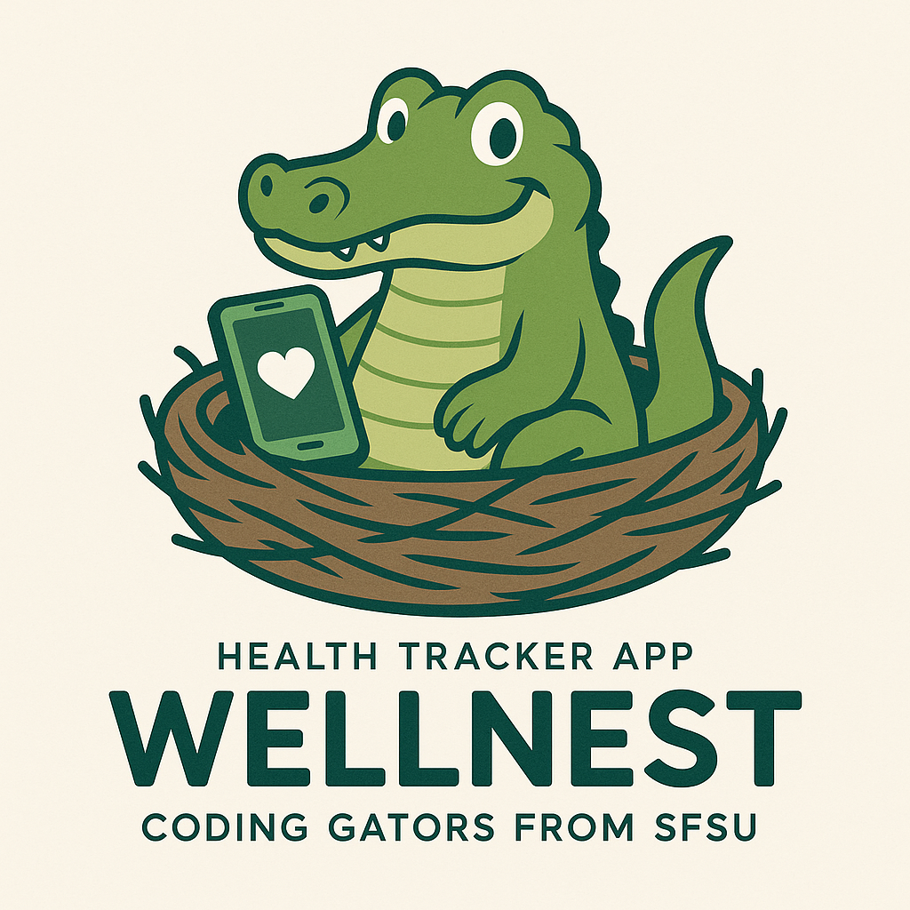

# SW Engineering CSC648-848-03 Summer 2025

## &#x20;<mark style="background-color:purple;">WELLNEST</mark> &#x20;

## <mark style="background-color:blue;">Team 03</mark>&#x20;

**Team Lead & GitHub Master:** Jacob Cordano - [jcordano1@sfsu.edu](mailto:jcordano1@sfsu.edu)

**GitHub Master & Technical Writer:** Jacob Vuong

**Scrum Master:** Kevin Hu

**Database Lead:** Hamed Emari

**Front End Lead:** Shivani Bokka

**Back End Lead:** Diego Antunez

**Milestone 4**

## <mark style="color:blue;">Version History</mark>

| Milestone   | Version   | Date    |
| ----------- | --------- | ------- |
| Milestone 4 | Version 1 | 7/24/25 |
| Milestone 3 | Version 1 | 7/22/25 |
| Milestone 2 | Version 2 | 7/22/25 |
| Milestone 2 | Version 1 | 7/3/25  |
| Milestone 1 | Version 2 | 6/30/25 |
| Milestone 1 | Version 1 | 6/16/25 |

## Table of Contents

- [SW Engineering CSC648-848-03 Summer 2025](#sw-engineering-csc648-848-03-summer-2025)
- [ WELLNEST ](#wellnest)
- [Team 03 ](#team-03)
- [Version History](#version-history)
- [Table of Contents](#table-of-contents)
- [Product Summary](#product-summary)
- [Usabilility Test Plan](#usability-test-plan)
- [QA Test Plan](#qa-test-plan)
- [Localization Testing](#localization-testing)
- [Code Review](#code-review)
- [Self-Check on Security Practices](#self-check-on-security-practices)
- [Self-Check Adherence to Non-Functional Specs](#self-check-adherence-to-non-functional-specs)
- [Team Contributions](#team-contributions)

## Product Summary

### WellNest

### Prioritized High-Level Functional Requirements

**Priority 1**

**Registered Users**

1. Users shall be able to create and register an account -D
1. Users shall be able to edit their profile information
1. Users shall be able to delete their accounts
1. Users shall be able to track their progress
1. Users shall be able to navigate the app without complication

**User Personal Survey**

1. Users shall be asked onboard questions for curated habit suggestions -D (Should eliminate if we dont do anything with the survey answers)
1. Users shall be able to skip survey -D

**Personal Health Tracker**

1. Users shall track number of consecutive habit sessions
1. Users shall be able to monitor indications of completed habits -D
1. User shall have an indication of missed habits
1. Users shall be able to remove suggested habits by the app

**Habit Tracking**

1. Users shall be able to add habits -D
1. Users shall be able to delete habits
1. Users shall be able to modify days of habit occurance
1. Users shall be able to name habits
1. Users shall be able to track pre-defined habits
1. Users shall be able to view suggested habits to track (Delete if not used in onboarding)

**Calendar**

1. Users shall be able to view their weekly progress
1. Users shall be able to change the time of their habit
1. Users shall be able to change the duration of the habit

**Settings**

1. Users shall be able to change their information
1. Users shall be able to delete their account

**For Friends**

1. Users shall be able to create challenges.
1. Users shall be able to view leaderboard
1. Users shall be able to add friends
1. Users shall be able to delete friends

**Leaderboards and Progress**

1. Users shall be able to track their progression
1. Users shall be able to compete with other users through a leaderboard
1. Users shall gain points based off of their progress
1. User shall be able to have tiered awards, indicated by badges in their profile

**Priority 2**

**Registered Users**

1. Users shall be able to create a profile picture
1. Users shall be guided through helpful onboarding (slides or video)

**User Personal Survey**

1. Users shall be able to skip individual questions -D

**Habit Tracking**

1. Users shall be able to track custom habits

**Calendar**

1. User shall be able to filter calendar view by type (habits, challenges).
1. Users shall be able to view monthly progress

**Notifications**

1. Users shall receive notifications through the app

**Settings**

1. Users shall be able to block other users
1. Users shall be able to turn off notifications

**For Friends**

1. Users shall be able to have joint habit tracking
1. Users shall be able to see suggested friends on the app

### Unique Features

- Mood Tracking
- Smoking/Alchohol Habit Tracking
- Personalized AI Nudges
- WellNest Circles

### Deployment URL

**--------------Product Summary Draft End-----------**

##

## Usability Test Plan

### Test Functions

### Test Components

##

## QA Test Plan

### Test Plan

### Testing Execution

##

## Localization Testing

### Localization Plan

### Test Cases

### Results

##

## Code Review

### Coding Standards

### Github Code Review

### External Code Review

##

## Self-Check on Security Practices

### Major Assets

### Password Encryption

### Input Validation

##

## Self-Check: Adherence to Non-Functional Specs

### Status Update

##

## Team Contributions
